#### Dubbo

###### 1.发展历程

ORM---单一应用架构

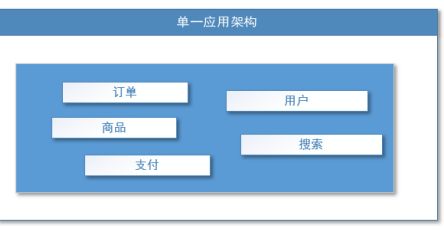

MVC---垂直应用架构

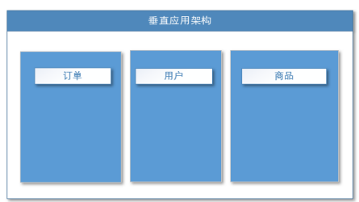

RPC---分布式服务架构

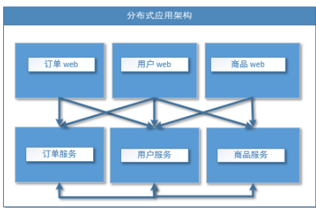

SOA---流动计算架构

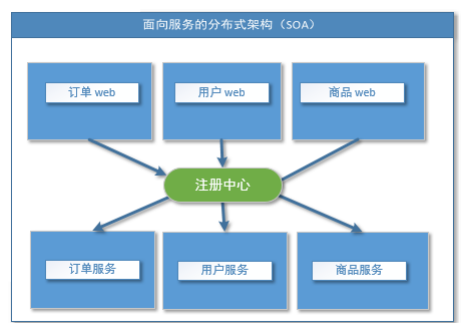

###### 2.流动计算架构

​	核心：提高机器利用率的资源调度和治理中心 (SOA)[ Service Oriented Architecture]

###### 3.什么叫RPC？

​	指远程过程调用，是一种进程间通信方式，他是一种技术的思想， 而不是规范。

###### 4.RPC基本原理

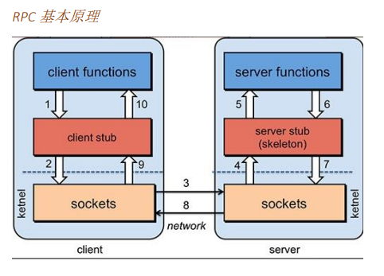

​		通过Sockets进行网络通信

###### 5.RPC 两个核心模块：通讯，序列化

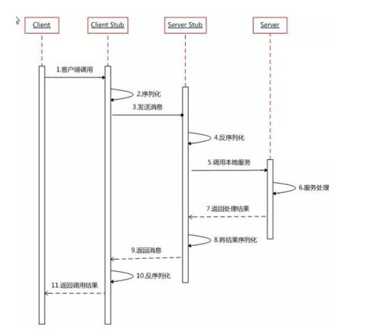

###### 6.Dubbo的基本概念

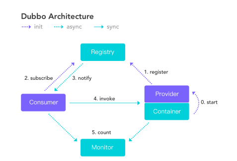

​	服务提供者（Provider）：暴露服务的服务提供方，服务提供者在启动时，向注册中心注册自 己提供的服务。

​	服务消费者（Consumer）: 调用远程服务的服务消费方，服务消费者在启动时，向注册中心订 阅自己所需的服务，服务消费者，从提供者地址列表中，基于软负载均衡算法，选一台提供者进行 调用，如果调用失败，再选另一台调用。

​	注册中心（Registry）：注册中心返回服务提供者地址列表给消费者，如果有变更，注册中心 将基于长连接推送变更数据给消费者

​	监控中心（Monitor）：服务消费者和提供者，在内存中累计调用次数和调用时间，定时每分 钟发送一次统计数据到监控中心

​	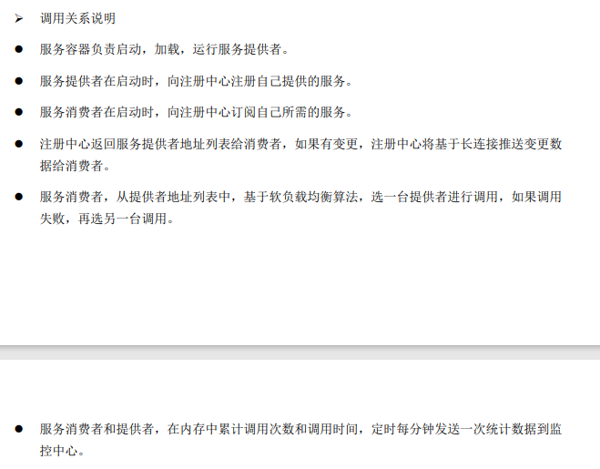

###### 7.dubbo 环境搭建

​	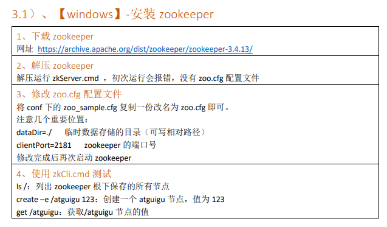

###### 8.安装 dubbo-admin 管理控制台

​	1.dubbo 本身并不是一个服务软件。它其实就是一个 jar 包能够帮你的 java 程序连接到 zookeeper，并 利用 zookeeper 消费、提供服务。

​	2.为了让用户更好的管理监控众多的 dubbo 服务，官方提供了一个可视化的监控程序，不过这个 监控即使不装也不影响使用。

###### 9.Dubbo-简单需求

​	订单服务 web 模块在 A 服务器，用户服务模块在 B 服务器，A 可以远程调用 B 的功能。

###### 10.Dubbo-工程架构

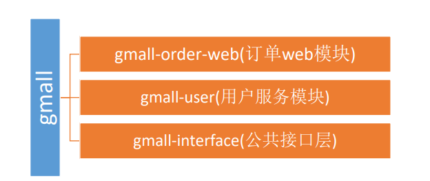

###### 	11.项目中的Dubbo引入

​	1.Maven引入Dubbo

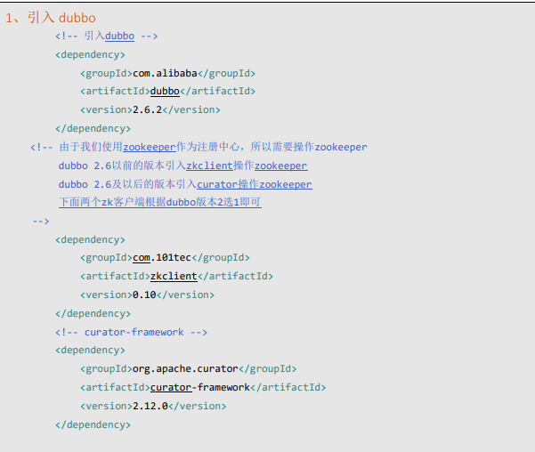

​	2.设置Dubbo配置文件---将当前应用配置为提供者

​	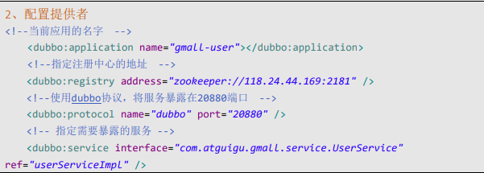

​	3.启动当前的服务

​	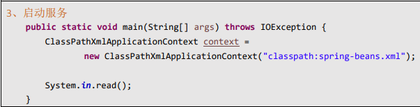

​	4.更新调用模块的Meaven作为服务消费者---引入依赖+新增Dubbo配置文件

​	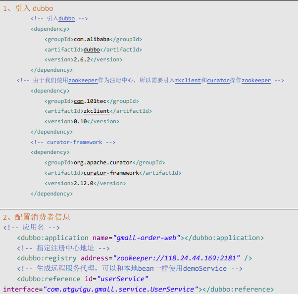

###### 12.通过注解完成Dubbo的引入和调用

​	前提，需要完成对Dubbo服务或者消费的Bean的配置文件的配置

​	

​	

​	1.服务提供方

​	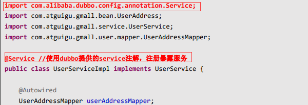

​	2.服务消费方---通过Reference注解完成调用

​	

​	

###### 13.监控中心--通过完整的图形化软件或者网页

​	dubbo-admin---图形化界面

​	dubbo-monitor-simple---类似于Swagger

###### 14.监控中心的配置

​	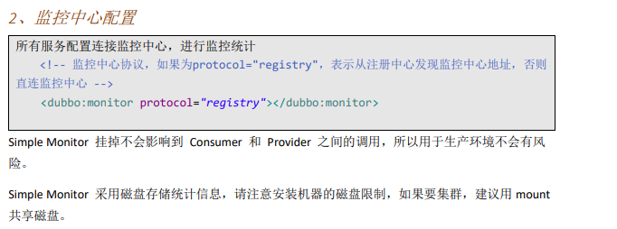

###### 15.Dubbo与SprtingBoot的整合

​	Step 1：引入dubbo的依赖

​	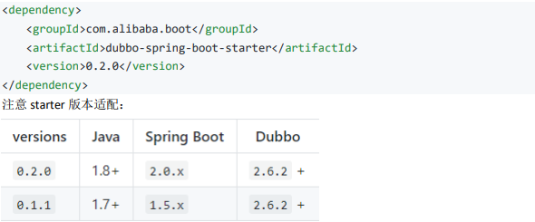

​	Step 2:配置Dubbo的配置文件---配置 application.properties

​	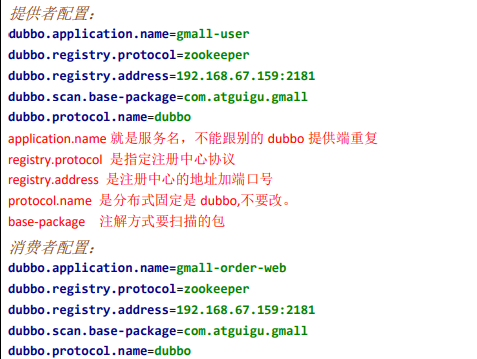

​	Step 3：通过Dubbo注解来完成服务的注册调用

​	

###### 16.Dubbo的配置细节

###### 17.配置文件中的配置原则

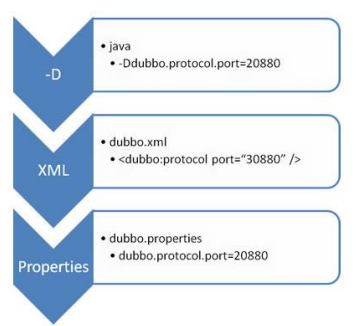

JVM 启动 -D 参数优先，这样可以使用户在部署和启动时进行参数重写，比如在启动时需改变协议 的端口。 

XML 次之，如果在 XML 中有配置，则 dubbo.properties 中的相应配置项无效。 

Properties 最后，相当于缺省值，只有 XML 没有配置时，dubbo.properties 的相应配置项才会生 效，通常用于共享公共配置，比如应用名。

###### 18.Dubbo的重试次数

​	

​	失败自动切换，当出现失败，重试其它服务器，但重试会带来更长延迟。可通过 retries="2" 来设 置重试次数(不含第一次)。

###### 19.Dubbo的超时时间

​	由于网络或服务端不可靠，会导致调用出现一种不确定的中间状态（超时）。为了避免超时导致客 户端资源（线程）挂起耗尽，必须设置超时时间。

​	Step 1：消费端的超时时间

​	

​	Step 2：服务端超时时间

​	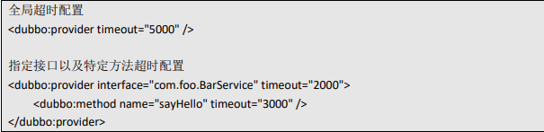

###### 20.Dubbo的配置原则：在服务提供端配置消费端的属性

​	1、作服务的提供者，比服务使用方更清楚服务性能参数，如调用的超时时间，合理的重试次 数，等等 

​	2、在 Provider 配置后，Consumer 不配置则会使用 Provider 的配置值，即 Provider 配置可以作为 Consumer 的缺省值。否则，Consumer 会使用 Consumer 端的全局设置，这对于 Provider 不可控 的，并且往往是不合理的

###### 21.配置的覆盖原则

 1.方法级配置别优于接口级别，即小 Scope 优先 

 2.Consumer 端配置 优于 Provider 配置 优于 全局配置

 3.最后是 Dubbo Hard Code 的配置值（见配置文档）

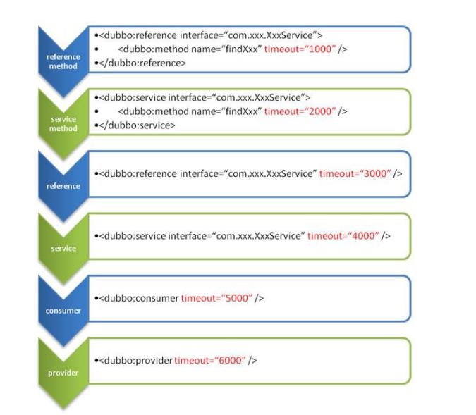

###### 22.zookeeper 宕机与 dubbo 直连

​	现象：zookeeper 注册中心宕机，还可以消费 dubbo 暴露的服务。

​	没有了注册中心，依然可以使用dubbo暴露的服务

​	原因：

​	监控中心宕掉不影响使用，只是丢失部分采样数据

​	数据库宕掉后，注册中心仍能通过缓存提供服务列表查询，但不能注册新服务

​	注册中心对等集群，任意一台宕掉后，将自动切换到另一台

​	注册中心全部宕掉后，服务提供者和服务消费者仍能通过本地缓存通讯

​	服务提供者无状态，任意一台宕掉后，不影响使用

​	服务提供者全部宕掉后，服务消费者应用将无法使用，并无限次重连等待服务提供者恢复

###### 23.集群下 dubbo 负载均衡配置----轮片等

​	在集群负载均衡时，Dubbo 提供了多种均衡策略，缺省为 random 随机调用。

​	Random LoadBalance ---随即重置

​	随机，按权重设置随机概率。 在一个截面上碰撞的概率高，但调用量越大分布越均匀，而且按概率使用权重后也比较均匀，有 利于动态调整提供者权重。

​	RoundRobin LoadBalance 轮循

​	按公约后的权重设置轮循比率。 存在慢的提供者累积请求的问题，比如：第二台机器很慢，但没挂，当请求调到第二台时就卡在 那，久而久之，所有请求都卡在调到第二台上。

​	LeastActive LoadBalance 最少活跃调用数

​	相同活跃数的随机，活跃数指调用前后计数差。 使慢的提供者收到更少请求，因为越慢的提供者的调用前后计数差会越大。

​	ConsistentHash LoadBalance 

​	一致性 Hash，相同参数的请求总是发到同一提供者。

###### 24.Dubbo可以整合hystrix(豪猪)，提升服务的健壮性---服务熔断+降级处理

###### 25.什么是服务降级？

​	当服务器压力剧增的情况下，根据实际业务情况及流量，对一些服务和页面有策略的不处理或 换种简单的方式处理，从而释放服务器资源以保证核心交易正常运作或高效运作。

​	可以通过服务降级功能临时屏蔽某个出错的非关键服务，并定义降级后的返回策略。

###### 26.什么是集群容错？

​	在集群调用失败时，Dubbo 提供了多种容错方案，缺省为 failover 重试。

###### 27.Dubbo提供的集群容错模式

​	

​	1.Failover Cluster---失败自动切换

​	失败自动切换，当出现失败，重试其它服务器。通常用于读操作，但重试会带来更长延迟。可通 过 retries="2" 来设置重试次数(不含第一次)。

​	2.Failfast Cluster---快速失败，只调用一次，失败就立即报错

​	3.Failsafe Cluster---失败安全，出现异常，直接忽略

​	4.Failback Cluster

​	失败自动恢复，后台记录失败请求，定时重发。通常用于消息通知操作。

​	5.Forking Cluster---并行请求

​	并行调用多个服务器，只要一个成功即返回。通常用于实时性要求较高的读操作，但需要浪费更 多服务资源。可通过 forks="2" 来设置最大并行数。

​	6.Broadcast Cluster

​	广播调用所有提供者，逐个调用，任意一台报错则报错 [2]。通常用于通知所有提供者更新缓存 或日志等本地资源信息。

###### 28.整合hystrix的过程

​	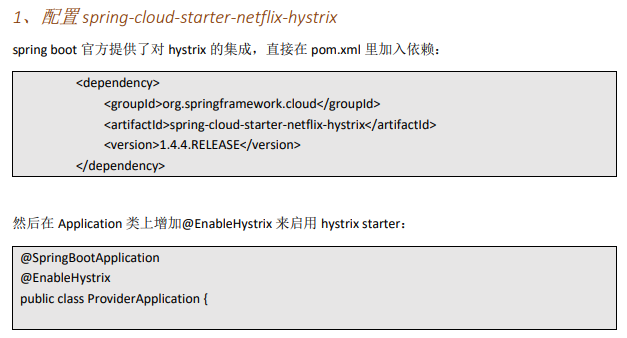

​	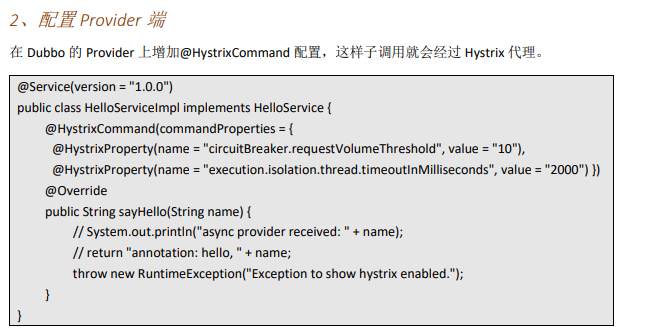

​	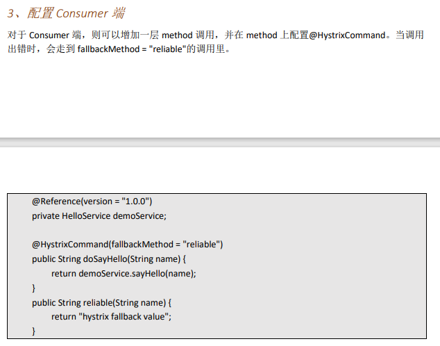

###### 29.RPC 原理

​	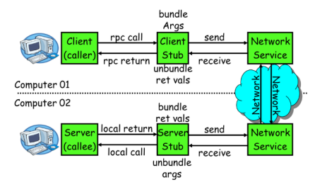

​	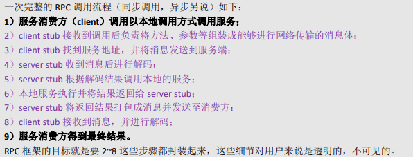

###### 30.netty 通信原理---通信框架

​	Netty 是一个异步事件驱动的网络应用程序框架， 用于快速开发可维护的高性能协议服务器和客户 端。它极大地简化并简化了 TCP 和 UDP 套接字服务器等网络编程。

​	BIO---阻塞

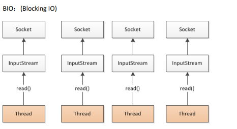

​	NIO---异步、非阻塞

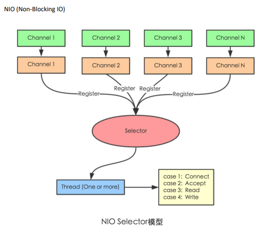

​		Selector 一般称 为选择器 ，也可以翻译为 多路复用器， Connect（连接就绪）、Accept（接受就绪）、Read（读就绪）、Write（写就绪）
