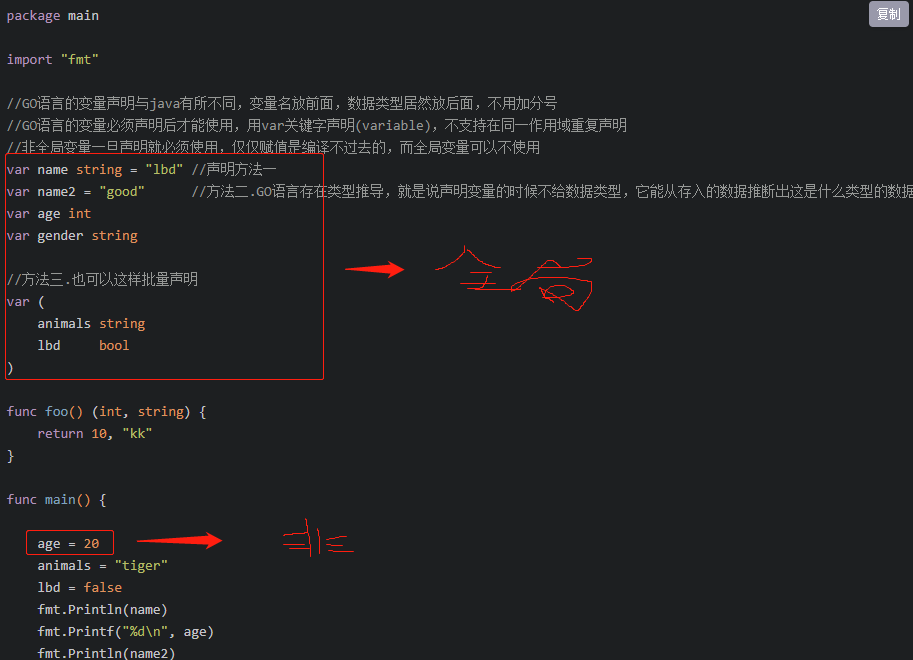
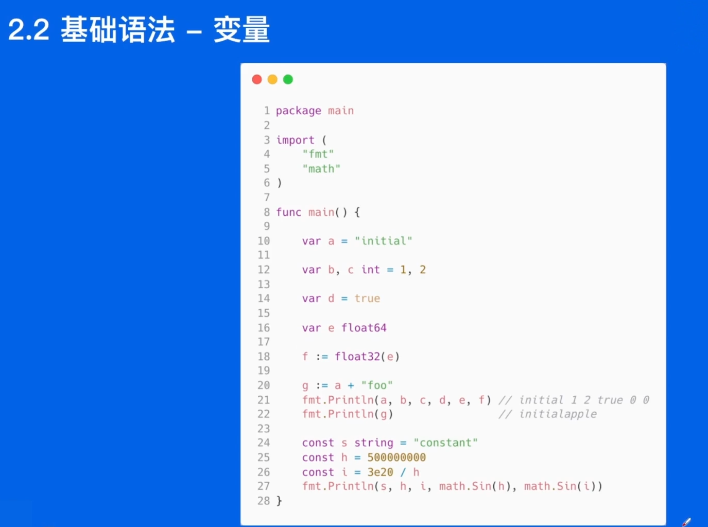

# GO

#### 优点


1.go语言的每一个文件都要归属于一个包

2.go语言带有指针 保留了C语言的执行编译方式和弱化指针

3.具有垃圾回收机制

4.天然的并发

​	语言方面就支持

​	基于goroutine轻量线程

​	用CPS并发模型实现

​	吸收了管道通信机制---形成了Go-channel

5.函数可以返回多个值

#### 执行过程

类似Java编译器的过程

1.xxx.go语言通过goc.exe编译，生成xxx.exe可执行文件

2.通过go.exe执行xxx.exe,具体是通过文件里的main()函数进行执行

#### 代码细节

1.非全局变量一旦声明就必须使用，仅仅赋值是编译不过去的，而全局变量可以不使用



```go
package main

import "fmt"

func main() {
   fmt.Printf("Hello Wrold!")
}
```

```Go
package main

import "fmt"

// 主方法
// main 方法
func main() {
   fmt.Print("这个是主方法:")
   fmt.Print(sum(1, 2))
}

func sum(a int, b int) (int, int) {
   var sum int = a + b
   var reduse int = a - b
   return sum, reduse
}
```

#### 变量类型

