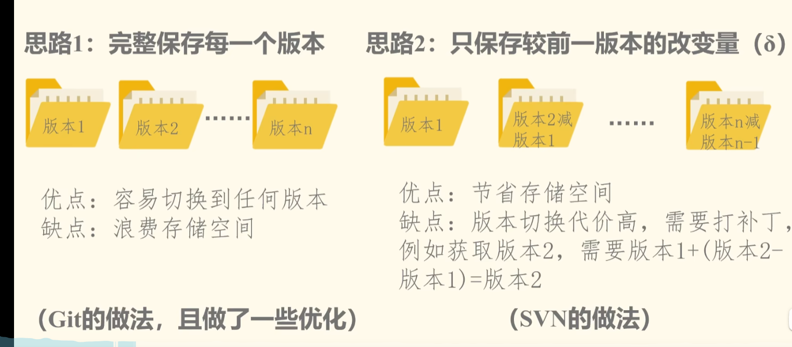
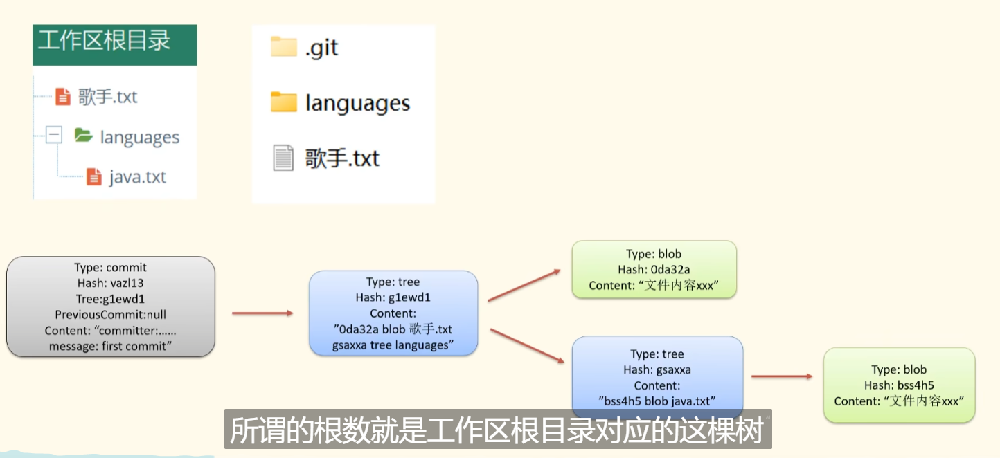
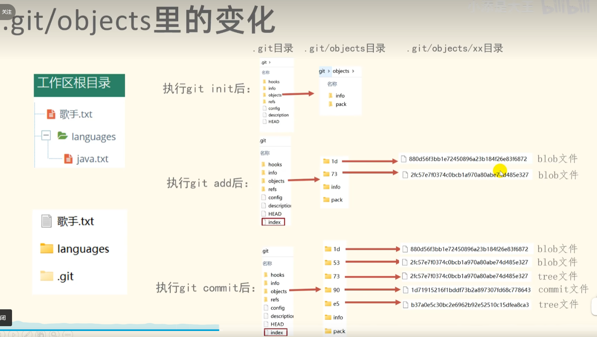

Git 源码

​	总结

​	1.每个版本都是一个文件夹或者文件

​	2.文件对应为Blob

​		目录对应Tree

​		提交记录对应为Commit文件

​	3.index 缓存区

​		每次未提交前，是放到这里

init之后

​	版本存放在----.git----objects里

###### 1.Git和SVN怎么进行版本存储的？

​	优化：对Blob文件进行压缩算法压缩

###### 2.Git如何判断要不要新建文件，怎么新建？

​	文件---转化为Blob

​	目录---转化为Tree

​	文件和目录都有对应的Hash值，通过比较Hash值来判断是否新建

###### 3.Git提交时转换为什么？

​	转换为一个对象

​	

​	对象的属性---

​	Type

​	Hash(自身的哈希值)

​	Tree Blob(文件夹或者文件的哈希值)

​	前序提交---上一次提交，指针，用来回复之前版本

​	信息

###### 4.Git提交的程序变化

###### 5.Git怎么写入Blob文件的？

​	通过字节流生成

###### 6.Index文件就是缓存区

​	缓存区加上Blob文件的记录

###### 7.git add命令的实现---先生成Blob文件，再提交到缓存区

​	