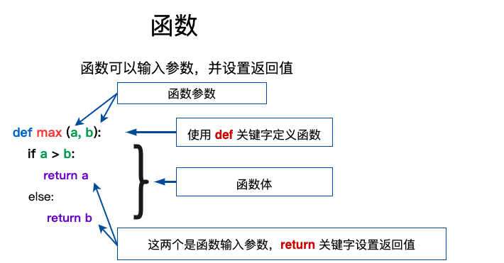

Pyhton

List

1.[]---在里面写数据

2.截取--左闭右开


3.加号 **+** 是列表连接运算符，星号 ***** 是重复操作。

​	如下实例：

```Py
list = [ 'abcd', 786 , 2.23, 'runoob', 70.2 ]
tinylist = [123, 'runoob']

**print** (list)       # 输出完整列表
**print** (list[0])     # 输出列表第一个元素
**print** (list[1:3])    # 从第二个开始输出到第三个元素
**print** (list[2:])     # 输出从第三个元素开始的所有元素
**print** (tinylist * 2)   # 输出两次列表
**print** (list + tinylist) # 连接列表
```

4.Python字符串不一样的是，列表中的元素是可以改变的---数组赋值

```python
>>> a = [1, 2, 3, 4, 5, 6]
>>> a[0] = 9
>>> a[2:5] = [13, 14, 15]
>>> a
[9, 2, 13, 14, 15, 6]
>>> a[2:5] = []  # 将对应的元素值设置为 []
>>> a
[9, 2, 6]
```
5.Python 列表截取可以接收第三个参数，参数作用是截取的步长


6.翻转字符串

```Python
def reverseWords(input):
     
    # 通过空格将字符串分隔符，把各个单词分隔为列表
    inputWords = input.split(" ")
 
    # 翻转字符串
    # 假设列表 list = [1,2,3,4],  
    # list[0]=1, list[1]=2 ，而 -1 表示最后一个元素 list[-1]=4 ( 与 list[3]=4 一样)
    # inputWords[-1::-1] 有三个参数
    # 第一个参数 -1 表示最后一个元素
    # 第二个参数为空，表示移动到列表末尾
    # 第三个参数为步长，-1 表示逆向
    inputWords=inputWords[-1::-1]
 
    # 重新组合字符串
    output = ' '.join(inputWords)
     
    return output
 
if __name__ == "__main__":
    input = 'I like runoob'
    rw = reverseWords(input)
    print(rw)
```

7.Tuple（元组）

元组（tuple）与列表类似，不同之处在于元组的元素不能修改。元组写在小括号 **()** 里，元素之间用逗号隔开。

```Python
tuple = ( 'abcd', 786 , 2.23, 'runoob', 70.2  )
tinytuple = (123, 'runoob')

print (tuple)             # 输出完整元组
print (tuple[0])          # 输出元组的第一个元素
print (tuple[1:3])        # 输出从第二个元素开始到第三个元素
print (tuple[2:])         # 输出从第三个元素开始的所有元素
print (tinytuple * 2)     # 输出两次元组
print (tuple + tinytuple) # 连接元组
```

```python
tup1 = ()    # 空元组
tup2 = (20,) # 一个元素，需要在元素后添加逗号
```

8.Set（集合）

集合（set）是由一个或数个形态各异的大小整体组成的，构成集合的事物或对象称作元素或是成员。

基本功能是进行成员关系测试和删除重复元素。

可以使用大括号 **{ }** 或者 **set()** 函数创建集合，注意：创建一个空集合必须用 **set()** 而不是 **{ }**，因为 **{ }** 是用来创建一个空字典。

```Python
sites = {'Google', 'Taobao', 'Runoob', 'Facebook', 'Zhihu', 'Baidu'}

print(sites)   # 输出集合，重复的元素被自动去掉

# 成员测试
if 'Runoob' in sites :
    print('Runoob 在集合中')
else :
    print('Runoob 不在集合中')


# set可以进行集合运算
a = set('abracadabra')
b = set('alacazam')

print(a)

print(a - b)     # a 和 b 的差集

print(a | b)     # a 和 b 的并集

print(a & b)     # a 和 b 的交集

print(a ^ b)     # a 和 b 中不同时存在的元素
```

9.Dictionary（字典）---HashMap

字典（dictionary）是Python中另一个非常有用的内置数据类型。

列表是有序的对象集合，字典是无序的对象集合。两者之间的区别在于：字典当中的元素是通过键来存取的，而不是通过偏移存取。

字典是一种映射类型，字典用 **{ }** 标识，它是一个无序的 **键(key) : 值(value)** 的集合。

键(key)必须使用不可变类型。

在同一个字典中，键(key)必须是唯一的。

```Python
dict = {}
dict['one'] = "1 - 菜鸟教程"
dict[2]     = "2 - 菜鸟工具"

tinydict = {'name': 'runoob','code':1, 'site': 'www.runoob.com'}


print (dict['one'])       # 输出键为 'one' 的值
print (dict[2])           # 输出键为 2 的值
print (tinydict)          # 输出完整的字典
print (tinydict.keys())   # 输出所有键
print (tinydict.values()) # 输出所有值
```

10.数据类型转换

​	自动转换

```Python
num_int = 123
num_flo = 1.23

num_new = num_int + num_flo

print("datatype of num_int:",type(num_int))
print("datatype of num_flo:",type(num_flo))

print("Value of num_new:",num_new)
print("datatype of num_new:",type(num_new))
```

​	强制转换

​	**int()** 强制转换为整型：

```Python
x = int(1)   # x 输出结果为 1
y = int(2.8) # y 输出结果为 2
z = int("3") # z 输出结果为 3
```

​	**float()** 强制转换为浮点型：

```Python
x = float(1)     # x 输出结果为 1.0
y = float(2.8)   # y 输出结果为 2.8
z = float("3")   # z 输出结果为 3.0
w = float("4.2") # w 输出结果为 4.2
```

**str()** 强制转换为字符串类型：

```Python
x = str("s1") # x 输出结果为 's1'
y = str(2)    # y 输出结果为 '2'
z = str(3.0)  # z 输出结果为 '3.0'
```

| 函数                                                         | 描述                                                |
| :----------------------------------------------------------- | :-------------------------------------------------- |
| [int(x [,base\])](https://www.runoob.com/python3/python-func-int.html) | 将x转换为一个整数                                   |
| [float(x)](https://www.runoob.com/python3/python-func-float.html) | 将x转换到一个浮点数                                 |
| [complex(real [,imag\])](https://www.runoob.com/python3/python-func-complex.html) | 创建一个复数                                        |
| [str(x)](https://www.runoob.com/python3/python-func-str.html) | 将对象 x 转换为字符串                               |
| [repr(x)](https://www.runoob.com/python3/python-func-repr.html) | 将对象 x 转换为表达式字符串                         |
| [eval(str)](https://www.runoob.com/python3/python-func-eval.html) | 用来计算在字符串中的有效Python表达式,并返回一个对象 |
| [tuple(s)](https://www.runoob.com/python3/python3-func-tuple.html) | 将序列 s 转换为一个元组                             |
| [list(s)](https://www.runoob.com/python3/python3-att-list-list.html) | 将序列 s 转换为一个列表                             |
| [set(s)](https://www.runoob.com/python3/python-func-set.html) | 转换为可变集合                                      |
| [dict(d)](https://www.runoob.com/python3/python-func-dict.html) | 创建一个字典。d 必须是一个 (key, value)元组序列。   |
| [frozenset(s)](https://www.runoob.com/python3/python-func-frozenset.html) | 转换为不可变集合                                    |
| [chr(x)](https://www.runoob.com/python3/python-func-chr.html) | 将一个整数转换为一个字符                            |
| [ord(x)](https://www.runoob.com/python3/python-func-ord.html) | 将一个字符转换为它的整数值                          |
| [hex(x)](https://www.runoob.com/python3/python-func-hex.html) | 将一个整数转换为一个十六进制字符串                  |
| [oct(x)](https://www.runoob.com/python3/python-func-oct.html) | 将一个整数转换为一个八进制字符串                    |

11.推导式---循环转换数据结构

- 列表(list)推导式
- 字典(dict)推导式
- 集合(set)推导式
- 元组(tuple)推导式

```Python
names=['Bob','Tom','alice','Jerry','Wendy','Smith']
new_names=[name.upper()for name in names if len(name)>3]
print(new_names)
```

```Python
multiples = [i for i in range(30) if i % 3 == 0]
print(multiples)
```

```Python
listdemo = ['Google','Runoob', 'Taobao']
newdict = {key:len(key) for key in listdemo if len(key)>3}

dic = {x: x**2 for x in (2, 4, 6)}
```

12.运算符

| **   | 幂 - 返回x的y次幂           | a**b 为10的21次方         |
| ---- | --------------------------- | ------------------------- |
| //   | 取整除 - 向下取接近商的整数 | `>>> 9//2 4 >>> -9//2 -5` |

| 运算符 | 逻辑表达式 | 描述                                                         | 实例                    |
| :----- | :--------- | :----------------------------------------------------------- | :---------------------- |
| and    | x and y    | 布尔"与" - 如果 x 为 False，x and y 返回 x 的值，否则返回 y 的计算值。 | (a and b) 返回 20。     |
| or     | x or y     | 布尔"或" - 如果 x 是 True，它返回 x 的值，否则它返回 y 的计算值。 | (a or b) 返回 10。      |
| not    | not x      | 布尔"非" - 如果 x 为 True，返回 False 。如果 x 为 False，它返回 True。 | not(a and b) 返回 False |

| 运算符 | 描述                                                    | 实例                                              |
| :----- | :------------------------------------------------------ | :------------------------------------------------ |
| in     | 如果在指定的序列中找到值返回 True，否则返回 False。     | x 在 y 序列中 , 如果 x 在 y 序列中返回 True。     |
| not in | 如果在指定的序列中没有找到值返回 True，否则返回 False。 | x 不在 y 序列中 , 如果 x 不在 y 序列中返回 True。 |

| 运算符 | 描述                                        | 实例                                                         |
| :----- | :------------------------------------------ | :----------------------------------------------------------- |
| is     | is 是判断两个标识符是不是引用自一个对象     | **x is y**, 类似 **id(x) == id(y)** , 如果引用的是同一个对象则返回 True，否则返回 False |
| is not | is not 是判断两个标识符是不是引用自不同对象 | **x is not y** ， 类似 **id(x) != id(y)**。如果引用的不是同一个对象则返回结果 True，否则返回 False。 |

13.关键字-end 关键字

```Python
a, b = 0, 1
while b < 1000:
    print(b, end=',')
    a, b = b, a+b
```

14.条件控制关键字

```python
var1 = 100
if var1:
    print("1 - if 表达式条件为 true")
    print(var1)

var2 = 0
if var2:
    print("2 - if 表达式条件为 true")
    print(var2)
print("Good bye!")
```

15.循环-while+else for+else

```Python
for x in range(6):
  print(x)
else:
  print("Finally finished!")
```

16.迭代终止异常关键字---StopIteration

​	StopIteration 异常用于标识迭代的完成，防止出现无限循环的情况，在 __next__() 方法中我们可以设置在完成指定循环次数后触发 StopIteration 异常来结束迭代。

17.函数



```Python
def digui(n):
    if n==1:
        return 1
    if n==0:
        return 0
    if n==2:
        return 2
    return digui(n-1)+digui(n-2);
ans=digui(3)
print(ans)
```

18.不定长参数

```Python
def printinfo(arg1, *vartuple):
    "打印任何传入的参数"
    print("输出: ")
    print(arg1)
    print(vartuple)


# 调用printinfo 函数
printinfo(70, 60, 50)
```

加了两个星号 ***\*** 的参数会以字典的形式导入。

```Python
# 可写函数说明
def printinfo(arg1, **vardict):
    "打印任何传入的参数"
    print("输出: ")
    print(arg1)
    print(vardict)


# 调用printinfo 函数
printinfo(1, a=2, b=3)
```

以上实例输出结果：

```
输出: 
1
{'a': 2, 'b': 3}
```

19.lambda 函数

```Python
x = lambda a : a + 10
print(x(5))
```

20.函数和lambda表示结合

```Python
def myfunc(n):
  return lambda a : a * n
 
mydoubler = myfunc(2)
mytripler = myfunc(3)
 
print(mydoubler(11))
print(mytripler(11))
```

21.数据结构的主要方法

## 列表

| 方法              | 描述                                                         |
| :---------------- | :----------------------------------------------------------- |
| list.append(x)    | 把一个元素添加到列表的结尾，相当于 a[len(a):] = [x]。        |
| list.extend(L)    | 通过添加指定列表的所有元素来扩充列表，相当于 a[len(a):] = L。 |
| list.insert(i, x) | 在指定位置插入一个元素。第一个参数是准备插入到其前面的那个元素的索引，例如 a.insert(0, x) 会插入到整个列表之前，而 a.insert(len(a), x) 相当于 a.append(x) 。 |
| list.remove(x)    | 删除列表中值为 x 的第一个元素。如果没有这样的元素，就会返回一个错误。 |
| list.pop([i])     | 从列表的指定位置移除元素，并将其返回。如果没有指定索引，a.pop()返回最后一个元素。元素随即从列表中被移除。（方法中 i 两边的方括号表示这个参数是可选的，而不是要求你输入一对方括号，你会经常在 Python 库参考手册中遇到这样的标记。） |
| list.clear()      | 移除列表中的所有项，等于del a[:]。                           |
| list.index(x)     | 返回列表中第一个值为 x 的元素的索引。如果没有匹配的元素就会返回一个错误。 |
| list.count(x)     | 返回 x 在列表中出现的次数。                                  |
| list.sort()       | 对列表中的元素进行排序。                                     |
| list.reverse()    | 倒排列表中的元素。                                           |
| list.copy()       | 返回列表的浅复制，等于a[:]。                                 |

## 将列表当做堆栈使用

列表方法使得列表可以很方便的作为一个堆栈来使用，堆栈作为特定的数据结构，最先进入的元素最后一个被释放（后进先出）。用 append() 方法可以把一个元素添加到堆栈顶。用不指定索引的 pop() 方法可以把一个元素从堆栈顶释放出来。

```
>>> stack = [3, 4, 5]
>>> stack.append(6)
>>> stack.append(7)
>>> stack
[3, 4, 5, 6, 7]
>>> stack.pop()
7
>>> stack
[3, 4, 5, 6]
>>> stack.pop()
6
>>> stack.pop()
5
>>> stack
[3, 4]
```

## 将列表当作队列使用

也可以把列表当做队列用，只是在队列里第一加入的元素，第一个取出来；但是拿列表用作这样的目的效率不高。在列表的最后添加或者弹出元素速度快，然而在列表里插入或者从头部弹出速度却不快（因为所有其他的元素都得一个一个地移动）。

```
>>> from collections import deque
>>> queue = deque(["Eric", "John", "Michael"])
>>> queue.append("Terry")           # Terry arrives
>>> queue.append("Graham")          # Graham arrives
>>> queue.popleft()                 # The first to arrive now leaves
'Eric'
>>> queue.popleft()                 # The second to arrive now leaves
'John'
>>> queue                           # Remaining queue in order of arrival
deque(['Michael', 'Terry', 'Graham'])
```

