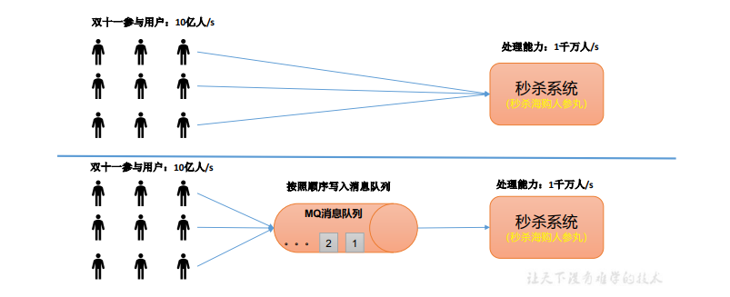
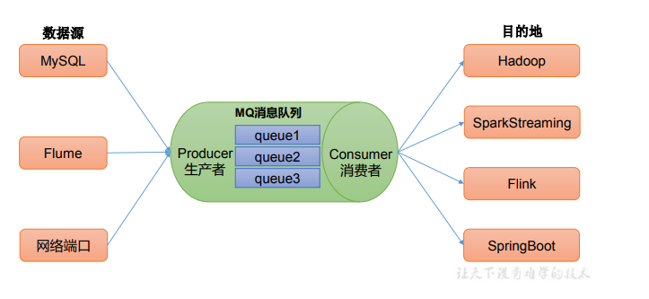
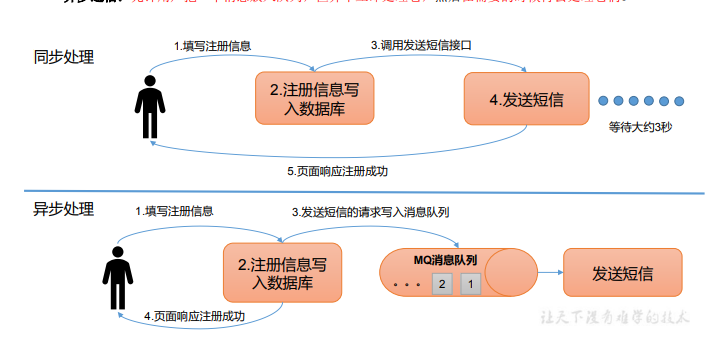
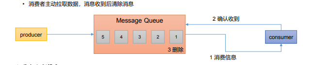
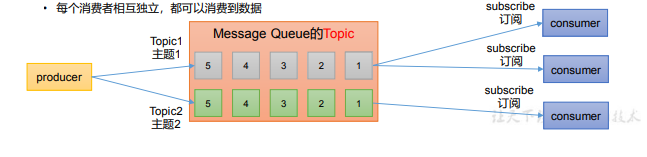
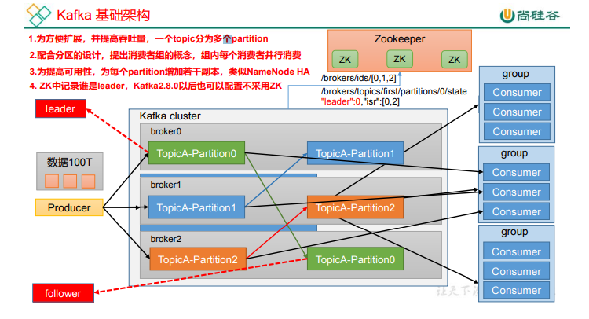

# Kafka

# 1.消息队列基础解释与应用

###### 1.传统消息队列的应用场景

​	传统的消息队列的主要应用场景包括：缓存/消峰、解耦和异步通信。

###### 2.消息队列的应用场景——缓冲/消峰

​	消息队列：Message Queue---先进先出

​	有助于控制和优化数据流经过系统的速度，解决生产消息和消费消息的处理速度不一致的情况。

###### 3.消息队列的应用场景——解耦

​	解耦：允许你独立的扩展或修改两边的处理过程，只要确保它们遵守同样的接口约束。

​	

###### 4.消息队列的应用场景——异步通信

异步通信：允许用户把一个消息放入队列，但并不立即处理它，然后在需要的时候再去处理它们。

###### 5.消息队列的两种模式-----点对点模式

​	• 消费者主动拉取数据，消息收到后清除消息

###### 6.消息队列的两种模式-----发布/订阅模式

• 可以有多个topic主题（浏览、点赞、收藏、评论等）	

• 消费者消费数据之后，不删除数据

• 每个消费者相互独立，都可以消费到数据

###### 7.Kafka基础架构

​	1.为方便扩展，并提高吞吐量，一个topic分为多个partition 

​	 2.配合分区的设计，提出消费者组的概念，组内每个消费者并行消费

​	3.为提高可用性，为每个partition增加若干副本，类似NameNode HA

​	4. ZK中记录谁是leader，Kafka2.8.0以后也可以配置不采用ZK

（1）Producer：消息生产者，就是向 Kafka broker 发消息的客户端。 

（2）Consumer：消息消费者，向 Kafka broker 取消息的客户端。 

（3）Consumer Group（CG）：消费者组，由多个 consumer 组成。消费者组内每个消 费者负责消费不同分区的数据，一个分区只能由一个组内消费者消费；消费者组之间互不 影响。所有的消费者都属于某个消费者组，即消费者组是逻辑上的一个订阅者。

（4）Broker：一台 Kafka 服务器就是一个 broker。一个集群由多个 broker 组成。一个 broker 可以容纳多个 topic。

（5）Topic：可以理解为一个队列，生产者和消费者面向的都是一个 topic。 

（6）Partition：为了实现扩展性，一个非常大的 topic 可以分布到多个 broker（即服 务器）上，一个 topic 可以分为多个 partition，每个 partition 是一个有序的队列。 

（7）Replica：副本。一个 topic 的每个分区都有若干个副本，一个 Leader 和若干个 Follower。

 （8）Leader：每个分区多个副本的“主”，生产者发送数据的对象，以及消费者消费数 据的对象都是 Leader。 （9）Follower：每个分区多个副本中的“从”，实时从 Leader 中同步数据，保持和 Leader 数据的同步。Leader 发生故障时，某个 Follower 会成为新的 Leader。