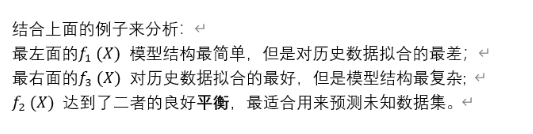

人工智能-尚硅谷

​	阿尔法go用的是蒙特卡洛搜索树

1.机器学习基础

学习方式：

监督：有信息输入，告知如何分类

无监督：最常用的为聚类无监督学习

半监督

强化学习

2.线性回归模型

拟合为例如最小二乘法的形式

​	K折交叉验证，通过多次取为测试集的形式来进行设计模型

3.目标函数

4.损失函数

为了验证拟合的好坏，使用一个函数来度量拟合的程度----损失函数

5.常用损失函数

6.过拟合和欠拟合

7.如何避免过拟合？

​	定义一个函数 J(f)，专门用来度量模型的复杂度，在机器学习中也叫**正则化**(regularization)。

​	常用的正则化函数有L1和L2范数。

​	

8.优化函数：损失函数+正则化函数

9.**目标函数**：最优化经验风险和结构风险

10.风险函数

​	风险函数是损失函数的期望

11.经验风险

​	f(X)关于训练集的平均损失称作**经验风险**(empirical risk)，即

​	

​	

12.目标函数公式=偏差+方差

​	

• 优化训练误差可以让模型具有预测性

• 优化正则可以让模型更简单，使其预测更加稳定

因此优化目标函数通常就是：**Bias and Variance Trade-off**，**偏差和方差的平衡**

当我们的模型表现不佳时，通常是出现两种问题，一种是高偏差(hign bias) 问题，一种是高方差(hign variance) 问题。

\- 偏差: 描述模型输出结果的期望与样本真实结果的差距。

\- 方差: 描述模型对于给定值的输出稳定性。

就像打靶一样，偏差描述了我们的射击总体是否偏离了我们的目标，而方差描述了射击准不准。

13.目标函数的改进方式

高偏差：引入更多的相关特征

采用多项式特征

减小正则化参数 λ

高方差：采集更多的样本数据

减少特征数量，去除非主要的特征

增加正则化参数 λ