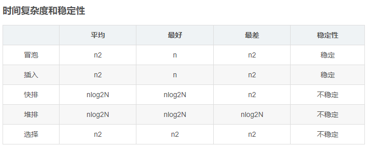
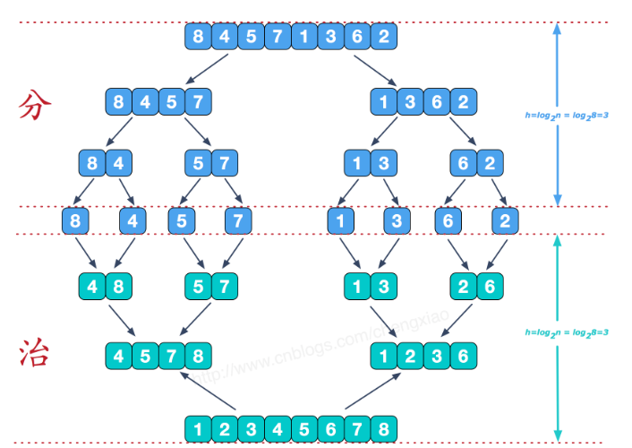
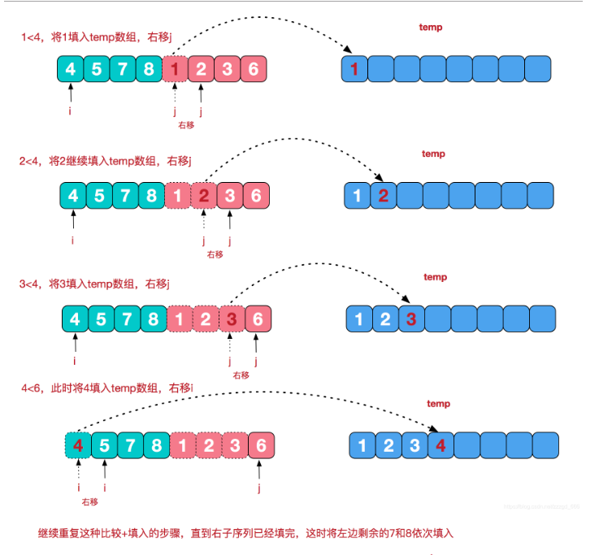

##### 排序整合



###### 1.插入排序

一次插入排序的操作过程：
`将待插元素，依次与已排序好的子数列元素从后到前进行比较，如果当前元素值比待插元素值大，则将移位到与其相邻的后一个位置，否则直接将待插元素插入当前元素相邻的后一位置，因为说明已经找到插入点的最终位置`

```java
    public static void sort(int[] arr) {
        if (arr.length >= 2) {
            for (int i = 1; i < arr.length; i++) {
                //挖出一个要用来插入的值,同时位置上留下一个可以存新的值的坑
                int x = arr[i];
                int j = i - 1;
                //在前面有一个或连续多个值比x大的时候,一直循环往前面找,将x插入到这串值前面
                while (j >= 0 && arr[j] > x) {
                    //当arr[j]比x大的时候,将j向后移一位,正好填到坑中
                    arr[j + 1] = arr[j];
                    j--;
                }
                //将x插入到最前面
                arr[j + 1] = x;
            }
        }
    }
```

###### 2.快速排序

​	我自己的思路

​	1.1-n

​	2.取1对应的数temp作为中间值

​	3.比temp小的放左边，比temp大的放右边，与temp相同的放左边或者右边都可以

​	4.左右两边同时开始

​	5.取左边第一个为temp 继续

​	6.取右边第一个为temp 继续

​	就是设置一个`标准值`, 将`大`于这个值的放到`右边`(不管排序), 将`小`于这个值的放到`左边`(不管排序), 那么这样只是区分了左小右大, 没有排序, 没关系, 左右两边再重复这个步骤.直到不能分了为止.

```java
    public static void sort(int[] arr,int begin,int end) {
        //先定义两个参数接收排序起始值和结束值
        int a = begin;
        int b = end;
        //先判断a是否大于b

        if (a >= b) {
            //没必要排序
            return;
        }
        //基准数,默认设置为第一个值
        int x = arr[a];

        //循环
        while (a < b) {
            //从后往前找,找到一个比基准数x小的值,赋给arr[a]
            //如果a和b的逻辑正确--a<b ,并且最后一个值arr[b]>x,就一直往下找,直到找到后面的值大于x
            while (a < b && arr[b] >= x) {
                b--;
            }
            //跳出循环,两种情况,一是a和b的逻辑不对了,a>=b,这时候排序结束.二是在后面找到了比x小的值
            if (a < b) {
                //将这时候找到的arr[b]放到最前面arr[a]
                arr[a] = arr[b];
                //排序的起始位置后移一位
                a++;
            }

            //从前往后找,找到一个比基准数x大的值,放在最后面arr[b]
            while (a < b && arr[a] <= x) {
                a++;
            }
            if (a < b) {
                arr[b] = arr[a];
                //排序的终止位置前移一位
                b--;
            }
        }
        //跳出循环 a < b的逻辑不成立了,a==b重合了,此时将x赋值回去arr[a]
        arr[a] = x;
        //调用递归函数,再细分再排序
        sort(arr,begin,a-1);
        sort(arr,a+1,end);
    }
```

###### 3.冒泡排序

​	核心思路

​	两两比较----每一轮找当前的最大值

​	如果有n个数  数组从0-n-1----需要多少轮？ n-1轮

​	01比 12比 23比 34比... n-2和n-1比

​	大的在后面小的在左边

```java
    public static void sort(int[] arr) {
        for(int i=1;i<arr.length;i++){
            for(int j=0;j<arr.length-1;j++){
                if(arr[j]>arr[j+1]){
                    int temp = arr[j];
                    arr[j] = arr[j+1];
                    arr[j+1] = temp;
                }
            }
        }
    }
```

###### 4.选择排序

​	如何理解？

​	分为已排序和未排序数组

​	1.从未排序数组中找最小值

​	2.放到已排序数组的末尾

​	3.循环直至未排序数组的长度为0

```java
    public static void sort(int[] arr){
        List<Integer> Sorted=new ArrayList<>();
        List<Integer> Unsorted= new ArrayList<>();
        for(int a:arr){
            Unsorted.add(a);
        }
        while (Unsorted.size()!=0){
            int min=Integer.MAX_VALUE;
            int index=-1;
            for(int i=0;i<Unsorted.size();i++){
                min=Math.max(min,Unsorted.get(i));
            }
            for(int i=0;i<Unsorted.size();i++){
                if(min== Unsorted.get(i)){
                    index=i;
                    break;
                }
            }
            Sorted.add(min);
            Unsorted.remove(index);
        }
        int index=0;
        for(int a:Sorted){
            arr[index]=a;
            index++;
        }
    }
```

###### 5.归并排序

​	分治算法





​	数组长度为n 从0到n-1

​	分：分为 左 和 右

​	再二分---直至分为1个

​	按照大小拼合---左+右

​	左右都是排序后的

​	合：

​	左和右怎么合?

​	left 指向 左0

​	right 指向 右0

​	比较当前的两边的大小

```java
    public static void sort(int[] a,int s,int e) {
        int m = (s + e) / 2;
        if (s < e){
            sort(a,s,m);
            sort(a,m+1,e);
            //归并
            merge(a,s,m,e);
        }
    }
    private static void merge(int[] a, int s, int m, int e) {
        //初始化一个从起始s到终止e的一个数组
        int[] temp = new int[(e - s) + 1];
        //左起始指针
        int l = s;
        //右起始指针
        int r = m+1;
        int i = 0;
        //将s-e这段数据在逻辑上一分为二,l-m为一个左边的数组,r-e为一个右边的数组,两边都是有序的
        //从两边的第一个指针开始遍历,将其中小的那个值放在temp数组中
        while (l <= m && r <= e){
            if (a[l] < a[r]){
                temp[i++] = a[l++];
            }else{
                temp[i++] = a[r++];
            }
        }

        //将两个数组剩余的数放到temp中
        while (l <= m){
            temp[i++] = a[l++];
        }
        while (r <= e){
            temp[i++] = a[r++];
        }

        //将temp数组覆盖原数组
        for (int n = 0; n < temp.length; n++) {
            a[s+n] = temp[n];
        }

    }
```

###### 6.堆排序

​	核心是用大顶堆来排序

​	大顶堆是什么？

​	是二叉树 

​	节点的左孩子和右孩子的值都小于当前节点的值

​	1.无序数组建堆

​	2.调整堆

​	3.根据调整后的堆排序

​		每次找出最大值---将最大值删除出堆---放到数组最后位置