# 网络

### 1.HTTP协议

###### 1.HTTP+HTTPS

超文本传输协议

 超文本 传输 协议

HTTPS解决安全问题---密文传输

​	混合加密+摘要算法

###### 2.Get Post

安全 不破坏资源

幂等 多次请求结果一致

###### 3.HTTP 1.1 优缺点

 简单 Header+Body

方便 不存信息---无法保存客户信息---Cookies

不安全 明文送信息----HTTPS+JWT

性能 长连接-----只要任意一端没有明确提出断开连接，则保持 TCP 连接状态。

​		 长连接-----导致管道传输可能-----请求一直发，请求对列---之前是事务-事务

长连接新问题：队头阻塞------第一个请求被堵

###### 4.HTTPS 是如何建立连接的？其间交互了什么？

​	1.ClientHello(需要被兼容)

​	版本协议+客户端随机数+用什么加密算法

​	2.ServerHello(兼容客户端)

​	确认协议版本+确认算法

​	产生服务端随机数+提供服务端数字证书

​	3.客户端回应

​	CA公钥确认证书

​	第三随机数+加密算法改变通知（用会话密钥）

​	客户端+服务端-----通过3个随机数各自生成会话秘钥

​	4.服务端最后回应

​	OK的意思

###### 5.HTTP 2 3目的就是优化性能

​	1.1改动

​	长连接+管道运输-----队首阻塞

###### 6.那上面的 HTTP/1.1 的性能瓶颈，HTTP/2 做了什么优化？

​	1.头部压缩

​	相同请求头只发索引表中索引

​	2.发二进制

​	3.数据流

​	4.多路复用---人人都是车头

​	5.服务端主动推送--先发也许会用到的(Cache Push)

###### 7.HTTP/2 有哪些缺陷？HTTP/3 做了哪些优化？

​	HTTP/2 多个请求复用一个TCP连接，一旦发生丢包，就会阻塞住所有的 HTTP 请求.

​	HTTP3 改为 UDP连接

### 2.IP

###### 1.MAC与IP

​	MAC---区间通行

​	IP----起点到终点

###### 2.IP

​	有一点比较核心-----IP4原本是32位二进制的，点分为四组----转换为现在的IP地址

​	IP6 64位 16位分一组

###### 3.网络地址+主机地址

​	32位---ABCDE

​	8 24

​	16 16

​	24 8

###### 4.子网划分

​	将主机地址----划分为子网网络地址+子网主机地址

###### 5.域名解析---DNS解析流程

​	1.浏览器查缓存+操作系统缓存+检查本机域名解析文件

​	2.浏览器请求本地DNS服务器

​	3.DNS服务器返根服务器

​	4.根服务器返域名服务器

###### 6.IP分片与重组

​	最常见数据链路是以太网，它的 MTU 是 1500 字节。

​	那么当 IP 数据包大小大于 MTU 时， IP 数据包就会被分片。

###### 7.自己的理解

​	首先个人用户用的可能是分化后再分化的网络节点

​	传输信号像快递

​	IP---公网IP

​			私网IP+子网主机地址

​	MAC---硬件编号

​	交换机---多个MAC并入其中---区分不同电脑

​					交换机和交换机----通过路由进行通信

​	路由器---区分IP地址---区分公网IP地址----通信不同交换机信号

​	如果公网IP在一个地方----那就是同一局域网，不走路由--直接广播

​	如果公网IP不相同----不同局域网---走路由，传输快递

##### 3.ping 的工作原理

 1.ICMP 是什么？

 	互联网控制报文协议 Internet Control Message Protocol

 2.IP包是什么还记得吗？

 	协议中规定的传输量，如果大于就要分包---1500字节

 3.ICMP 功能都有啥？

​	 确认是否成功送达+报告失败原因+改善设置

​	 怎么发送？

​	 通过IP发送----例子中路由器2---路由器1----主机A

 4.ICMP 包头格式

 	封装在IP包里

​	 IP头+ICMP报文

​	 1.包头类型

​	 查询报文 或者 差错报文

​	 2.查询报文

 	0 8 两种类型

​	 8发送 0接受

 	3.差错报文

​	 3---不可送达

 	4---原点抑制消息
 	
 	5---重定向
 	
 	11---超时消息

5.差错报文中 不可送达-3 的几种分类

​	 0 网络不可达

​	 找不到此IP地址

​	 1 主机不可达

​	 找不到MAC地址

​	 2 协议不可达

 	主机端有可能禁止TCP协议
 	
 	3 端口不可达

​	 具体的程序没有监听

​	 4 设置了不可分片

​	 就是只接受不分包数据 分包就直接舍弃

6.原点抑制消息 4

 	缓和拥堵情况----增大IP包的传输间隔

7.重定向消息 5

​	 主机端的路径不是最优路径----返重定向

 	定向到最短路径

8.超时消息 11

​	 IP 包中有一个字段叫做 TTL （ Time To Live ，生存周期），它的值随着每经过一次路由器就会减 1，直到减到 0 时该 IP 包会被丢弃。

​	 如果TTL==0 返回超时消息 ----此包被抛弃

 	设置过期时间，防止无限转发

9.查询报文类型的使用

​	 比较重点的是Ping流程如何：

​	 1.构建报文本身--Body

​	 ICMP回送请求消息-----类型+序号+时间

​											区分是什么消息+区分ping的时候发出的连续数据包是哪一个

​	2.构建IP头--Header part1

​	源地址---自己的IP---自己所在小区名

​	目标地址---目标的IP---目标所在小区名

​	遵循协议：1---代表ICMP---走哪家快递公司

​	2.构建MAC头---通过IP-mac映射表或者路由通过ARC发包获取

​	源MAC---自己的姓名

​	目标MAC---对方姓名

​	3.传输过程

​	 A传到交换机判断是不是一个子网，子网直接广播---通过IP和子关网络码判断

​	传输到分管路由,传入到分管路由

​	路由到交换机--交换机通过mac到B

​		B看IP与MAC是不是对应，不对应直接舍弃

​	4.返回

​	B接受后传返信------ICMP报文类型设置为0 序号设置为接受时信号

​	A过期时间没有接受返信----判定不通---返不可达

​							接受----返回时间-发出时间--延迟

10.差错报文使用------traceroute 集成应用

11.traceroute 用处1：设置特殊TTL（过期时间），追踪途经路由器---获取路由IP

​	比如指向特定IP地址：192.168.1.100

​	

​	怎么工作？

​	TTL从1递增，相当于每路过一个路由----返一个路由的地址

​	递增---拿到所有的路由IP

​	

​	发送方如何知道发出的 UDP 包是否到达了目的主机呢？

​		利用差错代码机制---采用不可达的机制

​		故意填错收货人-----这样就会知道---货到了

​	traceroute 在发送 UDP 包时，会填入一个不可能的端口号值作为 UDP 目标端口号（大于 3000 ）。当目的主机，收到 UDP 包后，会返回 ICMP 差错报文消息，但这个差错报文消息的类型是「端口 不可达」。 所以，当差错报文类型是端口不可达时，说明发送方发出的 UDP 包到达了目的主机。

12.traceroute 用处2：故意设置不分片----确定路径MTU---确定路径的最大文件大小

​		因为有的时候我们并不知道路由器的 MTU 大小，以太网的数据链路上的 MTU 通常是 1500 字 节，但是非以外网的 MTU 值就不一样了，所以我们要知道 MTU 的大小，从而控制发送的包大小

​		

​		工作原理：

​		每次收到 ICMP 差错报文时就减少包的大小，以此来定位一个合适的 MTU 值，成功抵达目标主机

### 4.URL的解析过程

​		1.解析URL-----实际上就是找到文件所在的位置 请求它

​		协议+服务器+目录位置

​		http://www.server.com/dir1/file1.html

​		如果没有 目录位置----默认请求的为 index or default

​		2.生成HTTP请求报文----请求头+Body（请求主体）

​		请求头带参数

​		请求主体填信息---基本上用Json来传

​		3.通过Web服务器查出IP地址----DNS服务器

​		DNS服务器保存----IP地址与Web服务器的映射

​		如果属于同一子网，直接过去了

​		不是同一字网，查询服务器的IP地址

​		

​		复习过往知识----域名层级关系？

​		从左往右，越来越大，跟我国相反

​		从大往小找----找到目标IP

​		根DNS---顶级域DNS(com)----权威DNS(server.com)

​		4.具体的域名解析过程

​		

​			1.查浏览器缓存+查本地缓存

​			2.查询本地DNS服务器

​			3.本地DNS直接去最高级别----根域名服务器

​			4.一层一层挨个往下查找

​			5.返IP地址给本地DNS服务器

​		5.从DNS获取IP后-------HTTP通过协议栈传输信息

​			

​			1.DNS是什么？

​			还记得吗，DNS就是Web域名和IP的地址关系---通过IP可以得到域名，域名也可以获取IP建立联系

​			2.域名层级

​			从低到高---逐步是最高的层级

​			3.域名-IP的解析过程

​			本地客户端-浏览器缓存-本地缓存-根域名-顶级域名-权威DNS服务器-IP返本地DNS-DNS返IP到客户端

​		6.IP地址的具体应用---协议栈的用途

​			1.浏览器调用Socket库

​		 	2.Socket委托协议栈工作-----选取协议TCP或者UDP

​			3.IP协议发包

​								ICMP+ARP 组合

​			4.IP网卡驱动---网卡硬件

​			5.网卡收取二进制网络信号

​	

​		7.TCP协议

​			核心-可靠传输--三次握手--稳定 慢 安全

​			协议架构

​			1.源端口+目标端口----此时信号的传输已经是两个应用之间的传输

​				8080就是端口

​				IP+端口

​				IP定位网络地址

​				MAC定位人

​				端口定位功能

​			2.序号---数据包序号

​			3.确认号+状态位

​				确定是否收到

​				表示包的类型--发起连接、回复、重连、结束连接

​			4.窗口大小----维护速度保持

​		8.TCP的三次握手

​			1.客户端----服务端

​					请求

​			2.服务端---客户端

​					我收到你的请求

​			3.客户端---服务端

​					我收到 我收到你的请求

​			目的：确保双方都可以发送+接受

​		9.TCP报文生成

​			TCP头部+HTTP报文

​			组装完成

​		10.IP的作用体现---远程定位

​			1.IP地址存在IP头中，也就是存在TCP的前边

​			2.路由表判断---源IP+目标IP

​			

​		11.增加IP之后的网络报文格式

​		

​			IP头部+TCP头部+HTTP报文

​			IP定网络在哪里---用什么协议

​			TCP定端口---是什么程序

​			HTTP报文---包含了具体的发送信息

​		12.在IP头部前加上----MAC头部

​			

​			回忆：MAC头部是干什么的？

​			机器号----定位到是哪个机器---定位到是谁

​			

​			如何获取？

​			1.路由表----建立MAC与IP的对应关系

​			2.ARP协议-----交换机向子网内所有地址发送广播---对应的话就会返信---返IP+MAC地址

​		13.完整的请求体

​			MAC头部+IP头部+TCP头部+HTTP报文

​			MAC地址---给哪个人+用什么IP协议？

​			IP头部---往哪个省发？用什么传输协议---TCP

​			TCP头部---往哪个程序上发，程序就是端口对应

​			HTTP报文---数据

​		14.网卡----二进制转为电信号

​			

​		15.交换机---MAC层----寻找MAC地址的转化器

​				IP来到这里---通过某个端口找到目标MAC---发送信号

## 5.TCP详解

#### 	1.重传机制

​		1.超时重传

​					数据包丢失-----确认应答丢失

​		2.超时重传时间RTO与报文往返RTT

​					核心：将RTO设定为比RTT略大即可

​					采用平均值或者其他算法获取

​		3.快速重传----不以时间驱动，数据驱动----三次相同报文--推测丢失点

​		4.SACK+D-SACK 信息可以告知哪些是未被传送的，选择传送

#### 	2.TCP窗口

​			窗口内可以直接发送或者接受 不需要等待回应

​			通过三个指针定位窗口的三个位置

​			 SND.UNA---绝对指针 指向已发送第一个

​			SND.NXT----绝对指针 指向未发送，大小在可发送内---第一个

#### 	3.流量控制

​			1.系统的缓冲区，是如何影响发送窗口和接收窗口的呢？

​			TCP 规定是不允许同时减少缓存又收缩窗口的，而是采用先收缩窗口，过段时 间再减少缓存，这样就可以避免了丢包情况。

​			2.窗口关闭

​			双方窗口大小都为0-----窗口关闭

​			一旦丢失关闭ACK报文-----客户端 服务端进入死锁

​			3.TCP 是如何解决窗口关闭时，潜在的死锁现象呢？

​			只要 TCP 连接一方收到对方的零窗口通 知，就启动持续计时器。

​			只要 TCP 连接一方收到对方的零窗口通 知，就启动持续计时器。

​			5.怎么让接收方不通告小窗口呢？

​			接收方通常的策略如下: 

​			当「窗口大小」小于 min( MSS，缓存空间/2 ) ，也就是小于 MSS 与 1/2 缓存大小中的最小值时，就会 向发送方通告窗口为 0 ，也就阻止了发送方再发数据过来。等到接收方处理了一些数据后，窗口大小 >= MSS，或者接收方缓存空间有一半可以使用，就可以把窗 口打开让发送方发送数据过来。

​			6.怎么让发送方避免发送小数据呢？

​			发送方通常的策略: 使用 Nagle 算法，该算法的思路是延时处理，它满足以下两个条件中的一条才可以发送数据： 要等到窗口大小 >= MSS 或是 数据大小 >= MSS 收到之前发送数据的 ack 回包 只要没满足上面条件中的一条，发送方一直在囤积数据，直到满足上面的发送条件。

#### 	4.拥塞控制

​	 		1.为什么要有拥塞控制呀，不是有流量控制了吗？

​				避免「发送方」的数据填满整个网络。

​			  2.什么是拥塞窗口？和发送窗口有什么关系呢？

​				拥塞窗口 cwnd是发送方维护的一个的状态变量，它会根据网络的拥塞程度动态变化的。

​				发送窗口 swnd 和接收窗口 rwnd 是约等于的关系----那么由于加入了拥塞窗口的 概念后，此时发送窗口的值是swnd = min(cwnd, rwnd)

​				只要网络中没有出现拥塞， cwnd 就会增大； 

​				但网络中出现了拥塞， cwnd 就减少；

​			3.那么怎么知道当前网络是否出现了拥塞呢？

​				其实只要「发送方」没有在规定时间内接收到 ACK 应答报文，也就是发生了超时重传，就会认为网络 出现了用拥塞。

​			4.拥塞控制有哪些控制算法？

​				拥塞控制主要是四个算法： 慢启动 拥塞避免 拥塞发生 快速恢复

​			5.慢启动

​				当发送方每收到一个 ACK，拥塞窗口 cwnd 的大小就会加 1。

​			6.那慢启动涨到什么时候是个头呢？

​				有一个叫慢启动门限 ssthresh （slow start threshold）状态变量。 

​				当 cwnd < ssthresh 时，使用慢启动算法。 

​				当 cwnd >= ssthresh 时，就会使用「拥塞避免算法」。

​				指数扩容

​			7.拥塞避免算法

​				每当收到一个 ACK 时，cwnd 增加 1/cwnd。

​				线性增长

​			8.拥塞发生

​			9.发生超时重传的拥塞发生算法

​				1.将变更阈值设为现在的阻塞窗口大小/2

​				2.重新启动慢启动

​			10.发生快速重传的拥塞发生算法

​				ssthresh 和 cwnd 变化如下：

​			 	cwnd = cwnd/2 ，也就是设置为原来的一半;

​				 ssthresh = cwnd ; 进入快速恢复算法

​			11.快速恢复

​				拥塞窗口 cwnd = ssthresh + 3 （ 3 的意思是确认有 3 个数据包被收到了）；

​				 重传丢失的数据包； 

​				如果再收到重复的 ACK，那么 cwnd 增加 1； 

​				如果收到新数据的 ACK 后，把 cwnd 设置为第一步中的 ssthresh 的值，原因是该 ACK 确认了新 的数据，说明从 duplicated ACK 时的数据都已收到，该恢复过程已经结束，可以回到恢复之前的 状态了，也即再次进入拥塞避免状态；

### 	6.TCP--网络包分析

##### 	 	1.分析网络两大工具

​		tcpdump 和 Wireshark

​		

​		1.tcpdump 和 Wireshark 有什么区别？

​		tcpdump 仅支持命令行格式使用，常用在 Linux 服务器中抓取和分析网络包

​		Wireshark 除了可以抓包外，还提供了可视化分析网络包的图形页面。

​		先用 tcpdump 命令在 Linux 服务器上抓包，接着把抓包的文件拖 出到 Windows 电脑后，用 Wireshark 可视化分析。

​		

​		2.tcpdump 在 Linux 下如何抓包？

​		例子：抓取下面的 ping 的数据包

​		ping数据包---icmp协议---通过tcpdump命令抓包

​		

​		抓包后输出格式---

​		

​		

​		

​		tcpdump常用选项

​		

​		

​		常见的过滤表达式类

​		

​		

​		目的：通过指令抓取数据包---为接下来的分析提供基本素材

​		3.Wireshark 工具如何分析数据包？

​		通过Tcpdump获取的数据包----用Wireshark 工具打开---可以图形化分析

​		

​		在网络包列表中选择某一个网络包后，在其下面的网络包详情中，可以更清楚的看到，这个网络 包在协议栈各层的详细信息。

​		比如，以编号 1 的网络包为例子：

​		

​		具象化的几个传输层的不同工作

​		

##### 		2.解密TCP的三次握手和四次挥手

##### 			例：通过 http://192.168.3.200 服务端，

###### 			1.在终端一用tcpdump命令抓取数据包：

​			

​			2.在终端二执行下面的 curl 命令：

​			

​			3.回到终端一，按下 Ctrl+C 停止 tcpdump，并把得到的 http.pcap 取出到电脑。

​			4.通过可视化工具Wireshark打开http.pcap----可视化数据传输

​			

​			5.用时序图的方式显示数据包交互的过程

​				从菜单栏中，点击 统计 (Statistics) -> 流量图 (Flow Graph)，然后，在弹出的界面中的「流量类型」选择 「TCP Flows」，你可以更清晰的看到，整 个过程中 TCP 流的执行过程：

​			

##### 		3.为什么三次握手连接过程的 Seq 是 0 ？

​				因为 Wireshark 工具帮我们做了优化，它默认显示的是序列号 seq 是相对值，而不是真实值。

​				1.关闭绝对值选项

​				

​						2.三次握手可以显示真实值

​					

##### 			4.为什么抓到的 TCP 挥手是三次，而不是书上说的四次？

​			因为服务器端收到客户端的 FIN 后，服务器端同时也要关闭连接，这样就可以把 ACK 和 FIN 合 并到一起发送，节省了一个包，变成了“三次挥手”。 

​			而通常情况下，服务器端收到客户端的 FIN 后，很可能还没发送完数据，所以就会先回复客户端一个 ACK 包，稍等一会儿，完成所有数据包的发送后，才会发送 FIN 包，这也就是四次挥手了。

​			

##### 5.TCP 三次握手异常情况实战分析

​		1.第一次握手SYN丢包

​			指数增加时间---尝试再次发送SYN----达到设定目标次数---超时错误

​		2.第二次握手 SYN ACK丢包

​			当第二次握手的 SYN、ACK 丢包时，客户端会超时重发 SYN 包，服务端也会 超时重传 SYN、ACK 包。

​			A 发送-收不到-超时

​			B 收到-返信-超时-收到....

​		3.tcp_syn_retries 是限制 SYN 重传次数，那第二次握手 SYN、ACK 限制最大重传次数是多少？

​			通过TCP协议自身定的-----默认重传5次

​		4.TCP 第三次握手 ACK 丢包

​			客户端正常---发了SYN 收到了SYN+ACK  建立连接

​			服务端异常----收了SYN 发了SYN+ACK 一直没有收到第三次返回---超时重传默认5次---寄

​			客户端发送----超时重传15次---寄

​		5.那 TCP 建立连接后的数据包最大超时重传次数是由什么参 数指定呢？

​			最大超时重传次数是由 tcp_retries2 指定，默认值是 15 次

​			$ cat /proc/sys/net/ipv4/tcp_retries2 15

​		6.如果建立了TCP连接的客户端没有选择发数据触发超时重传的话，什么时候才会断开？

​			TCP 的 保活机制

​			复习：长时间未连接---主动发送少量数据检测---无反应报告死亡

​			2小时后--触发保活   间隔75秒 发9次

​			在 Linux 系统中，最少需要经过 2 小时 11 分 15 秒----发现

##### 6.TCP 快速建立连接

​		TCP Fast Open 功能----Linux 3.7 版本提供

​		客户端发送SYN+Cookie  并且直接发送 GET

​		服务端就收到后 直接SYN+ACK+DATA 

​		大大简化

##### 7.TCP 重复确认和快速重传

​		当接收方收到乱序数据包时，会发送重复的 ACK，以便告知发送方要重发该数据包，当发送方收到 3 个重复 ACK 时，就会触发快速重传，立刻重发丢失数据包。

##### 8.TCP 流量控制

​		回忆---流量控制内容

​		服务端 客户端---滑动窗口----确定可发送流量

​		缓存区 总发送 已读取

##### 9.发送窗口和 MSS 有什么关系？

​		发送窗口决定了一口气能发多少字节，而 MSS 决定了这些字节要分多少包才能发完

​		

##### 10.TCP 延迟确认与 Nagle 算法

​		Nagle算法----用来保障不浪费流量---发送小流量

​		TCP延迟确认----ACK不带数据 本身也有字节 效率低

##### 11.延迟确认的策略

​		异步执行 可以减缓发送的次数

​		TCP 延迟确认的策略： 

​		当有响应数据要发送时，ACK 会随着响应数据一起立刻发送给对方 

​		当没有响应数据要发送时，ACK 将会延迟一段时间，以等待是否有响应数据可以一起发送 

​		如果在延迟等待发送 ACK 期间，对方的第二个数据报文又到达了，这时就会立刻发送 ACK

### 7.TCP 半连接队列和全连接队列满了会发生什么？又该如何应对？

​		

#### 	7.1 什么是 TCP 半连接队列和全连接队列？

​		第三次握手---Linux内核维护两个队列

​		1.半连接队列---SYN队列

​		2.全连接队列---accepet队列

​		

​		收到第一次握手时---连接入半连接

​		收到第三次握手时---半连接移除连接---创建新连接---入全连接队列

#### 	7.2 如何知道应用程序的 TCP 全连接队列大小？

​			在服务端可以使用 ss 命令，来查看 TCP 全连接队列的情况：

​			ss 命令获取的 Recv-Q/Send-Q 

​			在「LISTEN 状态」和「非 LISTEN 状态」所表达 的含义是不同的。

​			1.在「LISTEN 状态」时， Recv-Q/Send-Q 表示的含义如下：

​				可用值+最大值

​			

​			Recv-Q：当前全连接队列的大小，也就是当前已完成三次握手并等待服务端 accept() 的 TCP 连 接； 

​			Send-Q：当前全连接最大队列长度，上面的输出结果说明监听 8088 端口的 TCP 服务，最大全连 接长度为 128；

​			2.在「非 LISTEN 状态」时， Recv-Q/Send-Q 表示的含义如下：

​				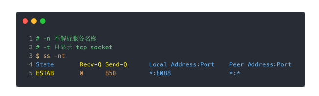

​		Recv-Q：已收到但未被应用进程读取的字节数； 

​		Send-Q：已发送但未收到确认的字节数；

###### 			3.全连接队列溢出时会执行什么？

​			如果超过最大全连接数---后续的连接会被丢弃

​			tcp_abort_on_overflow 设为 0 可以提高连接建立的成功率，只有你非常肯定 TCP 全连接队列会 长期溢出时，才能设置为 1 以尽快通知客户端

###### 			4.如何增大 TCP 全连接队列呢？

​			TCP 全连接队列的最大值取决于 somaxconn 和 backlog 之间的最小值，也就是 min(somaxconn, backlog)

​			somaxconn 是 Linux 内核的参数，默认值是 128，可以通过 /proc/sys/net/core/somaxconn 来设 置其值； 

​			backlog 是 listen(int sockfd, int backlog) 函数中的 backlog 大小，Nginx 默认值是 511，可以通 过修改配置文件设置其长度；

#### 	7.3 如何知道应用程序的 TCP 全连接队列大小？

​			1.服务端处于 SYN_RECV 状态的 TCP 连接，就是 TCP 半 连接队列

​			查看命令

​			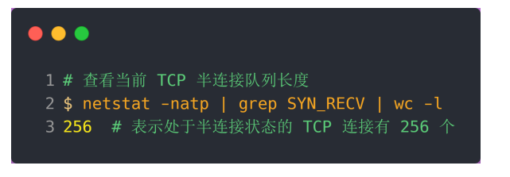

​			2.对服务端一直发送 TCP SYN 包，但是不回第三次握手 ACK，这样就会使得服务端有大量的处于 SYN_RECV 状态的 TCP 连接。

​			SYN 洪泛、SYN 攻击、DDos 攻击

​			3.TCP 半连接队列的最大值是如何决定的？

​				1.如果半连接队列满了，并且没有开启 tcp_syncookies，则会丢弃； 

​				2.若全连接队列满了，且没有重传 SYN+ACK 包的连接请求多于 1 个，则会丢弃； 

​				3.如果没有开启 tcp_syncookies，并且 max_syn_backlog 减去 当前半连接队列长度小于 (max_syn_backlog >> 2)，则会丢弃；

​				半连接队列最大值不是单单由 max_syn_backlog 决定，还跟 somaxconn 和 backlog 有关 系

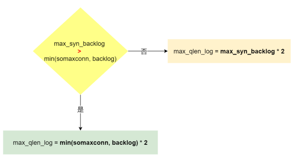

#### 	7.4 如果 SYN 半连接队列已满，只能丢弃连接吗？

​		开启 syncookies 功能就可以在不使用 SYN 半连接队列的情况下成功建立连接

​		syncookies：服务器根据当前状态计算出一个值，放在己方发出的 SYN+ACK 报文中发 出，当客户端返回 ACK 报文时，取出该值验证，如果合法，就认为连接建立成功

​		syncookies 参数主要有以下三个值：

​		 0 值，表示关闭该功能； 

​		1 值，表示仅当 SYN 半连接队列放不下时，再启用它； 

​		2 值，表示无条件开启功能；

#### 	7.5 如何防御 SYN 攻击？

​		增大半连接队列； 开启 tcp_syncookies 功能；减少 SYN+ACK 重传次数

​		1.增大半连接队列

​		不能只单纯增大 tcp_max_syn_backlog 的 值，还需一同增大 somaxconn 和 backlog，也就是增大全连接队列

​		2.开启 tcp_syncookies 功能

​		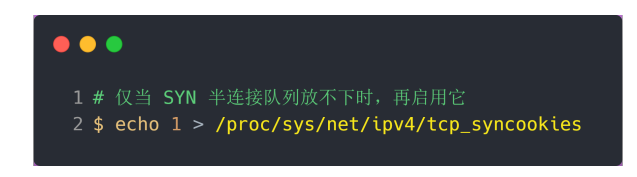

​		3.减少 SYN+ACK 重传次数

​		减少 SYN+ACK 的重传次数，以加快处于 SYN_REVC 状态的 TCP 连接断开

### 8.TCP参数

#### 		8.1 提升TCP三次握手的性能

###### 			A：客户端优化

​			三次握手建立连接的首要目的是「同步序列号」。

​			TCP 许多特性都依赖于序列号实现，比如流量控制、丢包重传等，这 也是三次握手中的报文称为 SYN 的原因，SYN 的全称就叫 Synchronize Sequence Numbers（同步序 列号）。

​			1.SYN_SENT 状态的优化

​			但如果客 户端长时间没有收到 SYN+ACK 报文，则会重发 SYN 包，重发的次数由 tcp_syn_retries 参数控制， 默认是 5 次

​			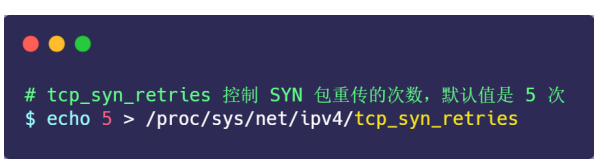

​			每次超时的时间是上一次的 2 倍，五次大约1分钟

​			修改 SYN 的重传次数

##### 			B：客户端优化

​			1.优化半连接池

​			调整 SYN 半连接队列大小---增大 tcp_max_syn_backlog 的值，还需一同增大 somaxconn 和 backlog，也就是增大 accept 队列。否则，只单纯增大 tcp_max_syn_backlog 是无效的

​			开启syncookies----开启 syncookies 功能就可以在不使用 SYN 半连接队列的情况下成功建立连接

​			2.优化SYN_RCV状态

​			客户端接收到服务器发来的 SYN+ACK 报文后，就会回复 ACK 给服务器，同时客户端连接状态从 SYN_SENT 转换为 ESTABLISHED，表示连接建立成功

​			服务端收到客户端的 ACK 后，服务端的连接状态才变 为 ESTABLISHED

​			如果服务器没有收到 ACK，就会重发 SYN+ACK 报文，同时一直处于 SYN_RCV 状态。

​			方式：修改重发次数----修改tcp_synack_retries 参数参数

​			

#### 	8.2 accept 队列已满，只能丢弃连接吗？

​			丢弃连接只是 Linux 的默认行为，我们还可以选择向客户端发送 RST 复位报文，告诉客户端连接已经 建立失败。打开这一功能需要将 tcp_abort_on_overflow 参数设置为 1。

​			tcp_abort_on_overflow 共有两个值分别是 0 和 1，其分别表示： 

​			0 ：如果 accept 队列满了，那么 server 扔掉 client 发过来的 ack ； 

​			1 ：如果 accept 队列满了，server 发送一个 RST 包给 client，表示废掉这个握手过程和这个连 接；

#### 	8.3 如何调整accept池大小？

​			accept 队列的长度取决于 somaxconn 和 backlog 之间的最小值，也就是 min(somaxconn, backlog)

​	

#### 	8.4 如何查看由于 accept 连接队列已满，而被丢弃的连接？

​		netstat -s 命令来查看：

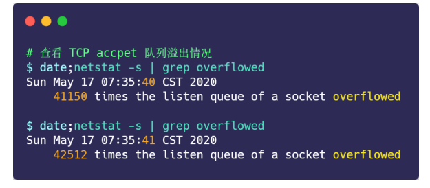

#### 	8.5 如何绕过三次握手？

​			在 Linux 3.7 内核版本之后，提供了 TCP Fast Open 功能，这个功能可以减少 TCP 连接建立的时延	

​			快速三次握手

​			核心：在第一次正常TCP之后，维护Cookie----通过cookie缩短三次TCP过程

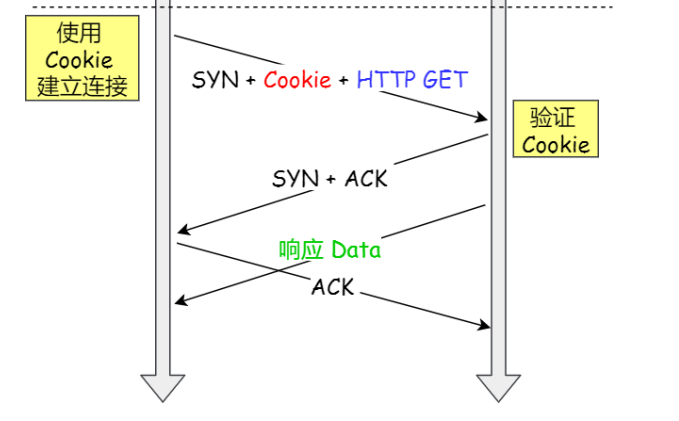

​		

​	加速TCP连接的几种方式

​	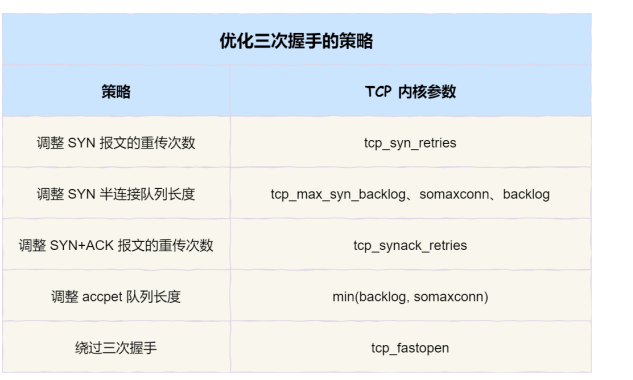

​		

### 	8.2 TCP四次挥手的性能提升

​			复习：四次挥手

​			双方都可以主动发起断开----主动方   被动方

​			A-----B 发Fin 我要关闭了 A（发送方）进入最终等待1

​			B收到Fin 回复ACK 进入 等待关闭

​			A收到ACK 进入最终关闭2

​			B等待一会 1分钟 关闭

​			1.调用 close 函数和 shutdown 函数有什么区别？

​				调用了 close 函数意味着完全断开连接，完全断开不仅指无法传输数据，而且也不能发送数据。 此时， 调用了 close 函数的一方的连接叫做「孤儿连接」，如果你用 netstat -p 命令，会发现连接对应的进程 名为空。

​			shutdown 函数，它可以 控制只关闭一个方向的连接

​		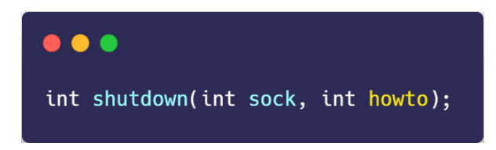

​			第二个参数决定断开连接的方式，主要有以下三种方式： 

​			SHUT_RD(0)：关闭连接的「读」这个方向，如果接收缓冲区有已接收的数据，则将会被丢弃， 并且后续再收到新的数据，会对数据进行 ACK，然后悄悄地丢弃。也就是说，对端还是会接收到 ACK，在这种情况下根本不知道数据已经被丢弃了。 

​			SHUT_WR(1)：关闭连接的「写」这个方向，这就是常被称为「半关闭」的连接。如果发送缓冲 区还有未发送的数据，将被立即发送出去，并发送一个 FIN 报文给对端。 

​			SHUT_RDWR(2)：相当于 SHUT_RD 和 SHUT_WR 操作各一次，关闭套接字的读和写两个方向。

##### 		8.2.1 优化FIN_WAIT1 状态

​		 		A发送Fin到B 自己进入FIN_WAIT1状态

​				定时重发 FIN 报文，其中重发次数由 tcp_orphan_retries 参数控制---默认8次---降低次数

##### 		8.2.2 优化FIN_WAIT2状态

​				A发送Fin到B 进入1 等着收B的返ACK

​				收到ACK--进入FIN_WAIT2 ---等着对面发Fin报文

​				如果连接是用 shutdown 函数关闭的，连接可以一直处于 FIN_WAIT2 状态，因为它可能还可以 发送或接收数据。但对于 close 函数关闭的孤儿连接，由于无法再发送和接收数据，所以这个状态不可 以持续太久，而 tcp_fin_timeout 控制了这个状态下连接的持续时长，默认值是 60 秒

##### 		8.2.3 TIME_WAIT状态优化

​				当收到被动方发来的 FIN 报文后，主动方会立刻回复 ACK，表示确认对方的发送通道已经关闭，接着 就处于 TIME_WAIT 状态。在 Linux 系统，TIME_WAIT 状态会持续 60 秒后才会进入关闭状态。

​				TIME_WAIT 状态的连接，在主动方看来确实快已经关闭了。然后，被动方没有收到 ACK 报文前，还是 处于 LAST_ACK 状态。如果这个 ACK 报文没有到达被动方，被动方就会重发 FIN 报文。重发次数仍 然由前面介绍过的 tcp_orphan_retries 参数控制。

​				一旦ACK没有到达 又会重发FIN

​				1.防止旧连接的数据包

​				经过 2MSL 这个时间，足以让两个方向上的数据包都被丢弃， 使得原来连接的数据包在网络中都自然消失，再出现的数据包一定都是新建立连接所产生的。

​				2.保证连接正确关闭

​				等待足够的时间以确保最后的 ACK 能让被动关闭方接收，从而帮助其正 常关闭。

​				MSL 全称是 Maximum Segment Lifetime，它定义了一个报文在网络中的最长生存时间

##### 		8.2.4 被动方优化

​			1.close函数

​			内核没有权利替代进程去关闭连接，因为如果主动方是通过 shutdown 关闭连接，那么它就是想在半关 闭连接上接收数据或发送数据。因此，Linux 并没有限制 CLOSE_WAIT 状态的持续时间。 当然，大多数应用程序并不使用 shutdown 函数关闭连接。所以，当你用 netstat 命令发现大量 CLOSE_WAIT 状态。就需要排查你的应用程序，因为可能因为应用程序出现了 Bug，read 函数返回 0 时，没有调用 close 函数。

​			2.FIN报文重发

​			处于 CLOSE_WAIT 状态时，调用了 close 函数，内核就会发出 FIN 报文关闭发送通道，同时连接进入 LAST_ACK 状态，等待主动方返回 ACK 来确认连接关闭。 如果迟迟收不到这个 ACK，内核就会重发 FIN 报文，重发次数仍然由 tcp_orphan_retries 参数控制， 这与主动方重发 FIN 报文的优化策略一致。

​			

​		结论：优化策略

​		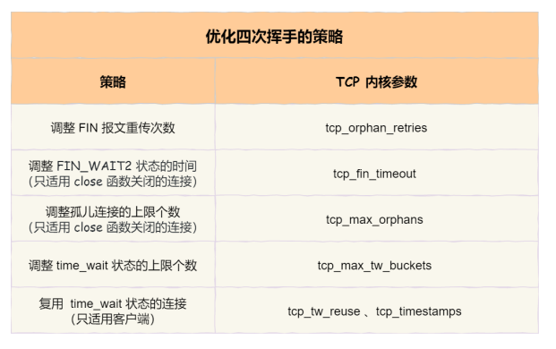

#### 	9.传输数据的性能提升

​		核心：TCP滑动窗口的改变----缓冲区大小的改变

​		1.怎样调整缓冲区大小？

​			发送缓冲区是自行调节的，当发送方发送的数据被确认后，并且没有新的数据要发送，就会把发送缓冲 区的内存释放掉。

​			调节接收缓冲区范围，接收缓冲区可以根据系统空闲内存的大小来调节接收窗口：

​			如果系统的空闲内存很多，就可以自动把缓冲区增大一些，这样传给对方的接收窗口也会变大， 因而提升发送方发送的传输数据数量； 

​			反之，如果系统的内存很紧张，就会减少缓冲区，这虽然会降低传输效率，可以保证更多的并发 连接正常工作；

​			发送缓冲区的调节功能是自动开启的，而接收缓冲区则需要配置 tcp_moderate_rcvbuf 为 1 来开启调 节功能：

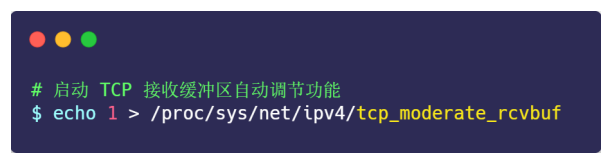

​		2.接收缓冲区调节时，怎么知道当前内存是否紧张或充分呢？

​				通过 tcp_mem 配置完成

​				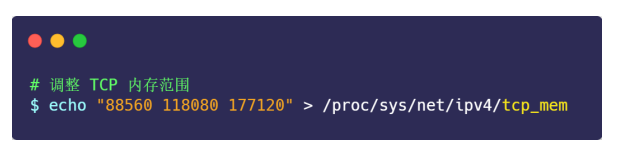
