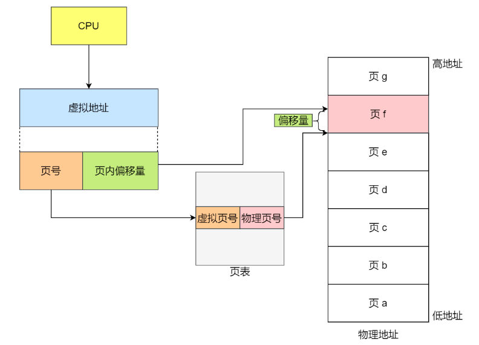
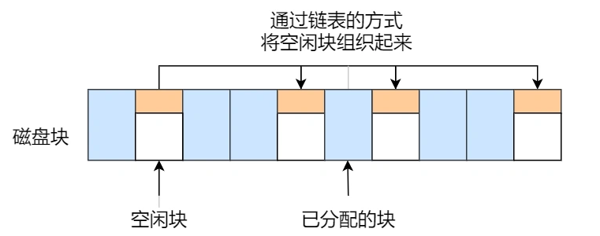

# 计算机操作系统

# 1.操作系统基础

1.GUI和SHELL区别

​	图形化界面(Graphical User Interface, GUI)

​	指令界面

2.CPU

​	寄存器-保存关键变量与临时结果

​	特殊寄存器----程序计数器----指向下一条需要从内存提取指令的地址

​	堆栈指针---指向内存中当前栈顶端

​	程序状态寄存器----PSW---跟踪当前系统状态

​	

​	时间多路复用CPU

3.CPU模式-内核态和用户态

​	PSW中属性控制何种状态

​	内核态--执行任何指令集中指令 并且使用硬件功能

​	用户态--执行部分指令

​	用户调用---系统调用----进入内核态

4.多线程与多核芯片

​	多线程----实际上简单的多线程还是一个线程 并不是并发

5.内存

​	快速 量大 便宜

​	

​	寄存器---最顶层

​	CPU一样材料，和CPU一样快

​	高速缓存

​	划为高速缓存行

​	内存---RAM

​	磁盘-硬盘

6.I/O设备

7.总线


8.计算机启动过程

​	主板上 有-BIOS 基本 输入 输出 系统

​	BIOS检查RAM数量，键盘和其他基础设备---查找PCle和CPL总线

​	CMOS启动设备

​	BIOS配置程序进入外部或者硬盘内部启动操作系统

9.文件-树机构

​	Linux上有特殊文件

​	线程--文件之间交互----管道

# 2.硬件结构

### 	1.CPU怎么执行程序的？

​	   实际上就是按照栈读取的方式执行程序-----读入---判断---执行

###### 		1.1 冯诺依曼模型

​       **运算器、控制器、存储器、输入设备、输出设备**，这 5 个部分也被称为**冯诺依曼模型**

​		运算器、控制器是在中央处理器里的，存储器就我们常见的内存，输入输出设备则是计算机外接的设备，比如键盘就是输入设备，显示器就是输出设备。

​		存储单元和输入输出设备要与中央处理器打交道的话，离不开总线。

###### 		1.2 程序执行过程

​		 CPU 执行程序的过程如下：

​		读取程序计数器----指令内存地址---CPU通过内存地址找到内存

​		读取指令寄存器---确定类型+参数----分为逻辑运算或者控制单元执行

​		程序计数器自增---指向下一条指令

### 2.内存 硬盘运行速度为什么不同？

###### 		1.存储器的层次结构

​		寄存器

​		CPU Cache-----L1 L2 L3

​		内存

​		硬盘

###### 		2.存储器类比关系

​	

​		复习看书

​		大脑--CPU

​		 大脑正在思考---寄存器

​		 大脑 的短期记忆——L1

​		 大脑长期记忆--L2 L3

​		内存

​		硬盘

###### 		3.CPU高速缓存 Cache

​		CPU 的高速缓存，通常可以分为 L1、L2、L3 这样的三层高速缓存，也称为一级缓存、二级缓存、三级缓存。

​		L1 高速缓存通常分成**指令缓存**和**数据缓存**。

​		L2 高速缓存同样每个 CPU 核心都有

​		L3 高速缓存通常是多个 CPU 核心共用的

###### 		4.内存

​		内存用的芯片和 CPU Cache 有所不同，它使用的是一种叫作 **DRAM （\*Dynamic Random Access Memory\*，动态随机存取存储器）** 的芯片。

​		只有不断刷新，数据才能被存储起来。

###### 		5.硬盘

​		速度慢

###### 		6.CPU怎么读取Cache中的数据？

​		直接映射为例子

​		根据内存地址中索引信息，计算在 CPU Cahe 中的索引，也就是找出对应的 CPU Cache Line 的地址

​		找到对应 CPU Cache Line 后，判断 CPU Cache Line 中的有效位，确认 CPU Cache Line 中数据是否是有效的，如果是无效的，CPU 就会直接访问内存，并重新加载数据，如果数据有效，则往下执行

​		对比内存地址中组标记和 CPU Cache Line 中的组标记，确认 CPU Cache Line 中的数据是我们要访问的内存数据，如果不是的话，CPU 就会直接访问内存，并重新加载数据，如果是的话，则往下执行

​		根据内存地址中偏移量信息，从 CPU Cache Line 的数据块中，读取对应的字

​		加速方式：

​		1.**遇到这种遍历数组的情况时，按照内存布局顺序访问，将可以有效的利用 CPU Cache 带来的好处，这样我们代码的性能就会得到很大的提升**

​		2.绑定CPU某个核心，不再度加载L1 L2缓存

### 3.CPU缓存一致性

###### 		1.那在什么时机才把 Cache 中的数据写回到内存呢

- 写直达（*Write Through*）

- 写回（*Write Back*）

  保持内存与 Cache 一致性最简单的方式是，**把数据同时写入内存和 Cache 中**，这种方法称为**写直达（\*Write Through\*）**。

  **当发生写操作时，新的数据仅仅被写入 Cache Block 里，只有当修改过的 Cache Block「被替换」时才需要写到内存中**

###### 		2.缓存一致性问题

​		由于 L1/L2 Cache 是多个核心各自独有的，那么会带来多核心的**缓存一致性（\*Cache Coherence\*）** 的问题

​		和数据库中的幻读一个意思实际上。


​		怎么解决？

​		某个 CPU 核心里的 Cache 数据更新时，必须要传播到其他核心的 Cache，这个称为**写传播（\*Write Propagation\*）**----数据一致

​		某个 CPU 核心里对数据的操作顺序，必须在其他核心看起来顺序是一样的，这个称为**事务的串行化（\*Transaction Serialization\*）**-----数据可以复现

​		

###### 		3.实现数据的传播-----总线嗅探

​		老方法---总线嗅探

​		变量i变化---发广播---所有cpu自检--有一致

###### 		4.MESI协议

​		MESI 协议其实是 4 个状态单词的开头字母缩写，分别是：

- *Modified*，已修改
- *Exclusive*，独占
- *Shared*，共享
- *Invalidated*，已失效

### 4.CPU如何执行任务？

###### 		1.CPU伪分享问题

​		这种因为多个线程同时读写同一个 Cache Line 的不同变量时，而导致 CPU Cache 失效的现象称为**伪共享（\*False Sharing\*）**

###### 		2.解决方式

​		对于多个线程共享的热点数据，即经常会修改的数据，应该避免这些数据刚好在同一个 Cache Line 中，否则就会出现为伪共享的问题

​		空间换时间

###### 		3.CPU怎么选择线程的？

​		CFS完全公平调度---为每个任务安排一个虚拟运行时间 vruntime


### 5.什么是软中断？

###### 	1.中断的上下部分

​	中断处理程序的上部分和下半部可以理解为：

- **上半部直接处理硬件请求，也就是硬中断**，主要是负责耗时短的工作，特点是快速执行；
- **下半部是由内核触发，也就说软中断**，主要是负责上半部未完成的工作，通常都是耗时比较长的事情，特点是延迟执行；

​	硬中断（上半部）是会打断 CPU 正在执行的任务，然后立即执行中断处理程序，而软中断（下半部）是以内核线程的方式执行

###### 	2.如何定位软中断 CPU 使用率过高的问题？

​	抓包解决

### 6.0.1+0.2==0.3？

###### 	1.为什么负数要用补码表示？

​	负数不是使用补码的方式表示，则在做基本对加减法运算的时候，**还需要多一步操作来判断是否为负数，如果为负数，还得把加法反转成减法，或者把减法反转成加法**

​	**用了补码的表示方式，对于负数的加减法操作，实际上是和正数加减法操作一样的**。

###### 	2.十进制小数与二进制的转换

​	**没办法用二进制精确的表示 0.1，只能用「近似值」来表示，就是在有限的精度情况下，最大化接近 0.1 的二进制数，于是就会造成精度缺失的情况**

###### 	3.计算机是怎么存小数的？

​	计算机存储小数的采用的是**浮点数**，名字里的「浮点」表示小数点是可以浮动的。

​	计算机是以浮点数的形式存储小数的，大多数计算机都是 IEEE 754 标准定义的浮点数格式，包含三个部分：

- 符号位：表示数字是正数还是负数，为 0 表示正数，为 1 表示负数；
- 指数位：指定了小数点在数据中的位置，指数可以是负数，也可以是正数，指数位的长度越长则数值的表达范围就越大；
- 尾数位：小数点右侧的数字，也就是小数部分，比如二进制 1.0011 x 2^(-2)，尾数部分就是 0011，而且尾数的长度决定了这个数的精度，因此如果要表示精度更高的小数，则就要提高尾数位的长度；

用 32 位来表示的浮点数，则称为单精度浮点数，也就是我们编程语言中的 float 变量，而用 64 位来表示的浮点数，称为双精度浮点数，也就是 double 变量。

###### 	4.0.1 + 0.2 == 0.3 吗？

​	不是的，0.1 和 0.2 这两个数字用二进制表达会是一个一直循环的二进制数


# 3.内存管理（重要）

### 1.为什么要有虚拟内存？

###### 	1.单片机

​	**单片机的 CPU 是直接操作内存的「物理地址」**

​	在这种情况下，要想在内存中同时运行两个程序是不可能的。如果第一个程序在 2000 的位置写入一个新的值，将会擦掉第二个程序存放在相同位置上的所有内容，所以同时运行两个程序是根本行不通的，这两个程序会立刻崩溃。

###### 	2.虚拟内存

​	操作系统是如何解决这个问题呢？---两个程序引用一个绝对地址

​	把进程所使用的地址「隔离」开来，即让操作系统为每个进程分配独立的一套「**虚拟地址**」

​	前提：每个进程都不能访问物理地址

​	**操作系统会提供一种机制，将不同进程的虚拟地址和不同内存的物理地址映射起来。**

​	虚拟---物理


​	进程持有的虚拟地址会通过 CPU 芯片中的内存管理单元（MMU）的映射关系，来转换变成物理地址

​	

###### 	3.操作系统是如何管理虚拟地址与物理地址之间的关系？

​	主要有两种方式，分别是**内存分段和内存分页**

###### 	4.内存分段

​	程序是由若干个逻辑分段组成的，如可由代码分段、数据分段、栈段、堆段组成。

​	**不同的段是有不同的属性的，所以就用分段（\*Segmentation\*）的形式把这些段分离出来。**

###### 	5.分段机制下，虚拟地址和物理地址是如何映射的？

​	分段机制下的虚拟地址由两部分组成，**段选择因子**和**段内偏移量**。


​	段选择因子----哪种类型？

​	段内偏移量----这个类型的第几个？

​	段选择因子和段内偏移量：

- **段选择子**就保存在段寄存器里面。段选择子里面最重要的是**段号**，用作段表的索引。**段表**里面保存的是这个**段的基地址、段的界限和特权等级**等。
- 虚拟地址中的**段内偏移量**应该位于 0 和段界限之间，如果段内偏移量是合法的，就将段基地址加上段内偏移量得到物理内存地址。


###### 6.分段机制会产生哪些问题？

分段的办法很好，解决了程序本身不需要关心具体的物理内存地址的问题，但它也有一些不足之处：

- 第一个就是**内存碎片**的问题。
- 第二个就是**内存交换的效率低**的问题。

###### 7.分段为什么会产生内存碎片的问题？

​	某个程序占用的内存不是连续的------间隔占用---再开只能选择填充这些被分开的

我们来看看这样一个例子。假设有 1G 的物理内存，用户执行了多个程序，其中：

- 游戏占用了 512MB 内存
- 浏览器占用了 128MB 内存
- 音乐占用了 256 MB 内存。

这个时候，如果我们关闭了浏览器，则空闲内存还有 1024 - 512 - 256 = 256MB。

如果这个 256MB 不是连续的，被分成了两段 128 MB 内存，这就会导致没有空间再打开一个 200MB 的程序。


###### 8.解决「外部内存碎片」的问题就是**内存交换**？

​	可以把音乐程序占用的那 256MB 内存写到硬盘上，然后再从硬盘上读回来到内存里。不过再读回的时候，我们不能装载回原来的位置，而是紧紧跟着那已经被占用了的 512MB 内存后面。这样就能空缺出连续的 256MB 空间，于是新的 200MB 程序就可以装载进来。

这个内存交换空间，在 Linux 系统里，也就是我们常看到的 Swap 空间，这块空间是从硬盘划分出来的，用于内存与硬盘的空间交换。

​	用A---存A---放A----放在B的紧挨着

###### 9.分段为什么会导致内存交换效率低的问题？

​	每次都要将内存存到硬盘里 再读取一次

​	**如果内存交换的时候，交换的是一个占内存空间很大的程序，这样整个机器都会显得卡顿。**

###### 10.为了解决内存分段的「外部内存碎片和内存交换效率低」的问题，就出现了内存分页

​	能少出现一些内存碎片的办法+进行内存交换的时候，让需要交换写入或者从磁盘装载的数据更少一点

​	**分页是把整个虚拟和物理内存空间切成一段段固定尺寸的大小**。这样一个连续并且尺寸固定的内存空间，我们叫**页**（*Page*）。在 Linux 下，每一页的大小为 `4KB`。

​	程序用的时候---不能自己划分想要多少是多少---只能选择多少份

​	虚拟地址与物理地址之间通过**页表**来映射

​	

​	页表是存储在内存里的，**内存管理单元** （*MMU*）就做将虚拟内存地址转换成物理地址的工作。

###### 11.分页是怎么解决分段的「外部内存碎片和内存交换效率低」的问题？

​	**采用了分页，页与页之间是紧密排列的，所以不会有外部碎片。**

​	因为内存分页机制分配内存的最小单位是一页，即使程序不足一页大小，我们最少只能分配一个页，所以页内会出现内存浪费，所以针对**内存分页机制会有内部内存碎片**的现象

​	操作系统会把其他正在运行的进程中的「最近没被使用」的内存页面给释放掉，也就是暂时写在硬盘上，称为**换出**（*Swap Out*）。一旦需要的时候，再加载进来，称为**换入**（*Swap In*）。所以，一次性写入磁盘的也只有少数的一个页或者几个页，不会花太多时间，**内存交换的效率就相对比较高。**

​	核心：可以采用那些穿插的内存地址

​	**只有在程序运行中，需要用到对应虚拟内存页里面的指令和数据时，再加载到物理内存里面去。**

###### 12.分页机制下，虚拟地址和物理地址是如何映射的？

​	哪一页+页里的哪个地址

​	分页机制下，虚拟地址分为两部分，**页号**和**页内偏移**。



###### 	13.多级分页

​	**如果某个一级页表的页表项没有被用到，也就不需要创建这个页表项对应的二级页表了，即可以在需要时才创建二级页表**。

​	**页表一定要覆盖全部虚拟地址空间，不分级的页表就需要有 100 多万个页表项来映射，而二级分页则只需要 1024 个页表项**

​	对于 64 位的系统，两级分页肯定不够了，就变成了四级目录，分别是：

- 全局页目录项 PGD（*Page Global Directory*）；
- 上层页目录项 PUD（*Page Upper Directory*）；
- 中间页目录项 PMD（*Page Middle Directory*）；
- 页表项 PTE（*Page Table Entry*）；


###### 14.TLB----内存里的缓存

​	最常访问的几个页表项存储到访问速度更快的硬件，于是计算机科学家们，就在 CPU 芯片中，加入了一个专门存放程序最常访问的页表项的 Cache，这个 Cache 就是 TLB（*Translation Lookaside Buffer*） ，通常称为页表缓存、转址旁路缓存、快表等。

​	

​	在 CPU 芯片里面，封装了内存管理单元（*Memory Management Unit*）芯片，它用来完成地址转换和 TLB 的访问与交互。

有了 TLB 后，那么 CPU 在寻址时，会先查 TLB，如果没找到，才会继续查常规的页表。

TLB 的命中率其实是很高的，因为程序最常访问的页就那么几个。

###### 15.段页式内存管理

​	内存分段和内存分页并不是对立的，它们是可以组合起来在同一个系统中使用的，那么组合起来后，通常称为**段页式内存管理**。

​	每一个程序一张段表，每个段又建立一张页表，段表中的地址是页表的起始地址，而页表中的地址则为某页的物理页号


段页式地址变换中要得到物理地址须经过三次内存访问：

- 第一次访问段表，得到页表起始地址；
- 第二次访问页表，得到物理页号；
- 第三次将物理页号与页内位移组合，得到物理地址。

###### 16.Linux 内存管理

​	**页式内存管理的作用是在由段式内存管理所映射而成的地址上再加上一层地址映射。**

​	**Linux 内存主要采用的是页式内存管理，但同时也不可避免地涉及了段机制**。

​	在 Linux 操作系统中，虚拟地址空间的内部又被分为**内核空间和用户空间**两部分，不同位数的系统，地址空间的范围也不同。


### 2.malloc 是如何分配内存的？

###### 1.Linux 进程的内存分布长什么样？

内核空间与用户空间的区别：

- 进程在用户态时，只能访问用户空间内存；
- 只有进入内核态后，才可以访问内核空间的内存；

每个进程都各自有独立的虚拟内存，但是**每个虚拟内存中的内核地址，其实关联的都是相同的物理内存**。这样，进程切换到内核态后，就可以很方便地访问内核空间内存。

###### 2.malloc 是如何分配内存的？

​	使用 C 标准库的 `malloc()或者 mmap()，` 可以分别在堆和文件映射段动态分配内存。

malloc 申请内存的时候，会有两种方式向操作系统申请堆内存。

- 方式一：通过 brk() 系统调用从堆分配内存
- 方式二：通过 mmap() 系统调用在文件映射区域分配内存；

方式一实现的方式很简单，就是通过 brk() 函数将「堆顶」指针向高地址移动，获得新的内存空间。


方式二通过 mmap() 系统调用中「私有匿名映射」的方式，在文件映射区分配一块内存，也就是从文件映射区“偷”了一块内存。


###### 3.什么场景下 malloc() 会通过 brk() 分配内存？又是什么场景下通过 mmap() 分配内存？

malloc() 源码里默认定义了一个阈值：

- 如果用户分配的内存小于 128 KB，则通过 brk() 申请内存；
- 如果用户分配的内存大于 128 KB，则通过 mmap() 申请内存；

###### 4.malloc() 分配的是物理内存吗？

**malloc() 分配的是虚拟内存**。

分配后的虚拟内存没有被访问的话，是不会将虚拟内存不会映射到物理内存，这样就不会占用物理内存了。

###### 5.malloc(x) 会分配多大的虚拟内存？

比预先要求的分配的稍微更大一点---X+N

**会预分配更大的空间作为内存池**。

###### 6.free 释放内存，会归还给操作系统吗？

堆调用内存---不会

- malloc 通过 **brk()** 方式申请的内存，free 释放内存的时候，**并不会把内存归还给操作系统，而是缓存在 malloc 的内存池中，待下次使用**；

匿名内存---会

- malloc 通过 **mmap()** 方式申请的内存，free 释放内存的时候，**会把内存归还给操作系统，内存得到真正的释放**。

###### 7.为什么不全部使用 mmap 来分配内存？

因为向操作系统申请内存，是要通过系统调用的，执行系统调用是要进入内核态的，然后在回到用户态，运行态的切换会耗费不少时间。

**频繁通过 mmap 分配的内存话，不仅每次都会发生运行态的切换，还会发生缺页中断（在第一次访问虚拟地址后），这样会导致 CPU 消耗较大**。

###### 8.为什么不全部使用 brk 来分配？

原因--当前缓存内的内存无法满足需求，一直保留，缓存越来越大

如果下次申请的内存大于 30k，没有可用的空闲内存空间，必须向 OS 申请，实际使用内存继续增大。

对于小块内存，堆内将产生越来越多不可用的碎片，导致“内存泄露”。

###### 9.free() 函数只传入一个内存地址，为什么能知道要释放多大的内存？

 malloc 返回给用户态的内存起始地址比进程的堆空间起始地址多了 16 字节吗？

这个多出来的 16 字节就是保存了该内存块的描述信息，比如有该内存块的大小。

### 3.内存满了，会发生什么？

###### 1.虚拟内存有什么作用？（复习）

虚拟内存可以使使用内存大于实际内存---CPU 访问内存会有很明显的重复访问的倾向性

每个进程的虚拟内存空间就是相互独立的---保证线程之间不会出现内存地址冲突

页表项中除了物理地址之外，还有一些标记属性的比特----在内存访问方面，操作系统提供了更好的安全性。

###### 2.内存分配的过程是怎样的？

虚拟内存没有映射到物理内存---**缺页中断**

**缺页中断**-----是否有空闲的物理内存，如果有，就直接分配物理内存，并建立虚拟内存与物理内存之间的映射关系

没有---**回收内存**

- **后台内存回收**（kswapd）：在物理内存紧张的时候，会唤醒 kswapd 内核线程来回收内存，这个回收内存的过程**异步**的，不会阻塞进程的执行。
- **直接内存回收**（direct reclaim）：如果后台异步回收跟不上进程内存申请的速度，就会开始直接回收，这个回收内存的过程是**同步**的，会阻塞进程的执行。

直接内存回收后，空闲的物理内存仍然无法满足此次物理内存的申请，那么内核就会放最后的大招了 ——**触发 OOM （Out of Memory）机制**。

OOM Killer 机制会根据算法选择一个占用物理内存较高的进程，然后将其杀死，以便释放内存资源，如果物理内存依然不足，OOM Killer 会继续杀死占用物理内存较高的进程，直到释放足够的内存位置。


###### 3.哪些内存可以被回收？

主要有两类内存可以被回收，而且它们的回收方式也不同。

核心：可以被简单读取的---直接释放

​			不可以的----写入磁盘，下次再读取

- **文件页**（File-backed Page）：内核缓存的磁盘数据（Buffer）和内核缓存的文件数据（Cache）都叫作文件页。大部分文件页，都可以直接释放内存，以后有需要时，再从磁盘重新读取就可以了。而那些被应用程序修改过，并且暂时还没写入磁盘的数据（也就是脏页），就得先写入磁盘，然后才能进行内存释放。所以，**回收干净页的方式是直接释放内存，回收脏页的方式是先写回磁盘后再释放内存**。
- **匿名页**（Anonymous Page）：这部分内存没有实际载体，不像文件缓存有硬盘文件这样一个载体，比如堆、栈数据等。这部分内存很可能还要再次被访问，所以不能直接释放内存，它们**回收的方式是通过 Linux 的 Swap 机制**，Swap 会把不常访问的内存先写到磁盘中，然后释放这些内存，给其他更需要的进程使用。再次访问这些内存时，重新从磁盘读入内存就可以了。

###### 4.LRU算法（重要）----回收算法

​	文件页和匿名页的回收都是基于 LRU 算法，也就是优先回收不常访问的内存。

​	**LRU 回收算法，实际上维护着 active 和 inactive 两个双向链表（重要）**

- **active_list** 活跃内存页链表，这里存放的是最近被访问过（活跃）的内存页；
- **inactive_list** 不活跃内存页链表，这里存放的是很少被访问（非活跃）的内存页；

  核心：越接近链表尾部，就表示内存页越不常访问。这样，在回收内存时，系统就可以根据活跃程度，优先回收不活跃的内存。

​	活跃和非活跃的内存页，按照类型的不同，又分别分为文件页和匿名页。可以从 /proc/meminfo 中，查询它们的大小


###### 5.回收内存带来的性能影响

​	直接内存回收，这种方式是同步回收的，会阻塞进程，这样就会造成很长时间的延迟，以及系统的 CPU 利用率会升高，最终引起系统负荷飙高。

​	对于干净页是直接释放内存，这个操作不会影响性能，而对于脏页会先写回到磁盘再释放内存，这个操作会发生磁盘 I/O 的，这个操作是会影响系统性能的。

​	如果开启了 Swap 机制，那么 Swap 机制会将不常访问的匿名页换出到磁盘中，下次访问时，再从磁盘换入到内存中，这个操作是会影响系统性能的。

​	回收内存的操作基本都会发生磁盘 I/O 的----所以导致才会卡

###### 6.调整文件页和匿名页的回收倾向----解决内存卡顿的方式

​	文件页---只有脏读情况下IO

​	匿名页的 Swap 换入换出这两个操作都会发生磁盘 I/O

​	匿名页的卡顿纪律大于文件页

​	Linux 提供了一个 `/proc/sys/vm/swappiness` 选项，用来调整文件页和匿名页的回收倾向。

​	范围是 0-100，数值越大，越积极使用 Swap

###### 7.尽早触发 kswapd 内核线程异步回收内存----解决内存卡顿的方式

​	如何查看系统的直接内存回收和后台内存回收的指标？

​	使用 `sar -B 1` 命令来观察

​	

- pgscank/s : kswapd(后台回收线程) 每秒扫描的 page 个数。
- pgscand/s: 应用程序在内存申请过程中每秒直接扫描的 page 个数。
- pgsteal/s: 扫描的 page 中每秒被回收的个数（pgscank+pgscand）。

###### 8.什么条件下才能触发 kswapd 内核线程回收内存呢？

​	**核心：当剩余内存页（pages_free）小于页低阈值（pages_low），就会触发 kswapd 进行后台回收，然后 kswapd 会一直回收到剩余内存页（pages_free）大于页高阈值（pages_high）**

​	

​	


- 页最小阈值（pages_min）；
- 页低阈值（pages_low）；
- 页高阈值（pages_high）；

页低阈值（pages_low）可以通过内核选项 `/proc/sys/vm/min_free_kbytes` （该参数代表系统所保留空闲内存的最低限）来间接设置。

###### 9.什么是 SMP 架构？

​	**核心：CPU核心是完全公平的，没有优先核心**

​	SMP 指的是一种**多个 CPU 处理器共享资源的电脑硬件架构**

​	每个 CPU 地位平等，它们共享相同的物理资源，包括总线、内存、IO、操作系统等

​	每个 CPU 访问内存所用时间都是相同的，因此，这种系统也被称为一致存储访问结构（UMA，Uniform Memory Access）

​	CPU 处理器核数的增多，多个 CPU 都通过一个总线访问内存，这样总线的带宽压力会越来越大，同时每个 CPU 可用带宽会减少

###### 10.什么是NUMA 结构？

​	**核心：CPU不公平，有快速组**

​	 NUMA 结构，即非一致存储访问结构（Non-uniform memory access，NUMA）。

​	每个 CPU 进行了分组，每一组 CPU 用 Node 来表示，一个 Node 可能包含多个 CPU 。

​	**每个 Node 有自己独立的资源，包括内存、IO 等**，每个 Node 之间可以通过互联模块总线（QPI）进行通信，所以，也就意味着每个 Node 上的 CPU 都可以访问到整个系统中的所有内存。但是，访问远端 Node 的内存比访问本地内存要耗时很多。

###### 11.NUMA 架构跟回收内存有什么关系？

​	当前组不够，从其他组借

​	当某个 Node 内存不足时，系统可以从其他 Node 寻找空闲内存，也可以从本地内存中回收内存。

​	可以通过 /proc/sys/vm/zone_reclaim_mode 来控制：

- 0 （默认值）：在回收本地内存之前，在其他 Node 寻找空闲内存；
- 1：只回收本地内存；
- 2：只回收本地内存，在本地回收内存时，可以将文件页中的脏页写回硬盘，以回收内存。
- 4：只回收本地内存，在本地回收内存时，可以用 swap 方式回收内存。

###### 12.如何保护一个进程不被 OOM 杀掉呢？

​	Linux 内核里有一个 `oom_badness()` 函数，它会把系统中可以被杀掉的进程扫描一遍，并对每个进程打分，得分最高的进程就会被首先杀掉。

​	受下面这两个方面影响：

- 第一，进程已经使用的物理内存页面数。
- 第二，每个进程的 OOM 校准值 oom_score_adj。它是可以通过 `/proc/[pid]/oom_score_adj` 来配置的。我们可以在设置 -1000 到 1000 之间的任意一个数值，调整进程被 OOM Kill 的几率。

​	最终得分跟进程自身消耗的内存有关，消耗的内存越大越容易被杀掉。

​	如果你想某个进程无论如何都不能被杀掉，那你可以将 oom_score_adj 配置为 -1000。

###### 13.总结

内核在给应用程序分配物理内存的时候，如果空闲物理内存不够，那么就会进行内存回收的工作，主要有两种方式：

- 后台内存回收：在物理内存紧张的时候，会唤醒 kswapd 内核线程来回收内存，这个回收内存的过程异步的，不会阻塞进程的执行。
- 直接内存回收：如果后台异步回收跟不上进程内存申请的速度，就会开始直接回收，这个回收内存的过程是同步的，会阻塞进程的执行。

可被回收的内存类型有文件页和匿名页：

- 文件页的回收：对于干净页是直接释放内存，这个操作不会影响性能，而对于脏页会先写回到磁盘再释放内存，这个操作会发生磁盘 I/O 的，这个操作是会影响系统性能的。
- 匿名页的回收：如果开启了 Swap 机制，那么 Swap 机制会将不常访问的匿名页换出到磁盘中，下次访问时，再从磁盘换入到内存中，这个操作是会影响系统性能的。

文件页和匿名页的回收都是基于 LRU 算法，也就是优先回收不常访问的内存。回收内存的操作基本都会发生磁盘 I/O 的，如果回收内存的操作很频繁，意味着磁盘 I/O 次数会很多，这个过程势必会影响系统的性能。

针对回收内存导致的性能影响，常见的解决方式。

- 设置 /proc/sys/vm/swappiness，调整文件页和匿名页的回收倾向，尽量倾向于回收文件页；
- 设置 /proc/sys/vm/min_free_kbytes，调整 kswapd 内核线程异步回收内存的时机；
- 设置 /proc/sys/vm/zone_reclaim_mode，调整 NUMA 架构下内存回收策略，建议设置为 0，这样在回收本地内存之前，会在其他 Node 寻找空闲内存，从而避免在系统还有很多空闲内存的情况下，因本地 Node 的本地内存不足，发生频繁直接内存回收导致性能下降的问题；

在经历完直接内存回收后，空闲的物理内存大小依然不够，那么就会触发 OOM 机制，OOM killer 就会根据每个进程的内存占用情况和 oom_score_adj 的值进行打分，得分最高的进程就会被首先杀掉。

我们可以通过调整进程的 /proc/[pid]/oom_score_adj 值，来降低被 OOM killer 杀掉的概率。

# 4.在 4GB 物理内存的机器上，申请 8G 内存会怎么样？

###### 1.操作系统虚拟内存大小

​	32 位操作系统和 64 位操作系统的虚拟地址空间大小是不同的，在 Linux 操作系统中，虚拟地址空间的内部又被分为**内核空间和用户空间**两部分

​	

###### 2.在 32 位操作系统、4GB 物理内存的机器上，申请 8GB 内存，会怎么样？

​	因为 32 位操作系统，进程最多只能申请 3 GB 大小的虚拟内存空间，所以进程申请 8GB 内存的话，在申请虚拟内存阶段就会失败。

###### 3.在 64 位操作系统、4GB 物理内存的机器上，申请 8G 内存，会怎么样？

​	64 位操作系统，进程可以使用 128 TB 大小的虚拟内存空间，所以进程申请 8GB 内存是没问题的，因为进程申请内存是申请虚拟内存，只要不读写这个虚拟内存，操作系统就不会分配物理内存。

###### 4.Swap 机制的作用

​	如果申请物理内存大小超过了空闲物理内存大小，就要看操作系统有没有开启 Swap 机制：

- 如果没有开启 Swap 机制，程序就会直接 OOM；
- 如果有开启 Swap 机制，程序可以正常运行。

###### 5.什么是 Swap 机制？

​	**硬盘和内存交换**

​	Swap 就是把一块磁盘空间或者本地文件，当成内存来使用，它包含换出和换入两个过程：

- **换出（Swap Out）** ，是把进程暂时不用的内存数据存储到磁盘中，并释放这些数据占用的内存；
- **换入（Swap In）**，是在进程再次访问这些内存的时候，把它们从磁盘读到内存中来；

​	频繁地读写硬盘，会显著降低操作系统的运行速率，这也是 Swap 的弊端。

###### 6.Swap 机制什么时候触发？

​	**内存不足和内存闲置的场景下触发**

- **内存不足**：当系统需要的内存超过了可用的物理内存时，内核会将内存中不常使用的内存页交换到磁盘上为当前进程让出内存，保证正在执行的进程的可用性，这个内存回收的过程是强制的直接内存回收（Direct Page Reclaim）。直接内存回收是同步的过程，会阻塞当前申请内存的进程。
- **内存闲置**：应用程序在启动阶段使用的大量内存在启动后往往都不会使用，通过后台运行的守护进程（kSwapd），我们可以将这部分只使用一次的内存交换到磁盘上为其他内存的申请预留空间。kSwapd 是 Linux 负责页面置换（Page replacement）的守护进程，它也是负责交换闲置内存的主要进程，它会在[空闲内存低于一定水位 (opens new window)](https://xiaolincoding.com/os/3_memory/mem_reclaim.html#尽早触发-kSwapd-内核线程异步回收内存)时，回收内存页中的空闲内存保证系统中的其他进程可以尽快获得申请的内存。kSwapd 是后台进程，所以回收内存的过程是异步的，不会阻塞当前申请内存的进程。

###### 7.Swap 换入换出的是什么类型的内存？

​	内核缓存的文件数据，因为都有对应的磁盘文件，所以在回收文件数据的时候， 直接写回到对应的文件就可以了。

​	Swap 分区---存放：匿名页：像进程的堆、栈数据等，它们是没有实际载体

###### 8.OOM--内存溢出

​	内存溢出(Out Of Memory，简称OOM)是指应用系统中存在无法回收的内存或使用的内存过多，最终使得程序运行要用到的内存大于能提供的最大内存。此时程序就运行不了，系统会提示内存溢出。

# 5.进程管理

### 1.进程、线程基础知识

###### 1.进程是什么？

​	当我们运行这个可执行文件后，它会被装载到内存中，接着 CPU 会执行程序中的每一条指令，那么这个**运行中的程序，就被称为「进程」（Process）**

​	核心比喻：你去煮开水时，你会傻傻的等水壶烧开吗？很明显，小孩也不会傻等。我们可以在水壶烧开之前去做其他事情。当水壶烧开了，我们自然就会听到“嘀嘀嘀”的声音，于是再把烧开的水倒入到水杯里就好了。

​	进程转移---执行其他进程

​	当进程要从硬盘读取数据时，CPU 不需要阻塞等待数据的返回，而是去执行另外的进程。当硬盘数据返回时，CPU 会收到个**中断**，于是 CPU 再继续运行这个进程。


​	

​	对于一个支持多进程的系统，CPU 会从一个进程快速切换至另一个进程，其间每个进程各运行几十或几百个毫秒。

​	虽然单核的 CPU 在某一个瞬间，只能运行一个进程。但在 1 秒钟期间，它可能会运行多个进程，这样就产生**并行的错觉**，实际上这是**并发**。

###### 2.并发和并行有什么区别？

​	

###### 3.进程与程序的关系的类比

​	**CPU 可以从一个进程（做菜）切换到另外一个进程（买可乐），在切换前必须要记录当前进程中运行的状态信息，以备下次切换回来的时候可以恢复执行。**

​	进程有着「**运行 - 暂停 - 运行**」的活动规律。

###### 4.进程状态

**在一个进程的活动期间至少具备三种基本状态，即运行状态、就绪状态、阻塞状态。**

- 运行状态（*Running*）：该时刻进程占用 CPU；
- 就绪状态（*Ready*）：可运行，由于其他进程处于运行状态而暂时停止运行；
- 阻塞状态（*Blocked*）：该进程正在等待某一事件发生（如等待输入/输出操作的完成）而暂时停止运行，这时，即使给它CPU控制权，它也无法运行；

###### 5.进程的状态变迁

- *NULL -> 创建状态*：一个新进程被创建时的第一个状态；
- *创建状态 -> 就绪状态*：当进程被创建完成并初始化后，一切就绪准备运行时，变为就绪状态，这个过程是很快的；
- *就绪态 -> 运行状态*：处于就绪状态的进程被操作系统的进程调度器选中后，就分配给 CPU 正式运行该进程；
- *运行状态 -> 结束状态*：当进程已经运行完成或出错时，会被操作系统作结束状态处理；
- *运行状态 -> 就绪状态*：处于运行状态的进程在运行过程中，由于分配给它的运行时间片用完，操作系统会把该进程变为就绪态，接着从就绪态选中另外一个进程运行；
- *运行状态 -> 阻塞状态*：当进程请求某个事件且必须等待时，例如请求 I/O 事件；
- *阻塞状态 -> 就绪状态*：当进程要等待的事件完成时，它从阻塞状态变到就绪状态；

  通常会把阻塞状态的进程的物理内存空间换出到硬盘，等需要再次运行的时候，再从硬盘换入到物理内存。

​	**描述进程没有占用实际的物理内存空间的情况，这个状态就是挂起状态**

- 阻塞挂起状态：进程在外存（硬盘）并等待某个事件的出现；
- 就绪挂起状态：进程在外存（硬盘），但只要进入内存，即刻立刻运行；

###### 6.进程的控制结构

​	在操作系统中，是用**进程控制块**（*process control block，PCB*）数据结构来描述进程的。

​	**PCB 是进程存在的唯一标识**，这意味着一个进程的存在，必然会有一个 PCB，如果进程消失了，那么 PCB 也会随之消失。

###### 7.PCB 具体包含什么信息呢？

​	**进程描述信息：**

​	这个进程是谁？属于谁？

- 进程标识符：标识各个进程，每个进程都有一个并且唯一的标识符；
- 用户标识符：进程归属的用户，用户标识符主要为共享和保护服务；

**进程控制和管理信息：**

​	这个进程现在能不能干活？能不能优先干活？

- 进程当前状态，如 new、ready、running、waiting 或 blocked 等；
- 进程优先级：进程抢占 CPU 时的优先级；

**资源分配清单：**

​	这个进程可以被分多少内存？

- 有关内存地址空间或虚拟地址空间的信息，所打开文件的列表和所使用的 I/O 设备信息。

**CPU 相关信息：**

​	上次他的活干到哪里了？

- CPU 中各个寄存器的值，当进程被切换时，CPU 的状态信息都会被保存在相应的 PCB 中，以便进程重新执行时，能从断点处继续执行。

###### 8.每个 PCB 是如何组织的呢？

​	**链表**的方式进行组织，把具有**相同状态的进程链在一起，组成各种队列**。

​	**就绪队列**

​    **阻塞队列**

###### 9.进程控制

​	**创建、终止、阻塞、唤醒**

**01 创建进程**

​	new Thread()

操作系统允许一个进程创建另一个进程，而且允许子进程继承父进程所拥有的资源。

创建进程的过程如下：

- 申请一个空白的 PCB，并向 PCB 中填写一些控制和管理进程的信息，比如进程的唯一标识等；
- 为该进程分配运行时所必需的资源，比如内存资源；
- 将 PCB 插入到就绪队列，等待被调度运行；

**02 终止进程**

​	end()

进程可以有 3 种终止方式：正常结束、异常结束以及外界干预（信号 `kill` 掉）。

当子进程被终止时，其在父进程处继承的资源应当还给父进程。而当父进程被终止时，该父进程的子进程就变为孤儿进程，会被 1 号进程收养，并由 1 号进程对它们完成状态收集工作。

终止进程的过程如下：

- 查找需要终止的进程的 PCB；
- 如果处于执行状态，则立即终止该进程的执行，然后将 CPU 资源分配给其他进程；
- 如果其还有子进程，则应将该进程的子进程交给 1 号进程接管；
- 将该进程所拥有的全部资源都归还给操作系统；
- 将其从 PCB 所在队列中删除；

**03 阻塞进程**

​	wait()/sleep()

当进程需要等待某一事件完成时，它可以调用阻塞语句把自己阻塞等待。而一旦被阻塞等待，它只能由另一个进程唤醒。

阻塞进程的过程如下：

- 找到将要被阻塞进程标识号对应的 PCB；
- 如果该进程为运行状态，则保护其现场，将其状态转为阻塞状态，停止运行；
- 将该 PCB 插入到阻塞队列中去；

**04 唤醒进程**

进程由「运行」转变为「阻塞」状态是由于进程必须等待某一事件的完成，所以处于阻塞状态的进程是绝对不可能叫醒自己的。

如果某进程正在等待 I/O 事件，需由别的进程发消息给它，则只有当该进程所期待的事件出现时，才由发现者进程用唤醒语句叫醒它。

唤醒进程的过程如下：

- 在该事件的阻塞队列中找到相应进程的 PCB；
- 将其从阻塞队列中移出，并置其状态为就绪状态；
- 把该 PCB 插入到就绪队列中，等待调度程序调度；

进程的阻塞和唤醒是一对功能相反的语句，如果某个进程调用了阻塞语句，则必有一个与之对应的唤醒语句。

###### 10.CPU上下文切换

​	任务并不是同时运行的，只是因为系统在很短的时间内，让各个任务分别在 CPU 运行，于是就造成同时运行的错觉。

​	CPU 需要知道任务从哪里加载，又从哪里开始运行。

​	CPU 寄存器是 CPU 内部一个容量小，但是速度极快的内存（缓存）。

​	程序计数器则是用来存储 CPU 正在执行的指令位置、或者即将执行的下一条指令位置。

​	CPU 上下文切换就是先把前一个任务的 CPU 上下文（CPU 寄存器和程序计数器）保存起来，然后加载新任务的上下文到这些寄存器和程序计数器，最后再跳转到程序计数器所指的新位置，运行新任务。

###### 11.进程上下文切换----进程之间的通信（重要）

**一个进程切换到另一个进程运行，称为进程的上下文切换**

​	进程是由内核管理和调度的，所以进程的切换只能发生在内核态。

​	**进程的上下文切换不仅包含了虚拟内存、栈、全局变量等用户空间的资源，还包括了内核堆栈、寄存器等内核空间的资源。**

###### 12.发生进程上下文切换有哪些场景？

​	时间到了---CPU 时间被划分为一段段的时间片，这些时间片再被轮流分配给各个进程。当某个进程的时间片耗尽了，进程就从运行状态变为就绪状态，系统从就绪队列选择另外一个进程运行。

​	资源不够---进程在系统资源不足（比如内存不足）时，要等到资源满足后才可以运行，这个时候进程也会被挂起，并由系统调度其他进程运行；

​	自己sleep()----当进程通过睡眠函数 sleep 这样的方法将自己主动挂起时，自然也会重新调度；

​	进程特权----当有优先级更高的进程运行时，为了保证高优先级进程的运行，当前进程会被挂起，由高优先级进程来运行；

###### 13.线程是什么？

**线程是进程当中的一条执行流程。**

​	核心：三个人一起买票！

- 实体之间可以并发运行；
- 实体之间共享相同的地址空间；

​	同一个进程内多个线程之间可以共享代码段、数据段、打开的文件等资源，但每个线程各自都有一套独立的寄存器和栈，这样可以确保线程的控制流是相对独立的。


###### 14.线程的优缺点？

线程的优点：

- 一个进程中可以同时存在多个线程；
- 各个线程之间可以并发执行；
- 各个线程之间可以共享地址空间和文件等资源；

线程的缺点：

- 当进程中的一个线程崩溃时，会导致其所属进程的所有线程崩溃（这里是针对 C/C++ 语言，Java语言中的线程奔溃不会造成进程崩溃。

举个例子，对于游戏的用户设计，则不应该使用多线程的方式，否则一个用户挂了，会影响其他同个进程的线程。

###### 15.线程与进程的比较

线程与进程的比较如下：

- 进程是资源（包括内存、打开的文件等）分配的单位，线程是 CPU 调度的单位；
- 进程拥有一个完整的资源平台，而线程只独享必不可少的资源，如寄存器和栈；
- 线程同样具有就绪、阻塞、执行三种基本状态，同样具有状态之间的转换关系；
- 线程能减少并发执行的时间和空间开销；

对于，线程相比进程能减少开销，体现在：

- 线程的创建时间比进程快，因为进程在创建的过程中，还需要资源管理信息，比如内存管理信息、文件管理信息，而线程在创建的过程中，不会涉及这些资源管理信息，而是共享它们；
- 线程的终止时间比进程快，因为线程释放的资源相比进程少很多；
- 同一个进程内的线程切换比进程切换快，因为线程具有相同的地址空间（虚拟内存共享），这意味着同一个进程的线程都具有同一个页表，那么在切换的时候不需要切换页表。而对于进程之间的切换，切换的时候要把页表给切换掉，而页表的切换过程开销是比较大的；
- 由于同一进程的各线程间共享内存和文件资源，那么在线程之间数据传递的时候，就不需要经过内核了，这就使得线程之间的数据交互效率更高了；

所以，不管是时间效率，还是空间效率线程比进程都要高。

###### 16.线程通信

**线程是调度的基本单位，而进程则是资源拥有的基本单位**。

- 当进程只有一个线程时，可以认为进程就等于线程；
- 当进程拥有多个线程时，这些线程会共享相同的虚拟内存和全局变量等资源，这些资源在上下文切换时是不需要修改的；

线程也有自己的私有数据，比如栈和寄存器等，这些在上下文切换时也是需要保存的。

###### 17.线程上下文切换的是什么？

- 当两个线程不是属于同一个进程，则切换的过程就跟进程上下文切换一样；
- **当两个线程是属于同一个进程，因为虚拟内存是共享的，所以在切换时，虚拟内存这些资源就保持不动，只需要切换线程的私有数据、寄存器等不共享的数据**；

###### 18.线程的实现

- **用户线程（\*User Thread\*）**：在用户空间实现的线程，不是由内核管理的线程，是由用户态的线程库来完成线程的管理；
- **内核线程（\*Kernel Thread\*）**：在内核中实现的线程，是由内核管理的线程；
- **轻量级进程（\*LightWeight Process\*）**：在内核中来支持用户线程；

###### 19.用户线程和内核线程的对应关系

**多对一**的关系，也就是多个用户线程对应同一个内核线程

**一对一**的关系，也就是一个用户线程对应一个内核线程

**多对多**的关系，也就是多个用户线程对应到多个内核线程

**用户线程的整个线程管理和调度，操作系统是不直接参与的，而是由用户级线程库函数来完成线程的管理，包括线程的创建、终止、同步和调度等。**

**内核线程是由操作系统管理的，线程对应的 TCB 自然是放在操作系统里的，这样线程的创建、终止和管理都是由操作系统负责。**

###### 20.最后的轻量级进程如何理解？

**轻量级进程（\*Light-weight process，LWP\*）是内核支持的用户线程，一个进程可有一个或多个 LWP，每个 LWP 是跟内核线程一对一映射的，也就是 LWP 都是由一个内核线程支持，而且 LWP 是由内核管理并像普通进程一样被调度**。

###### 21.线程调度算法

**单核 CPU 系统**

01 先来先服务调度算法

最简单的一个调度算法，就是非抢占式的**先来先服务（\*First Come First Serve, FCFS\*）算法**了。

02 最短作业优先调度算法

**最短作业优先（\*Shortest Job First, SJF\*）调度算法**同样也是顾名思义，它会**优先选择运行时间最短的进程来运行**，这有助于提高系统的吞吐量。

03 高响应比优先调度算法

**高响应比优先 （\*Highest Response Ratio Next, HRRN\*）调度算法**主要是权衡了短作业和长作业。

**每次进行进程调度时，先计算「响应比优先级」，然后把「响应比优先级」最高的进程投入运行。**

04 时间片轮转调度算法

**每个进程被分配一个时间段，称为时间片（\*Quantum\*），即允许该进程在该时间段中运行。**

05最高优先级调度算法

进程的优先级可以分为，静态优先级和动态优先级：

- 静态优先级：创建进程时候，就已经确定了优先级了，然后整个运行时间优先级都不会变化；
- 动态优先级：根据进程的动态变化调整优先级，比如如果进程运行时间增加，则降低其优先级，如果进程等待时间（就绪队列的等待时间）增加，则升高其优先级，也就是**随着时间的推移增加等待进程的优先级**。

06多级反馈队列调度算法

**多级反馈队列（\*Multilevel Feedback Queue\*）调度算法**是「时间片轮转算法」和「最高优先级算法」的综合和发展。

#### 2.线程之间的通信方式（重要 很常问--跟锁有关）

每个进程的用户地址空间都是独立的，一般而言是不能互相访问的，但内核空间是每个进程都共享的，所以进程之间要通信必须通过**内核**。


###### 1.管道（Linux）

**管道传输数据是单向的**，如果想相互通信，我们需要创建两个管道才行。

「`|`」表示的管道称为**匿名管道**，用完了就销毁

**命名管道**，也被叫做 `FIFO`，因为数据是先进先出的传输方式。

```bash
$ mkfifo myPipe
```

往 myPipe 这个管道写入数据：

```bash
$ echo "hello" > myPipe  // 将数据写进管道
                         // 停住了 ...
```

另外一个命令来读取这个管道里的数据：

```bash
$ cat < myPipe  // 读取管道里的数据
hello
```

**所谓的管道，就是内核里面的一串缓存**

###### 2.消息队列（重要）

​	**消息队列**的通信模式适合进程间频繁地交换数据。

​	A 进程要给 B 进程发送消息，A 进程把数据放在对应的消息队列后就可以正常返回了，B 进程需要的时候再去读取数据就可以了。

​	**消息队列是保存在内核中的消息链表**，生命周期随内核，如果没有释放消息队列或者没有关闭操作系统，消息队列会一直存在。

​	**一是通信不及时，二是附件也有大小限制**

​	**消息队列不适合比较大数据的传输**

​	**消息队列通信过程中，存在用户态与内核态之间的数据拷贝开销**

###### 3.共享内存

​	**共享内存的机制，就是拿出一块虚拟地址空间来，映射到相同的物理内存中**


###### 4.信号量---防止共享内存出现脏读或者幻读---乐观锁

**信号量其实是一个整型的计数器，主要用于实现进程间的互斥与同步，而不是用于缓存进程间通信的数据**。

信号量表示资源的数量，控制信号量的方式有两种原子操作：

- 一个是 **P 操作**，这个操作会把信号量减去 1，相减后如果信号量 < 0，则表明资源已被占用，进程需阻塞等待；相减后如果信号量 >= 0，则表明还有资源可使用，进程可正常继续执行。
- 另一个是 **V 操作**，这个操作会把信号量加上 1，相加后如果信号量 <= 0，则表明当前有阻塞中的进程，于是会将该进程唤醒运行；相加后如果信号量 > 0，则表明当前没有阻塞中的进程；

P 操作是用在进入共享资源之前，V 操作是用在离开共享资源之后，这两个操作是必须成对出现的。


###### 5.信号---异常通信模式

​	信号是进程间通信机制中**唯一的异步通信机制**，因为可以在任何时候发送信号给某一进程，一旦有信号产生，我们就有下面这几种，用户进程对信号的处理方式。

​	**1.执行默认操作**。Linux 对每种信号都规定了默认操作，例如，上面列表中的 SIGTERM 信号，就是终止进程的意思。

​    **2.捕捉信号**。我们可以为信号定义一个信号处理函数。当信号发生时，我们就执行相应的信号处理函数。

​    **3.忽略信号**。当我们不希望处理某些信号的时候，就可以忽略该信号，不做任何处理。有两个信号是应用进程无法捕捉和忽略的，即 `SIGKILL` 和 `SEGSTOP`，它们用于在任何时候中断或结束某一进程。

###### 6.Socket跨主机通信线程通信

**跨网络与不同主机上的进程之间通信，就需要 Socket 通信了。**

   实际上，Socket 通信不仅可以跨网络与不同主机的进程间通信，还可以在同主机上进程间通信。

###### 7.针对 TCP 协议通信的 socket 编程模型---复习 三次握手

​	

- 服务端和客户端初始化 `socket`，得到文件描述符；
- 服务端调用 `bind`，将绑定在 IP 地址和端口;
- 服务端调用 `listen`，进行监听；
- 服务端调用 `accept`，等待客户端连接；
- 客户端调用 `connect`，向服务器端的地址和端口发起连接请求；
- 服务端 `accept` 返回用于传输的 `socket` 的文件描述符；
- 客户端调用 `write` 写入数据；服务端调用 `read` 读取数据；
- 客户端断开连接时，会调用 `close`，那么服务端 `read` 读取数据的时候，就会读取到了 `EOF`，待处理完数据后，服务端调用 `close`，表示连接关闭。

这里需要注意的是，服务端调用 `accept` 时，连接成功了会返回一个已完成连接的 socket，后续用来传输数据。

所以，监听的 socket 和真正用来传送数据的 socket，是「**两个**」 socket，一个叫作**监听 socket**，一个叫作**已完成连接 socket**。

成功连接建立之后，双方开始通过 read 和 write 函数来读写数据，就像往一个文件流里面写东西一样。

###### 8.针对 UDP 协议通信的 socket 编程模型

​	

UDP 是没有连接的，所以不需要三次握手，也就不需要像 TCP 调用 listen 和 connect，但是 UDP 的交互仍然需要 IP 地址和端口号，因此也需要 bind。

对于 UDP 来说，不需要要维护连接，那么也就没有所谓的发送方和接收方，甚至都不存在客户端和服务端的概念，只要有一个 socket 多台机器就可以任意通信，因此每一个 UDP 的 socket 都需要 bind。

另外，每次通信时，调用 sendto 和 recvfrom，都要传入目标主机的 IP 地址和端口。

### 总结

由于每个进程的用户空间都是独立的，不能相互访问，这时就需要借助内核空间来实现进程间通信，原因很简单，每个进程都是共享一个内核空间。

Linux 内核提供了不少进程间通信的方式，其中最简单的方式就是管道，管道分为「匿名管道」和「命名管道」。

**匿名管道**顾名思义，它没有名字标识，匿名管道是特殊文件只存在于内存，没有存在于文件系统中，shell 命令中的「`|`」竖线就是匿名管道，通信的数据是**无格式的流并且大小受限**，通信的方式是**单向**的，数据只能在一个方向上流动，如果要双向通信，需要创建两个管道，再来**匿名管道是只能用于存在父子关系的进程间通信**，匿名管道的生命周期随着进程创建而建立，随着进程终止而消失。

**命名管道**突破了匿名管道只能在亲缘关系进程间的通信限制，因为使用命名管道的前提，需要在文件系统创建一个类型为 p 的设备文件，那么毫无关系的进程就可以通过这个设备文件进行通信。另外，不管是匿名管道还是命名管道，进程写入的数据都是**缓存在内核**中，另一个进程读取数据时候自然也是从内核中获取，同时通信数据都遵循**先进先出**原则，不支持 lseek 之类的文件定位操作。

**消息队列**克服了管道通信的数据是无格式的字节流的问题，消息队列实际上是保存在内核的「消息链表」，消息队列的消息体是可以用户自定义的数据类型，发送数据时，会被分成一个一个独立的消息体，当然接收数据时，也要与发送方发送的消息体的数据类型保持一致，这样才能保证读取的数据是正确的。消息队列通信的速度不是最及时的，毕竟**每次数据的写入和读取都需要经过用户态与内核态之间的拷贝过程。**

**共享内存**可以解决消息队列通信中用户态与内核态之间数据拷贝过程带来的开销，**它直接分配一个共享空间，每个进程都可以直接访问**，就像访问进程自己的空间一样快捷方便，不需要陷入内核态或者系统调用，大大提高了通信的速度，享有**最快**的进程间通信方式之名。但是便捷高效的共享内存通信，**带来新的问题，多进程竞争同个共享资源会造成数据的错乱。**

那么，就需要**信号量**来保护共享资源，以确保任何时刻只能有一个进程访问共享资源，这种方式就是互斥访问。**信号量不仅可以实现访问的互斥性，还可以实现进程间的同步**，信号量其实是一个计数器，表示的是资源个数，其值可以通过两个原子操作来控制，分别是 **P 操作和 V 操作**。

与信号量名字很相似的叫**信号**，它俩名字虽然相似，但功能一点儿都不一样。信号是**异步通信机制**，信号可以在应用进程和内核之间直接交互，内核也可以利用信号来通知用户空间的进程发生了哪些系统事件，信号事件的来源主要有硬件来源（如键盘 Cltr+C ）和软件来源（如 kill 命令），一旦有信号发生，**进程有三种方式响应信号 1. 执行默认操作、2. 捕捉信号、3. 忽略信号**。有两个信号是应用进程无法捕捉和忽略的，即 `SIGKILL` 和 `SIGSTOP`，这是为了方便我们能在任何时候结束或停止某个进程。

前面说到的通信机制，都是工作于同一台主机，如果**要与不同主机的进程间通信，那么就需要 Socket 通信了**。Socket 实际上不仅用于不同的主机进程间通信，还可以用于本地主机进程间通信，可根据创建 Socket 的类型不同，分为三种常见的通信方式，一个是基于 TCP 协议的通信方式，一个是基于 UDP 协议的通信方式，一个是本地进程间通信方式。

以上，就是进程间通信的主要机制了。你可能会问了，那线程通信间的方式呢？

同个进程下的线程之间都是共享进程的资源，只要是共享变量都可以做到线程间通信，比如全局变量，所以对于线程间关注的不是通信方式，而是关注多线程竞争共享资源的问题，信号量也同样可以在线程间实现互斥与同步：

- 互斥的方式，可保证任意时刻只有一个线程访问共享资源；
- 同步的方式，可保证线程 A 应在线程 B 之前执行

### 3.多线程冲突了怎么办？---锁来了

###### 1.互斥的概念

​	三个人一起抢100张票---导致会抢到一样的票

​	加锁-**保证一个线程在临界区执行时，其他线程应该被阻止进入临界区**

2.同步的概念

​	**所谓同步，就是并发进程/线程在一些关键点上可能需要互相等待与互通消息，这种相互制约的等待与互通信息称为进程/线程同步**。

​	收到消息再一起动


###### 3.互斥与同步

为了实现进程/线程间正确的协作，操作系统必须提供实现进程协作的措施和方法，主要的方法有两种：

- *锁*：加锁、解锁操作；
- *信号量*：P、V 操作；

这两个都可以方便地实现进程/线程互斥，而信号量比锁的功能更强一些，它还可以方便地实现进程/线程同步。

###### 4.锁

​	现代 CPU 体系结构提供的特殊**原子操作指令 —— 测试和置位（\*Test-and-Set\*）指令**。

​	那什么是原子操作呢？**原子操作就是要么全部执行，要么都不执行，不能出现执行到一半的中间状态**

**自旋锁（\*spin lock\*）**：最简单的一种锁，一直自旋，利用 CPU 周期，直到锁可用。

###### 5.信号量

​	**两个原子操作的系统调用函数来控制信号量的**，分别是：

- *P 操作*：将 `sem` 减 `1`，相减后，如果 `sem < 0`，则进程/线程进入阻塞等待，否则继续，表明 P 操作可能会阻塞；
- *V 操作*：将 `sem` 加 `1`，相加后，如果 `sem <= 0`，唤醒一个等待中的进程/线程，表明 V 操作不会阻塞；

###### 6.生产者-消费者问题

​	回顾当时写的代码

###### 7.哲学家就餐问题

​	1.加悲观锁

​	2.设置取资源顺序：**让偶数编号的哲学家「先拿左边的叉子后拿右边的叉子」，奇数编号的哲学家「先拿右边的叉子后拿左边的叉子」。**

​	3.判断左右状态：**用一个数组 state 来记录每一位哲学家的三个状态，分别是在进餐状态、思考状态、饥饿状态（正在试图拿叉子）。**

​     那么，**一个哲学家只有在两个邻居都没有进餐时，才可以进入进餐状态。**

###### 8.读者-写者问题

- 「读-读」允许：同一时刻，允许多个读者同时读--可以查
- 「读-写」互斥：没有写者时读者才能读，没有读者时写者才能写---你读的时候我写了怎么办
- 「写-写」互斥：没有其他写者时，写者才能写---你写了我写的

### 4.怎么避免死锁？

​	两个线程为了保护两个不同的共享资源而使用了两个互斥锁，那么这两个互斥锁应用不当的时候，可能会造成**两个线程都在等待对方释放锁**

###### 	1.死锁条件

- 互斥条件；
- 持有并等待条件；
- 不可剥夺条件；
- 环路等待条件；

###### 2.互斥条件

互斥条件是指**多个线程不能同时使用同一个资源**。

比如下图，如果线程 A 已经持有的资源，不能再同时被线程 B 持有，如果线程 B 请求获取线程 A 已经占用的资源，那线程 B 只能等待，直到线程 A 释放了资源。

###### 3.持有并等待条件

持有并等待条件是指，当线程 A 已经持有了资源 1，又想申请资源 2，而资源 2 已经被线程 C 持有了，所以线程 A 就会处于等待状态，但是**线程 A 在等待资源 2 的同时并不会释放自己已经持有的资源 1**。

###### 4.不可剥夺条件

不可剥夺条件是指，当线程已经持有了资源 ，**在自己使用完之前不能被其他线程获取**，线程 B 如果也想使用此资源，则只能在线程 A 使用完并释放后才能获取。

###### 5.环路等待条件

环路等待条件指的是，在死锁发生的时候，**两个线程获取资源的顺序构成了环形链**。

### 5.悲观锁，乐观锁

###### 1.互斥锁与自旋锁

- **互斥锁**加锁失败后，线程会**释放 CPU** ，给其他线程；---一般锁
- **自旋锁**加锁失败后，线程会**忙等待**，直到它拿到锁；---循环锁

###### 2.读写锁

​	**读写锁适用于能明确区分读操作和写操作的场景**

**公平读写锁比较简单的一种方式是：用队列把获取锁的线程排队，不管是写线程还是读线程都按照先进先出的原则加锁即可，这样读线程仍然可以并发，也不会出现「饥饿」的现象。**

###### 3.乐观锁与悲观锁

​	悲观锁：**多线程同时修改共享资源的概率比较高，于是很容易出现冲突，所以访问共享资源前，先要上锁**。

​	默认你会修改数据，所以我用你别想用

​	乐观锁：**先修改完共享资源，再验证这段时间内有没有发生冲突，如果没有其他线程在修改资源，那么操作完成，如果发现有其他线程已经修改过这个资源，就放弃本次操作**。

​	我先不默认你修改，但是我比较版本号，不同我就不干了

###### 4.实现多人同时编辑，实际上是用了乐观锁

​	服务端要怎么验证是否冲突了呢？通常方案如下：

- 由于发生冲突的概率比较低，所以先让用户编辑文档，但是浏览器在下载文档时会记录下服务端返回的文档版本号；

- 当用户提交修改时，发给服务端的请求会带上原始文档版本号，服务器收到后将它与当前版本号进行比较，如果版本号一致则修改成功，否则提交失败。

   SVN 和 Git 也是用了乐观锁的思想，先让用户编辑代码，然后提交的时候，通过版本号来判断是否产生了冲突，发生了冲突的地方，需要我们自己修改后，再重新提交。

### 6.一个进程最多可以创建多少个线程？	

这个问题跟两个东西有关系：

- **进程的虚拟内存空间上限**，因为创建一个线程，操作系统需要为其分配一个栈空间，如果线程数量越多，所需的栈空间就要越大，那么虚拟内存就会占用的越多。
- **系统参数限制**，虽然 Linux 并没有内核参数来控制单个进程创建的最大线程个数，但是有系统级别的参数来控制整个系统的最大线程个数。

总结下：

- 32 位系统，用户态的虚拟空间只有 3G，如果创建线程时分配的栈空间是 10M，那么一个进程最多只能创建 300 个左右的线程。
- 64 位系统，用户态的虚拟空间大到有 128T，理论上不会受虚拟内存大小的限制，而会受系统的参数或性能限制。

### 7.线程崩溃了，进程也会崩溃吗？

C++会 Java不会

###### 1.进程是如何崩溃的-信号机制简介

​	实际上 kill 执行的是系统调用，将控制权转移给了内核（操作系统），由内核来给指定的进程发送信号

那么发个信号进程怎么就崩溃了呢，这背后的原理到底是怎样的？

​	其背后的机制如下：

1. CPU 执行正常的进程指令
2. 调用 kill 系统调用向进程发送信号
3. 进程收到操作系统发的信号，CPU 暂停当前程序运行，并将控制权转交给操作系统
4. 调用 kill 系统调用向进程发送信号（假设为 11，即 SIGSEGV，一般非法访问内存报的都是这个错误）
5. **操作系统根据情况执行相应的信号处理程序（函数），一般执行完信号处理程序逻辑后会让进程退出**

###### 2.为什么线程崩溃不会导致 JVM 进程崩溃

​	**因为 JVM 自定义了自己的信号处理函数，拦截了 SIGSEGV 信号，针对这两者不让它们崩溃**。

###### 3.openJDK 源码解析

​	HotSpot 虚拟机目前使用范围最广的 Java 虚拟机，据 R 大所述， Oracle JDK 与 OpenJDK 里的 JVM 都是 HotSpot VM，从源码层面说，两者基本上是同一个东西。

1. 发生 stackoverflow 还有空指针错误，确实都发送了 SIGSEGV，只是虚拟机不选择退出，而是自己内部作了额外的处理，其实是恢复了线程的执行，并抛出 StackoverflowError 和 NPE，这就是为什么 JVM 不会崩溃且我们能捕获这两个错误/异常的原因
2. 如果针对 SIGSEGV 等信号，在以上的函数中 JVM 没有做额外的处理，那么最终会走到 report_and_die 这个方法，这个方法主要做的事情是生成 hs_err_pid_xxx.log crash 文件（记录了一些堆栈信息或错误），然后退出

​	**原因其实就是虚拟机内部定义了信号处理函数，而在信号处理函数中对这两者做了额外的处理以让 JVM 不崩溃，另一方面也可以看出如果 JVM 不对信号做额外的处理，最后会自己退出并产生 crash 文件 hs_err_pid_xxx.log（可以通过 -XX:ErrorFile=/var/\*log\*/hs_err.log 这样的方式指定），这个文件记录了虚拟机崩溃的重要原因**。

# 6.调度算法

### 1.进程调度

###### 1.进程调度算法也称 CPU 调度算法，毕竟进程是由 CPU 调度的。

​	什么时候会发生 CPU 调度呢？通常有以下情况：

​	其中发生在 1 和 4 两种情况下的调度称为「非抢占式调度」，2 和 3 两种情况下发生的调度称为「抢占式调度」。

1. 当进程从运行状态转到等待状态；
2. 当进程从运行状态转到就绪状态；
3. 当进程从等待状态转到就绪状态；
4. 当进程从运行状态转到终止状态；

非抢占式的意思就是，当进程正在运行时，它就会一直运行，直到该进程完成或发生某个事件而被阻塞时，才会把 CPU 让给其他进程。

抢占式调度，顾名思义就是进程正在运行的时，可以被打断，使其把 CPU 让给其他进程。那抢占的原则一般有三种，分别是时间片原则、优先权原则、短作业优先原则。

###### 2.先来先服务调度算法

**每次从就绪队列选择最先进入队列的进程，然后一直运行，直到进程退出或被阻塞，才会继续从队列中选择第一个进程接着运行。**


###### 3.最短作业优先调度算法

**优先选择运行时间最短的进程来运行**


###### 4.高响应比优先调度算法

​	根据反应的活跃度来判断是不是值得优先调度

​	**每次进行进程调度时，先计算「响应比优先级」，然后把「响应比优先级」最高的进程投入运行**

###### 5.时间片轮转（\*Round Robin, RR\*）调度算法

最古老、最简单、最公平且使用最广的算法就是**时间片轮转（\*Round Robin, RR\*）调度算法**。


​	时间固定，没完成就轮换

​	**每个进程被分配一个时间段，称为时间片（\*Quantum\*），即允许该进程在该时间段中运行。**

- 如果时间片用完，进程还在运行，那么将会把此进程从 CPU 释放出来，并把 CPU 分配另外一个进程；
- 如果该进程在时间片结束前阻塞或结束，则 CPU 立即进行切换；

另外，时间片的长度就是一个很关键的点：

- 如果时间片设得太短会导致过多的进程上下文切换，降低了 CPU 效率；
- 如果设得太长又可能引起对短作业进程的响应时间变长。将

通常时间片设为 `20ms~50ms` 通常是一个比较合理的折中值。

###### 6.最高优先级调度算法

​	**从就绪队列中选择最高优先级的进程进行运行，这称为最高优先级（\*Highest Priority First，HPF\*）调度算法**。

​	进程的优先级可以分为，静态优先级或动态优先级：

- 静态优先级：创建进程时候，就已经确定了优先级了，然后整个运行时间优先级都不会变化；
- 动态优先级：根据进程的动态变化调整优先级，比如如果进程运行时间增加，则降低其优先级，如果进程等待时间（就绪队列的等待时间）增加，则升高其优先级，也就是**随着时间的推移增加等待进程的优先级**。

​	该算法也有两种处理优先级高的方法，非抢占式和抢占式：

- 非抢占式：当就绪队列中出现优先级高的进程，运行完当前进程，再选择优先级高的进程。
- 抢占式：当就绪队列中出现优先级高的进程，当前进程挂起，调度优先级高的进程运行。

###### 7.多级反馈队列调度算法

​	**多级反馈队列（\*Multilevel Feedback Queue\*）调度算法**是「时间片轮转算法」和「最高优先级算法」的综合和发展。

- 「多级」表示有多个队列，每个队列优先级从高到低，同时优先级越高时间片越短。
- 「反馈」表示如果有新的进程加入优先级高的队列时，立刻停止当前正在运行的进程，转而去运行优先级高的队列；


### 2.页面置换

1. 在 CPU 里访问一条 Load M 指令，然后 CPU 会去找 M 所对应的页表项。
2. 如果该页表项的状态位是「有效的」，那 CPU 就可以直接去访问物理内存了，如果状态位是「无效的」，则 CPU 则会发送缺页中断请求。
3. 操作系统收到了缺页中断，则会执行缺页中断处理函数，先会查找该页面在磁盘中的页面的位置。
4. 找到磁盘中对应的页面后，需要把该页面换入到物理内存中，但是在换入前，需要在物理内存中找空闲页，如果找到空闲页，就把页面换入到物理内存中。
5. 页面从磁盘换入到物理内存完成后，则把页表项中的状态位修改为「有效的」。
6. 最后，CPU 重新执行导致缺页异常的指令。

###### 1.页面置换算法功能

页面置换算法的功能是，**当出现缺页异常，需调入新页面而内存已满时，选择被置换的物理页面**。也就是说选择一个物理页面换出到磁盘，然后把需要访问的页面换入到物理页。

###### 2.算法目标

尽可能减少页面的换入换出的次数

###### 3.最佳页面置换算法

最佳页面置换算法基本思路是，**置换在「未来」最长时间不访问的页面**。


###### 4.先进先出置换算法

既然我们无法预知页面在下一次访问前所需的等待时间，那我们可以**选择在内存驻留时间很长的页面进行中置换**，这个就是「先进先出置换」算法的思想。

###### 5.最近最久未使用的置换算法

发生缺页时，**选择最长时间没有被访问的页面进行置换**，也就是说，该算法假设已经很久没有使用的页面很有可能在未来较长的一段时间内仍然不会被使用。


###### 6.时钟页面置换算法----最常用

该算法的思路是，把所有的页面都保存在一个类似钟面的「环形链表」中，一个表针指向最老的页面。

当发生缺页中断时，算法首先检查表针指向的页面：

- 如果它的访问位位是 0 就淘汰该页面，并把新的页面插入这个位置，然后把表针前移一个位置；
- 如果访问位是 1 就清除访问位，并把表针前移一个位置，重复这个过程直到找到了一个访问位为 0 的页面为止；


###### 7.最不常用算法

​	**当发生缺页中断时，选择「访问次数」最少的那个页面，并将其淘汰**。

### 3.磁盘调度

###### 1.先来先服务

先来先服务（*First-Come，First-Served，FCFS*），顾名思义，先到来的请求，先被服务。

那按照这个序列的话：

98，183，37，122，14，124，65，67

那么，磁盘的写入顺序是从左到右，如下图：


先来先服务算法总共移动了 `640` 个磁道的距离，这么一看这种算法，比较简单粗暴，但是如果大量进程竞争使用磁盘，请求访问的磁道可能会很分散，那先来先服务算法在性能上就会显得很差，因为寻道时间过长。

###### 2.最短寻道时间优先

最短寻道时间优先（*Shortest Seek First，SSF*）算法的工作方式是，优先选择从当前磁头位置所需寻道时间最短的请求


###### 3.扫描算法

​	**磁头在一个方向上移动，访问所有未完成的请求，直到磁头到达该方向上的最后的磁道，才调换方向，这就是扫描（\*Scan\*）算法**

​	这种算法也叫做电梯算法，比如电梯保持按一个方向移动，直到在那个方向上没有请求为止，然后改变方向。

​	

磁头先响应左边的请求，直到到达最左端（ 0 磁道）后，才开始反向移动，响应右边的请求。

###### 4.循环扫描算法

​	循环扫描（*Circular Scan, CSCAN* ）规定：只有磁头朝某个特定方向移动时，才处理磁道访问请求，而返回时直接快速移动至最靠边缘的磁道，也就是复位磁头，这个过程是很快的，并且**返回中途不处理任何请求**，该算法的特点，就是**磁道只响应一个方向上的请求**。


###### 5.LOOK 与 C-LOOK算法

优化的思路就是**磁头在移动到「最远的请求」位置，然后立即反向移动。**

那针对 SCAN 算法的优化则叫 LOOK 算法，它的工作方式，磁头在每个方向上仅仅移动到最远的请求位置，然后立即反向移动，而不需要移动到磁盘的最始端或最末端，**反向移动的途中会响应请求**。


C-SCAN 算法的优化则叫 C-LOOK，它的工作方式，磁头在每个方向上仅仅移动到最远的请求位置，然后立即反向移动，而不需要移动到磁盘的最始端或最末端，**反向移动的途中不会响应请求**。


# 7.文件系统

### 1.文件系统的组成

文件系统是操作系统中负责管理持久数据的子系统，说简单点，就是负责把用户的文件存到磁盘硬件中，因为即使计算机断电了，磁盘里的数据并不会丢失，所以可以持久化的保存文件。

Linux 文件系统会为每个文件分配两个数据结构：**索引节点（\*index node\*）和目录项（\*directory entry\*）**，它们主要用来记录文件的元信息和目录层次结构。

- 索引节点，也就是 *inode*，用来记录文件的元信息，比如 inode 编号、文件大小、访问权限、创建时间、修改时间、**数据在磁盘的位置**等等。索引节点是文件的**唯一**标识，它们之间一一对应，也同样都会被存储在硬盘中，所以**索引节点同样占用磁盘空间**。
- 目录项，也就是 *dentry*，用来记录文件的名字、**索引节点指针**以及与其他目录项的层级关联关系。多个目录项关联起来，就会形成目录结构，但它与索引节点不同的是，**目录项是由内核维护的一个数据结构，不存放于磁盘，而是缓存在内存**。

由于索引节点唯一标识一个文件，而目录项记录着文件的名，所以目录项和索引节点的关系是多对一，也就是说，一个文件可以有多个别字。比如，硬链接的实现就是多个目录项中的索引节点指向同一个文件。

###### 1.目录项和目录是一个东西吗？

​	目录是文件--在硬盘

​	目录项是结构--在内存

###### 2.那文件数据是如何存储在磁盘的呢？

​	

磁盘进行格式化的时候，会被分成三个存储区域，分别是超级块、索引节点区和数据块区。

- *超级块*，用来存储文件系统的详细信息，比如块个数、块大小、空闲块等等。
- *索引节点区*，用来存储索引节点；
- *数据块区*，用来存储文件或目录数据；

我们不可能把超级块和索引节点区全部加载到内存，这样内存肯定撑不住，所以只有当需要使用的时候，才将其加载进内存，它们加载进内存的时机是不同的：

- 超级块：当文件系统挂载时进入内存；
- 索引节点区：当文件被访问时进入内存；

###### 3.虚拟文件系统

文件系统的种类众多，而操作系统希望**对用户提供一个统一的接口**，于是在用户层与文件系统层引入了中间层，这个中间层就称为**虚拟文件系统（\*Virtual File System，VFS\*）。**

VFS 定义了一组所有文件系统都支持的数据结构和标准接口，这样程序员不需要了解文件系统的工作原理，只需要了解 VFS 提供的统一接口即可。

Linux 支持的文件系统也不少，根据存储位置的不同，可以把文件系统分为三类：

- *磁盘的文件系统*，它是直接把数据存储在磁盘中，比如 Ext 2/3/4、XFS 等都是这类文件系统。
- *内存的文件系统*，这类文件系统的数据不是存储在硬盘的，而是占用内存空间，我们经常用到的 `/proc` 和 `/sys` 文件系统都属于这一类，读写这类文件，实际上是读写内核中相关的数据。
- *网络的文件系统*，用来访问其他计算机主机数据的文件系统，比如 NFS、SMB 等等。

文件系统首先要先挂载到某个目录才可以正常使用，比如 Linux 系统在启动时，会把文件系统挂载到根目录

###### 4.文件的使用


我们打开了一个文件后，操作系统会跟踪进程打开的所有文件，所谓的跟踪呢，就是操作系统为每个进程维护一个打开文件表，文件表里的每一项代表「**文件描述符**」，所以说文件描述符是打开文件的标识。

操作系统在打开文件表中维护着打开文件的状态和信息：

- 文件指针：系统跟踪上次读写位置作为当前文件位置指针，这种指针对打开文件的某个进程来说是唯一的；
- 文件打开计数器：文件关闭时，操作系统必须重用其打开文件表条目，否则表内空间不够用。因为多个进程可能打开同一个文件，所以系统在删除打开文件条目之前，必须等待最后一个进程关闭文件，该计数器跟踪打开和关闭的数量，当该计数为 0 时，系统关闭文件，删除该条目；
- 文件磁盘位置：绝大多数文件操作都要求系统修改文件数据，该信息保存在内存中，以免每个操作都从磁盘中读取；
- 访问权限：每个进程打开文件都需要有一个访问模式（创建、只读、读写、添加等），该信息保存在进程的打开文件表中，以便操作系统能允许或拒绝之后的 I/O 请求；

在用户视角里，文件就是一个持久化的数据结构，但操作系统并不会关心你想存在磁盘上的任何的数据结构，操作系统的视角是如何把文件数据和磁盘块对应起来。

###### 5.文件储存----连续空间存放方式

​	连续空间存放方式顾名思义，**文件存放在磁盘「连续的」物理空间中**。这种模式下，文件的数据都是紧密相连，**读写效率很高**，因为一次磁盘寻道就可以读出整个文件。

​	**文件头里需要指定「起始块的位置」和「长度」**，有了这两个信息就可以很好的表示文件存放方式是一块连续的磁盘空间。

​	**「磁盘空间碎片」和「文件长度不易扩展」的缺陷**

###### 6.文件储存----非连续空间存放方式

​	链表的方式存放是**离散的，不用连续的**，于是就可以**消除磁盘碎片**，可大大提高磁盘空间的利用率，同时**文件的长度可以动态扩展**。

​	隐式链表的存放方式的**缺点在于无法直接访问数据块，只能通过指针顺序访问文件，以及数据块指针消耗了一定的存储空间**。隐式链接分配的**稳定性较差**，系统在运行过程中由于软件或者硬件错误**导致链表中的指针丢失或损坏，会导致文件数据的丢失。**

​	取出每个磁盘块的指针，把它放在内存的一个表中，就可以解决上述隐式链表的两个不足。那么，这种实现方式是「**显式链接**」，它指**把用于链接文件各数据块的指针，显式地存放在内存的一张链接表中**，该表在整个磁盘仅设置一张，**每个表项中存放链接指针，指向下一个数据块号**。

###### 7.索引的方式

​	链表的方式解决了连续分配的磁盘碎片和文件动态扩展的问题，但是不能有效支持直接访问（FAT除外），索引的方式可以解决这个问题。

​	索引的实现是为每个文件创建一个「**索引数据块**」，里面存放的是**指向文件数据块的指针列表**，说白了就像书的目录一样，要找哪个章节的内容，看目录查就可以。

​	如果文件很大，大到一个索引数据块放不下索引信息，这时又要如何处理大文件的存放呢？我们可以通过组合的方式，来处理大文件的存。

​	链表 + 索引的组合，这种组合称为「**链式索引块**」：**在索引数据块留出一个存放下一个索引数据块的指针**

​	索引 + 索引：「**多级索引块**」，实现方式是**通过一个索引块来存放多个索引数据块**，一层套一层索引

###### 8.空闲空间管理---空闲表法

​	空闲表法就是为所有空闲空间建立一张表，表内容包括空闲区的第一个块号和该空闲区的块个数，注意，这个方式是连续分配的。

​	

​	当请求分配磁盘空间时，系统依次扫描空闲表里的内容，直到找到一个合适的空闲区域为止。当用户撤销一个文件时，系统回收文件空间。这时，也需顺序扫描空闲表，寻找一个空闲表条目并将释放空间的第一个物理块号及它占用的块数填到这个条目中。

###### 9.空闲空间管理---空闲链表法

​	使用「链表」的方式来管理空闲空间，每一个空闲块里有一个指针指向下一个空闲块，这样也能很方便的找到空闲块并管理起来。

​	

​	只要在主存中保存一个指针，令它指向第一个空闲块。其特点是简单，但不能随机访问，工作效率低，因为每当在链上增加或移动空闲块时需要做很多 I/O 操作，同时数据块的指针消耗了一定的存储空间。

###### 10.空闲空间管理---位图法

​	位图是利用二进制的一位来表示磁盘中一个盘块的使用情况，磁盘上所有的盘块都有一个二进制位与之对应。

​	1111110011111110001110110111111100111 ...

​	当值为 0 时，表示对应的盘块空闲，值为 1 时，表示对应的盘块已分配。

###### 11.目录的存储

​	保存目录的格式改成**哈希表**，对文件名进行哈希计算，把哈希值保存起来，如果我们要查找一个目录下面的文件名，可以通过名称取哈希。

###### 12.软链接和硬链接

​	**硬链接是不可用于跨文件系统的**。由于多个目录项都是指向一个 inode，那么**只有删除文件的所有硬链接以及源文件时，系统才会彻底删除该文件。**

​	软链接相当于重新创建一个文件，这个文件有**独立的 inode**，但是这个**文件的内容是另外一个文件的路径**，所以访问软链接的时候，实际上相当于访问到了另外一个文件，所以**软链接是可以跨文件系统的**，甚至**目标文件被删除了，链接文件还是在的，只不过指向的文件找不到了而已。**

###### 13.缓冲与非缓冲 I/O

​	**根据「是否利用标准库缓冲」，可以把文件 I/O 分为缓冲 I/O 和非缓冲 I/O**：

- 缓冲 I/O，利用的是标准库的缓存实现文件的加速访问，而标准库再通过系统调用访问文件。
- 非缓冲 I/O，直接通过系统调用访问文件，不经过标准库缓存。

这里所说的「缓冲」特指标准库内部实现的缓冲。

###### 14.直接与非直接 I/O

​	在系统调用后，会把用户数据拷贝到内核中缓存起来，这个内核缓存空间也就是「页缓存」，只有当缓存满足某些条件的时候，才发起磁盘 I/O 的请求。

#### 2.进程写文件时，进程发生了崩溃，已写入的数据会丢失吗？

​	不会丢失

###### 1.Page Cache 是什么？

​	 Page Cache 的本质是由 Linux 内核管理的内存区域。我们通过 mmap 以及 buffered I/O 将文件读取到内存空间实际上都是读取到 Page Cache 中。

###### 2.page 与 Page Cache

​	page 是内存管理分配的基本单位， Page Cache 由多个 page 构成。page 在操作系统中通常为 4KB 大小（32bits/64bits），而 Page Cache 的大小则为 4KB 的整数倍。

###### 3.Swap 与缺页中断

​	Swap 机制指的是当物理内存不够用，内存管理单元（Memory Mangament Unit，MMU）需要提供调度算法来回收相关内存空间，然后将清理出来的内存空间给当前内存申请方。

​	**Page Cache 用于缓存文件的页数据，buffer cache 用于缓存块设备（如磁盘）的块数据。**

# 8.设备管理

### 1.键盘敲入 A 字母时，操作系统期间发生了什么？

​	核心：操作系统是如何管理多种多样的的输入输出设备

###### 	1.设备控制器

​	为了屏蔽设备之间的差异，每个设备都有一个叫**设备控制器（\*Device Control\*）** 的组件，比如硬盘有硬盘控制器、显示器有视频控制器等。

​	设备控制器里有芯片，它可执行自己的逻辑，也有自己的寄存器，用来与 CPU 进行通信，比如：

- 通过写入这些寄存器，操作系统可以命令设备发送数据、接收数据、开启或关闭，或者执行某些其他操作。
- 通过读取这些寄存器，操作系统可以了解设备的状态，是否准备好接收一个新的命令等。

实际上，控制器是有三类寄存器，它们分别是**状态寄存器（\*Status Register\*）**、 **命令寄存器（\*Command Register\*）\**以及\**数据寄存器（\*Data Register\*）**

​	输入输出设备可分为两大类 ：**块设备（\*Block Device\*）\**和\**字符设备（\*Character Device\*）**。

那 CPU 是如何与设备的控制寄存器和数据缓冲区进行通信的？存在两个方法：

- *端口 I/O*，每个控制寄存器被分配一个 I/O 端口，可以通过特殊的汇编指令操作这些寄存器，比如 `in/out` 类似的指令。
- *内存映射 I/O*，将所有控制寄存器映射到内存空间中，这样就可以像读写内存一样读写数据缓冲区。

###### 	2.I/O 控制方式

​	**轮询等待**-----**中断**----**软中断**---**硬件中断**---DMA

​	对于这一类设备的问题的解决方法是使用 **DMA（\*Direct Memory Access\*）** 功能，它可以使得设备在 CPU 不参与的情况下，能够自行完成把设备 I/O 数据放入到内存。那要实现 DMA 功能要有 「DMA 控制器」硬件的支持。

​	DMA 的工作方式如下：

- CPU 需对 DMA 控制器下发指令，告诉它想读取多少数据，读完的数据放在内存的某个地方就可以了；
- 接下来，DMA 控制器会向磁盘控制器发出指令，通知它从磁盘读数据到其内部的缓冲区中，接着磁盘控制器将缓冲区的数据传输到内存；
- 当磁盘控制器把数据传输到内存的操作完成后，磁盘控制器在总线上发出一个确认成功的信号到 DMA 控制器；
- DMA 控制器收到信号后，DMA 控制器发中断通知 CPU 指令完成，CPU 就可以直接用内存里面现成的数据了；

###### 3.设备驱动程序

​		为了屏蔽「设备控制器」的差异，引入了**设备驱动程序**。


###### 4.通用块层

​	对于块设备，为了减少不同块设备的差异带来的影响，Linux 通过一个统一的**通用块层**，来管理不同的块设备。

​	通用块层是处于文件系统和磁盘驱动中间的一个块设备抽象层，它主要有两个功能：

- 第一个功能，向上为文件系统和应用程序，提供访问块设备的标准接口，向下把各种不同的磁盘设备抽象为统一的块设备，并在内核层面，提供一个框架来管理这些设备的驱动程序；
- 第二功能，通用层还会给文件系统和应用程序发来的 I/O 请求排队，接着会对队列重新排序、请求合并等方式，也就是 I/O 调度，主要目的是为了提高磁盘读写的效率。

​	Linux 内存支持 5 种 I/O 调度算法，分别是：

- 没有调度算法
- 先入先出调度算法
- 完全公平调度算法
- 优先级调度
- 最终期限调度算法

###### 5.存储系统 I/O 软件分层

​	

###### 6.键盘敲入字母时，期间发生了什么？

我们先来看看 CPU 的硬件架构图：


​	CPU 里面的内存接口，直接和系统总线通信，然后系统总线再接入一个 I/O 桥接器，这个 I/O 桥接器，另一边接入了内存总线，使得 CPU 和内存通信。再另一边，又接入了一个 I/O 总线，用来连接 I/O 设备，比如键盘、显示器等。

​	那当用户输入了键盘字符，**键盘控制器**就会产生扫描码数据，并将其缓冲在键盘控制器的寄存器中，紧接着键盘控制器通过总线给 CPU 发送**中断请求**。

CPU 收到中断请求后，操作系统会**保存被中断进程的 CPU 上下文**，然后调用键盘的**中断处理程序**。

键盘的中断处理程序是在**键盘驱动程序**初始化时注册的，那键盘**中断处理函数**的功能就是从键盘控制器的寄存器的缓冲区读取扫描码，再根据扫描码找到用户在键盘输入的字符，如果输入的字符是显示字符，那就会把扫描码翻译成对应显示字符的 ASCII 码，比如用户在键盘输入的是字母 A，是显示字符，于是就会把扫描码翻译成 A 字符的 ASCII 码。

得到了显示字符的 ASCII 码后，就会把 ASCII 码放到「读缓冲区队列」，接下来就是要把显示字符显示屏幕了，显示设备的驱动程序会定时从「读缓冲区队列」读取数据放到「写缓冲区队列」，最后把「写缓冲区队列」的数据一个一个写入到显示设备的控制器的寄存器中的数据缓冲区，最后将这些数据显示在屏幕里。

显示出结果后，**恢复被中断进程的上下文**。

# 9.网络系统

###### 1.为什么要有 DMA 技术?

​	在没有 DMA 技术前，I/O 的过程是这样的：

- CPU 发出对应的指令给磁盘控制器，然后返回；
- 磁盘控制器收到指令后，于是就开始准备数据，会把数据放入到磁盘控制器的内部缓冲区中，然后产生一个**中断**；
- CPU 收到中断信号后，停下手头的工作，接着把磁盘控制器的缓冲区的数据一次一个字节地读进自己的寄存器，然后再把寄存器里的数据写入到内存，而在数据传输的期间 CPU 是无法执行其他任务的。


​	整个数据的传输过程，都要需要 CPU 亲自参与搬运数据的过程，而且这个过程，CPU 是不能做其他事情的。

​	 DMA 技术，也就是**直接内存访问（\*Direct Memory Access\*）** 技术

###### 2.什么是 DMA 技术？

​	**在进行 I/O 设备和内存的数据传输的时候，数据搬运的工作全部交给 DMA 控制器，而 CPU 不再参与任何与数据搬运相关的事情，这样 CPU 就可以去处理别的事务**。


具体过程：

- 用户进程调用 read 方法，向操作系统发出 I/O 请求，请求读取数据到自己的内存缓冲区中，进程进入阻塞状态；
- 操作系统收到请求后，进一步将 I/O 请求发送 DMA，然后让 CPU 执行其他任务；
- DMA 进一步将 I/O 请求发送给磁盘；
- 磁盘收到 DMA 的 I/O 请求，把数据从磁盘读取到磁盘控制器的缓冲区中，当磁盘控制器的缓冲区被读满后，向 DMA 发起中断信号，告知自己缓冲区已满；
- **DMA 收到磁盘的信号，将磁盘控制器缓冲区中的数据拷贝到内核缓冲区中，此时不占用 CPU，CPU 可以执行其他任务**；
- 当 DMA 读取了足够多的数据，就会发送中断信号给 CPU；
- CPU 收到 DMA 的信号，知道数据已经准备好，于是将数据从内核拷贝到用户空间，系统调用返回；

###### 	3.传统的文件传输有多糟糕？

​	传统 I/O 的工作方式是，数据读取和写入是从用户空间到内核空间来回复制，而内核空间的数据是通过操作系统层面的 I/O 接口从磁盘读取或写入。

```c
read(file, tmp_buf, len);
write(socket, tmp_buf, len);
```

​	


​	期间共**发生了 4 次用户态与内核态的上下文切换**

​	发生了两次系统调用，一次是 `read()` ，一次是 `write()`，每次系统调用都得先从用户态切换到内核态，等内核完成任务后，再从内核态切换回用户态。

​	**发生了 4 次数据拷贝**，其中两次是 DMA 的拷贝，另外两次则是通过 CPU 拷贝的，下面说一下这个过程：

- *第一次拷贝*，把磁盘上的数据拷贝到操作系统内核的缓冲区里，这个拷贝的过程是通过 DMA 搬运的。
- *第二次拷贝*，把内核缓冲区的数据拷贝到用户的缓冲区里，于是我们应用程序就可以使用这部分数据了，这个拷贝到过程是由 CPU 完成的。
- *第三次拷贝*，把刚才拷贝到用户的缓冲区里的数据，再拷贝到内核的 socket 的缓冲区里，这个过程依然还是由 CPU 搬运的。
- *第四次拷贝*，把内核的 socket 缓冲区里的数据，拷贝到网卡的缓冲区里，这个过程又是由 DMA 搬运的。

**要想提高文件传输的性能，就需要减少「用户态与内核态的上下文切换」和「内存拷贝」的次数**。

###### 4.如何优化文件传输的性能？

###### 5.如何减少「用户态与内核态的上下文切换」的次数呢？

**	要想减少上下文切换到次数，就要减少系统调用的次数**。

###### 6.如何减少「数据拷贝」的次数？

​		「从内核的读缓冲区拷贝到用户的缓冲区里，再从用户的缓冲区里拷贝到 socket 的缓冲区里」，这个过程是没有必要的。

​		**用户的缓冲区是没有必要存在的**


###### 7.如何实现零拷贝？

​	零拷贝技术实现的方式通常有 2 种：

- mmap + write
- sendfile

###### 8.mmap + write

​	核心：应用进程调用了 `mmap()` 后，DMA 会把磁盘的数据拷贝到内核的缓冲区里。

​	`read()` 系统调用的过程中会把内核缓冲区的数据拷贝到用户的缓冲区里，于是为了减少这一步开销，我们可以用 `mmap()` 替换 `read()` 系统调用函数。

```c
buf = mmap(file, len);
write(sockfd, buf, len);
```

​	`mmap()` 系统调用函数会直接把内核缓冲区里的数据「**映射**」到用户空间，这样，操作系统内核与用户空间就不需要再进行任何的数据拷贝操作。

​	

- 应用进程调用了 `mmap()` 后，DMA 会把磁盘的数据拷贝到内核的缓冲区里。接着，应用进程跟操作系统内核「共享」这个缓冲区；
- 应用进程再调用 `write()`，操作系统直接将内核缓冲区的数据拷贝到 socket 缓冲区中，这一切都发生在内核态，由 CPU 来搬运数据；
- 最后，把内核的 socket 缓冲区里的数据，拷贝到网卡的缓冲区里，这个过程是由 DMA 搬运的。

###### 9.sendfile

```c

ssize_t sendfile(int out_fd, int in_fd, off_t *offset, size_t count);
```

​	它的前两个参数分别是目的端和源端的文件描述符，后面两个参数是源端的偏移量和复制数据的长度，返回值是实际复制数据的长度。

​	它可以替代前面的 `read()` 和 `write()` 这两个系统调用，这样就可以减少一次系统调用，也就减少了 2 次上下文切换的开销。

​	该系统调用，可以直接把内核缓冲区里的数据拷贝到 socket 缓冲区里，不再拷贝到用户态，这样就只有 2 次上下文切换，和 3 次数据拷贝。

​	

###### 10.SG-DMA

​	网卡支持 SG-DMA（*The Scatter-Gather Direct Memory Access*）技术（和普通的 DMA 有所不同），我们可以进一步减少通过 CPU 把内核缓冲区里的数据拷贝到 socket 缓冲区的过程。

​	对于支持网卡支持 SG-DMA 技术的情况下， `sendfile()` 系统调用的过程发生了点变化，具体过程如下：

- 第一步，通过 DMA 将磁盘上的数据拷贝到内核缓冲区里；
- 第二步，缓冲区描述符和数据长度传到 socket 缓冲区，这样网卡的 SG-DMA 控制器就可以直接将内核缓存中的数据拷贝到网卡的缓冲区里，此过程不需要将数据从操作系统内核缓冲区拷贝到 socket 缓冲区中，这样就减少了一次数据拷贝；

所以，这个过程之中，只进行了 2 次数据拷贝

​	

###### 11.零拷贝技术

​	**零拷贝（\*Zero-copy\*）技术，因为我们没有在内存层面去拷贝数据，也就是说全程没有通过 CPU 来搬运数据，所有的数据都是通过 DMA 来进行传输的**

​	零拷贝技术的文件传输方式相比传统文件传输的方式，减少了 2 次上下文切换和数据拷贝次数，**只需要 2 次上下文切换和数据拷贝次数，就可以完成文件的传输，而且 2 次的数据拷贝过程，都不需要通过 CPU，2 次都是由 DMA 来搬运。**

所以，总体来看，**零拷贝技术可以把文件传输的性能提高至少一倍以上**。

###### 12.使用零拷贝技术的项目

​	Kafka 这个开源项目，就利用了「零拷贝」技术，从而大幅提升了 I/O 的吞吐率，这也是 Kafka 在处理海量数据为什么这么快的原因之一

​	Nginx 也支持零拷贝技术，一般默认是开启零拷贝技术

###### 13.PageCache 有什么作用？

​	文件传输过程，其中第一步都是先需要先把磁盘文件数据拷贝「内核缓冲区」里，这个「内核缓冲区」实际上是**磁盘高速缓存（\*PageCache\*）**。

​	用 **PageCache 来缓存最近被访问的数据**

​	旋转磁头这个物理动作是非常耗时的，为了降低它的影响，**PageCache 使用了「预读功能」**

​	PageCache 的优点主要是两个：

- 缓存最近被访问的数据；
- 预读功能；

​	这两个做法，将大大提高读写磁盘的性能。

​	**在传输大文件（GB 级别的文件）的时候，PageCache 会不起作用，那就白白浪费 DMA 多做的一次数据拷贝，造成性能的降低，即使使用了 PageCache 的零拷贝也会损失性能。

###### 14.大文件传输用什么方式实现？

​	当调用 read 方法读取文件时，进程实际上会阻塞在 read 方法调用，因为要等待磁盘数据的返回

​	对于阻塞的问题，可以用异步 I/O 来解决

​	它把读操作分为两部分：

- 前半部分，内核向磁盘发起读请求，但是可以**不等待数据就位就可以返回**，于是进程此时可以处理其他任务；
- 后半部分，当内核将磁盘中的数据拷贝到进程缓冲区后，进程将接收到内核的**通知**，再去处理数据；


###### 15.绕开 PageCache 的 I/O 叫直接 I/O，使用 PageCache 的 I/O 则叫缓存 I/O

​	**在高并发的场景下，针对大文件的传输的方式，应该使用「异步 I/O + 直接 I/O」来替代零拷贝技术**。

​	直接 I/O 应用场景常见的两种：

- 应用程序已经实现了磁盘数据的缓存，那么可以不需要 PageCache 再次缓存，减少额外的性能损耗。在 MySQL 数据库中，可以通过参数设置开启直接 I/O，默认是不开启；
- 传输大文件的时候，由于大文件难以命中 PageCache 缓存，而且会占满 PageCache 导致「热点」文件无法充分利用缓存，从而增大了性能开销，因此，这时应该使用直接 I/O。

由于直接 I/O 绕过了 PageCache，就无法享受内核的这两点的优化：

- 内核的 I/O 调度算法会缓存尽可能多的 I/O 请求在 PageCache 中，最后「**合并**」成一个更大的 I/O 请求再发给磁盘，这样做是为了减少磁盘的寻址操作；
- 内核也会「**预读**」后续的 I/O 请求放在 PageCache 中，一样是为了减少对磁盘的操作；

传输文件的时候，我们要根据文件的大小来使用不同的方式：

- 传输大文件的时候，使用「异步 I/O + 直接 I/O」；
- 传输小文件的时候，则使用「零拷贝技术」；

## 总结

早期 I/O 操作，内存与磁盘的数据传输的工作都是由 CPU 完成的，而此时 CPU 不能执行其他任务，会特别浪费 CPU 资源。

于是，为了解决这一问题，DMA 技术就出现了，每个 I/O 设备都有自己的 DMA 控制器，通过这个 DMA 控制器，CPU 只需要告诉 DMA 控制器，我们要传输什么数据，从哪里来，到哪里去，就可以放心离开了。后续的实际数据传输工作，都会由 DMA 控制器来完成，CPU 不需要参与数据传输的工作。

传统 IO 的工作方式，从硬盘读取数据，然后再通过网卡向外发送，我们需要进行 4 上下文切换，和 4 次数据拷贝，其中 2 次数据拷贝发生在内存里的缓冲区和对应的硬件设备之间，这个是由 DMA 完成，另外 2 次则发生在内核态和用户态之间，这个数据搬移工作是由 CPU 完成的。

为了提高文件传输的性能，于是就出现了零拷贝技术，它通过一次系统调用（`sendfile` 方法）合并了磁盘读取与网络发送两个操作，降低了上下文切换次数。另外，拷贝数据都是发生在内核中的，天然就降低了数据拷贝的次数。

Kafka 和 Nginx 都有实现零拷贝技术，这将大大提高文件传输的性能。

零拷贝技术是基于 PageCache 的，PageCache 会缓存最近访问的数据，提升了访问缓存数据的性能，同时，为了解决机械硬盘寻址慢的问题，它还协助 I/O 调度算法实现了 IO 合并与预读，这也是顺序读比随机读性能好的原因。这些优势，进一步提升了零拷贝的性能。

需要注意的是，零拷贝技术是不允许进程对文件内容作进一步的加工的，比如压缩数据再发送。

另外，当传输大文件时，不能使用零拷贝，因为可能由于 PageCache 被大文件占据，而导致「热点」小文件无法利用到 PageCache，并且大文件的缓存命中率不高，这时就需要使用「异步 IO + 直接 IO 」的方式。

在 Nginx 里，可以通过配置，设定一个文件大小阈值，针对大文件使用异步 IO 和直接 IO，而对小文件使用零拷贝。

# 10.Linux命令

## 1.衡量网络性能指标

​	Linux 网络协议栈是根据 TCP/IP 模型来实现的，TCP/IP 模型由应用层、传输层、网络层和网络接口层，共四层组成，每一层都有各自的职责。

​	

​	用什么指标来衡量 Linux 的网络性能呢？以及如何分析网络问题呢？

###### 1.性能指标有哪些？

​	通常是以 4 个指标来衡量网络的性能，分别是带宽、延时、吞吐率、PPS（Packet Per Second）

​	

- *带宽*，表示链路的最大传输速率，单位是 b/s （比特 / 秒），带宽越大，其传输能力就越强。
- *延时*，表示请求数据包发送后，收到对端响应，所需要的时间延迟。不同的场景有着不同的含义，比如可以表示建立 TCP 连接所需的时间延迟，或一个数据包往返所需的时间延迟。
- *吞吐率*，表示单位时间内成功传输的数据量，单位是 b/s（比特 / 秒）或者 B/s（字节 / 秒），吞吐受带宽限制，带宽越大，吞吐率的上限才可能越高。
- *PPS*，全称是 Packet Per Second（包 / 秒），表示以网络包为单位的传输速率，一般用来评估系统对于网络的转发能力。

当然，除了以上这四种基本的指标，还有一些其他常用的性能指标，比如：

- *网络的可用性*，表示网络能否正常通信；
- *并发连接数*，表示 TCP 连接数量；
- *丢包率*，表示所丢失数据包数量占所发送数据组的比率；
- *重传率*，表示重传网络包的比例；

###### 2.网络配置如何看？

​	可以使用 `ifconfig` 或者 `ip` 命令来查看

​	查看网口 `eth0` 的配置等信息

​	

​		第一，网口的连接状态标志。其实也就是表示对应的网口是否连接到交换机或路由器等设备，如果 `ifconfig` 输出中看到有 `RUNNING`，或者 `ip` 输出中有 `LOWER_UP`，则说明物理网络是连通的，如果看不到，则表示网口没有接网线。

第二，MTU 大小。默认值是 `1500` 字节，其作用主要是限制网络包的大小，如果 IP 层有一个数据报要传，而且网络包的长度比链路层的 MTU 还大，那么 IP 层就需要进行分片，即把数据报分成若干片，这样每一片就都小于 MTU。事实上，每个网络的链路层 MTU 可能会不一样，所以你可能需要调大或者调小 MTU 的数值。

第三，网口的 IP 地址、子网掩码、MAC 地址、网关地址。这些信息必须要配置正确，网络功能才能正常工作。

第四，网络包收发的统计信息。通常有网络收发的字节数、包数、错误数以及丢包情况的信息，如果 `TX`（发送） 和 `RX`（接收） 部分中 errors、dropped、overruns、carrier 以及 collisions 等指标不为 0 时，则说明网络发送或者接收出问题了，这些出错统计信息的指标意义如下：

- *errors* 表示发生错误的数据包数，比如校验错误、帧同步错误等；
- *dropped* 表示丢弃的数据包数，即数据包已经收到了 Ring Buffer（这个缓冲区是在内核内存中，更具体一点是在网卡驱动程序里），但因为系统内存不足等原因而发生的丢包；
- *overruns* 表示超限数据包数，即网络接收/发送速度过快，导致 Ring Buffer 中的数据包来不及处理，而导致的丢包，因为过多的数据包挤压在 Ring Buffer，这样 Ring Buffer 很容易就溢出了；
- *carrier* 表示发生 carrirer 错误的数据包数，比如双工模式不匹配、物理电缆出现问题等；
- *collisions* 表示冲突、碰撞数据包数；

###### 3.socket 信息如何查看？

​	使用 `netstat` 或者 `ss`，这两个命令查看 socket、网络协议栈、网口以及路由表的信息

​	推荐使用性能更好的 `ss` 命令


​	 socket 的状态（*State*）、接收队列（*Recv-Q*）、发送队列（*Send-Q*）、本地地址（*Local Address*）、远端地址（*Foreign Address*）、进程 PID 和进程名称（*PID/Program name*）

​	接收队列（*Recv-Q*）和发送队列（*Send-Q*）比较特殊，在不同的 socket 状态。

​	当 socket 状态处于 `Established`时：

- *Recv-Q* 表示 socket 缓冲区中还没有被应用程序读取的字节数；
- *Send-Q* 表示 socket 缓冲区中还没有被远端主机确认的字节数；

而当 socket 状态处于 `Listen` 时：

- *Recv-Q* 表示全连接队列的长度；
- *Send-Q* 表示全连接队列的最大长度；

`netstat` 则有更详细的网络协议栈信息，比如上面显示了 TCP 协议的主动连接（*active connections openings*）、被动连接（*passive connection openings*）、失败重试（*failed connection attempts*）、发送（*segments send out*）和接收（*segments received*）的分段数量等各种信息


###### 4.网络吞吐率和 PPS 如何查看？

​	使用 `sar` 命令当前网络的吞吐率和 PPS，用法是给 `sar` 增加 `-n` 参数就可以查看网络的统计信息

- sar -n DEV，显示网口的统计数据；
- sar -n EDEV，显示关于网络错误的统计数据；
- sar -n TCP，显示 TCP 的统计数据


它们的含义：

- `rxpck/s` 和 `txpck/s` 分别是接收和发送的 PPS，单位为包 / 秒。
- `rxkB/s` 和 `txkB/s` 分别是接收和发送的吞吐率，单位是 KB/ 秒。
- `rxcmp/s` 和 `txcmp/s` 分别是接收和发送的压缩数据包数，单位是包 / 秒。

###### 5.连通性和延时如何查看？

使用 `ping` 命令

​	

显示的内容主要包含 `icmp_seq`（ICMP 序列号）、`TTL`（生存时间，或者跳数）以及 `time` （往返延时），而且最后会汇总本次测试的情况，如果网络没有丢包，`packet loss` 的百分比就是 0。

## 2.如何从日志分析 PV、UV？

###### 	1.用户行为？

​	什么用户行为呢？比如分析出哪个页面访问次数（*PV*）最多，访问人数（*UV*）最多，以及哪天访问量最多，哪个请求访问最多等等。

###### 	2.查看日志大小

​	当我们要分析日志的时候，先用 `ls -lh` 命令查看日志文件的大小，如果日志文件大小非常大，最好不要在线上环境做。

​	日志文件数据量太大，你直接一个 `cat` 命令一执行，是会影响线上环境，加重服务器的负载，严重的话，可能导致服务器无响应。

###### 	3.慎用 cat

​	`cat` 命令是用来查看文件内容的，但是日志文件数据量有多少，它就读多少，很显然不适用大文件。

对于大文件，我们应该养成好习惯，用 `less` 命令去读文件里的内容，因为 less 并不会加载整个文件，而是按需加载，先是输出一小页的内容，当你要往下看的时候，才会继续加载。


###### 	4.基于Nginx的日志分析

​		nginx 的 access.log 日志每一行是一次用户访问的记录

​		从左到右分别包含如下信息：

- 客户端的 IP 地址；
- 访问时间；
- HTTP 请求的方法、路径、协议版本、协议版本、返回的状态码；
- User Agent，一般是客户端使用的操作系统以及版本、浏览器及版本等；

###### 	5.PV分析

###### 	PV 的全称叫 *Page View*，用户访问一个页面就是一次 PV，比如大多数博客平台，点击一次页面，阅读量就加 1，所以说 PV 的数量并不代表真实的用户数量，只是个点击量。			

​	直接使用 `wc -l` 命令，就可以查看整体的 PV 了，如下图一共有 49903 条 PV。

###### 	6.PV 分组

​	使用 awk 命令来处理-我们先「访问时间」过滤出来

###### 	7.UV 分析

​	UV 的全称是 *Uniq Visitor*，它代表访问人数，比如公众号的阅读量就是以 UV 统计的，不管单个用户点击了多少次，最终只算 1 次阅读量。

​	「客户端 IP 地址」来**近似统计** UV

​		

​	从左到右的命令意思如下：

- `awk '{print $1}' access.log`，取日志的第 1 列内容，客户端的 IP 地址正是第 1 列；
- `sort`，对信息排序；
- `uniq`，去除重复的记录；
- `wc -l`，查看记录条数；

###### 	8.UV 分组

###### 	9.终端分析

​	nginx 的 access.log 日志最末尾关于 User Agent 的信息，主要是客户端访问服务器使用的工具，可能是手机、浏览器等。

